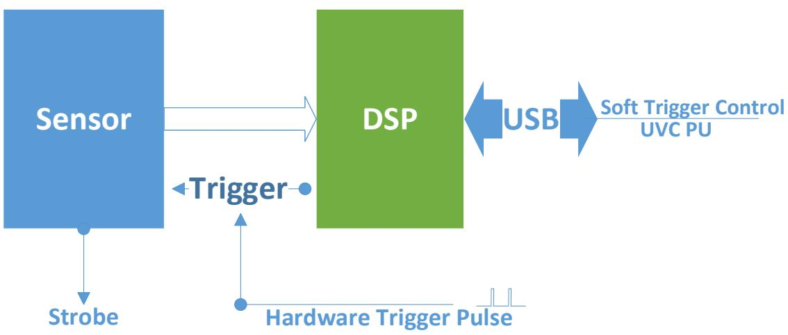
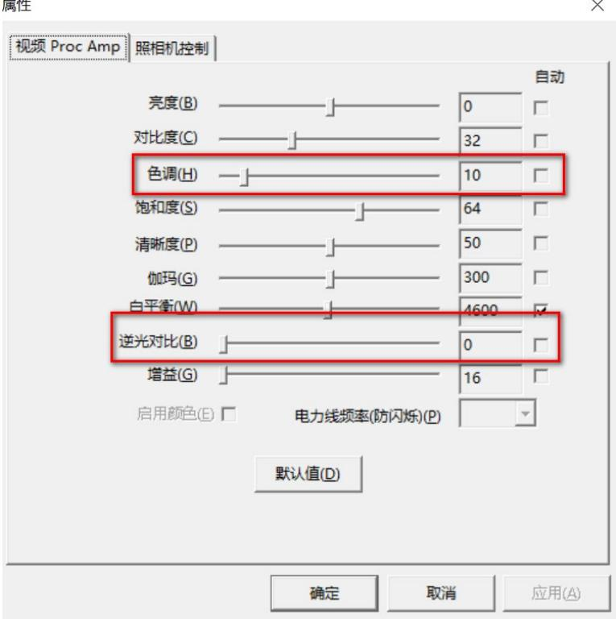
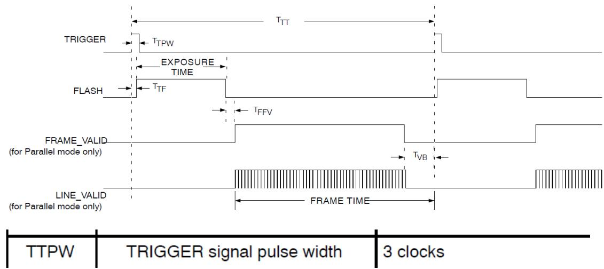
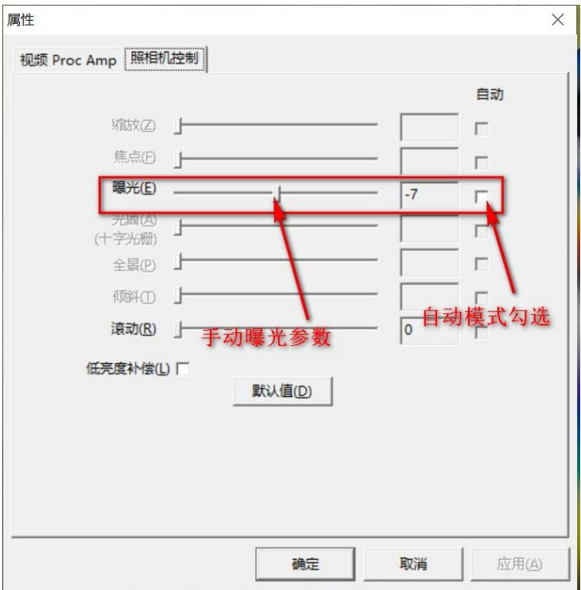
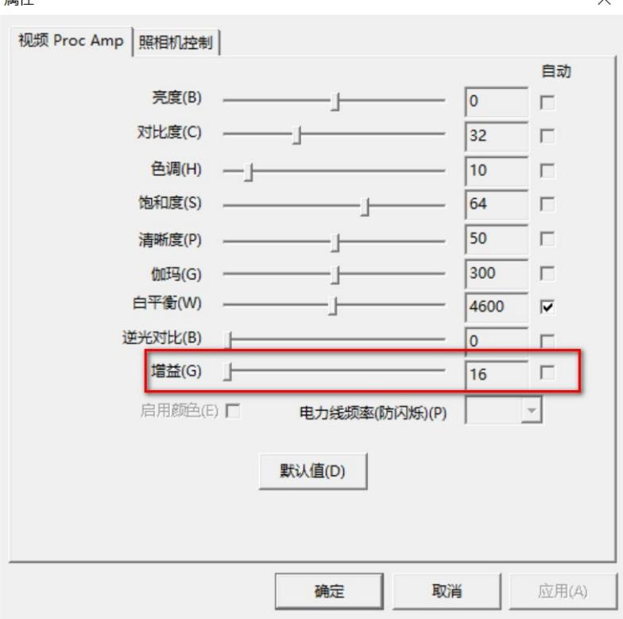

## AR0234 Trigger User Manumal v1.0

## 1、概述

USB相机支持两种输出模式，连续模式和触发模式。连续模式为相机连续输出视频流。触发模式分为软件触发和硬件帧触发。软件触发的信号由软件设定脉冲频率产生；硬件触发由外部硬件信号触发产生。触发模式、曝光时间和Sensor增益有对应参数和接口供用户去控制。在触发模式下，相机收到触发信号后开始曝光，在曝光结束后输出图像，输出图像后停止输出等待新的触发信号。

## 2、触发设置

## 2.1 模式选择和参数配置

通过第三方软件设置 UVC PU 参数属性控制接口实现模式选择和参数配置。以Windows 下的 AMCAP3.0.9 软件为例，通过调整“Options-Video Capture Filter...-属性

菜单下的视频Proc Amp-色调选项和逆光对比选项”实现。

属性

逆光对比 – 触发模式选择配置选项，有 0 / 1 / 2 三个选项；

色调 - 软件触发配置选项，用于设定触发脉冲频率，参数值设定范围为0-100。参数含义：0-关闭触发；1-100对应的触发频率是：100/设定值；

注意：如需保存 AMCAP 软件调整后的参数属性值（掉电之后，下次再打开相机时可调用上一次打开时设置的参数），需要在 AMCAP 软件端设置完属性值后点”确定“，再点”应用“，再正常关闭 AMCAP 软件，否则无法保存调整后的参数属性值。

## 2.2 触发配置

以 Windows 下的 AMCAP 软件为例，通过调整“Options-Video Capture Filter...-属性菜单下的视频 Proc Amp-色调选项和逆光对比选项。

2.2.1“逆光对比”设置为“0”，相机进入连续模式，相机连续输出视频流；

2.2.2“逆光对比”设置为“1”，相机进入软件触发模式，结合“色调”选项配置脉冲频率，

即可实现相机软件触发；

2.2.3“逆光对比”设置为“2”，硬件触发模式，通过外部所提供的上升沿电平触发实现：

1） 通过按键触发（如 PCB 板上有预留该器件），按一下触发一次并采集一帧图像；

2） 通过外部脉冲信号触发，外部脉冲信号需要先按照PCB板上的PIN脚定义和相机进行硬件连接，触发时序控制依照如下实现。

备注：

1) FSIN 脉冲宽度：tTPW > 3 input clock cycles(24Mhz)，实测 1uS 是可以的，1mS 也是可以的；

2) FSIN 触发频率：实测 触发频率<= FPS/3 是可以的；FPS为初始出图设置帧率，比如30FPS、60FPS 等；

## 2.3 闪光灯配置

闪光灯功能由Sensor直接输出闪光灯（Strobe）信号，来驱动外部闪光灯电路实现。外部闪光灯电路需要先按照PCB板上的PIN脚定义进行硬件连接，Strobe的宽度略宽于实际曝光的时间。

## 2.4 曝光配置

Exposure（曝光）可手动配置，以 Windows 下的 AMCAP 软件为例，通过调整“Options-Video Capture Filter...-属性菜单下的照相机控制-曝光”实现。

需要取消自动曝光，手动曝光参数才会生效；自动曝光模式下，DSP会自行控制曝光；“曝光”值与实际曝光时间 微软做了转换，换算关系是1/2value，单位：毫秒；对应表格如下：

<table><tr><td colspan="1" rowspan="1">取值-VALUE</td><td colspan="1" rowspan="1">对应曝光时间 (单位mS)</td></tr><tr><td colspan="1" rowspan="1">-14</td><td colspan="1" rowspan="1">0.061</td></tr><tr><td colspan="1" rowspan="1">-13</td><td colspan="1" rowspan="1">0.122</td></tr><tr><td colspan="1" rowspan="1">-12</td><td colspan="1" rowspan="1">0.244</td></tr><tr><td colspan="1" rowspan="1">-11</td><td colspan="1" rowspan="1">0.488</td></tr><tr><td colspan="1" rowspan="1">-10</td><td colspan="1" rowspan="1">0.976</td></tr><tr><td colspan="1" rowspan="1">-9</td><td colspan="1" rowspan="1">1.95</td></tr><tr><td colspan="1" rowspan="1">-8</td><td colspan="1" rowspan="1">3.9</td></tr><tr><td colspan="1" rowspan="1">-7</td><td colspan="1" rowspan="1">7.8125</td></tr><tr><td colspan="1" rowspan="1">-6</td><td colspan="1" rowspan="1">15.625</td></tr><tr><td colspan="1" rowspan="1">-5</td><td colspan="1" rowspan="1">31.25</td></tr><tr><td colspan="1" rowspan="1">-4</td><td colspan="1" rowspan="1">62.5</td></tr><tr><td colspan="1" rowspan="1">-3</td><td colspan="1" rowspan="1">125</td></tr><tr><td colspan="1" rowspan="1">-2</td><td colspan="1" rowspan="1">250</td></tr><tr><td colspan="1" rowspan="1">-1</td><td colspan="1" rowspan="1">500</td></tr><tr><td colspan="1" rowspan="1">０</td><td colspan="1" rowspan="1">1000</td></tr></table>

## 备注：

1）如果应用软件能取得底层函数接口，实际的范围是[0,10000]，单位为：10mS，0无效；

2）触发模式下 配置曝光时间也要考虑 触发频率 <=FPS/3 ;上面手动曝光时间对应的帧率 FPS=1/曝光时间；

## 2.5 增益配置

Gain（增益）可手动配置，在手动曝光模式前提下可配置，在自动曝光模式下没有作  
用。以 Windows 下的 AMCAP 软件为例，通过调整“Options-Video Capture Filter...-  
属性菜单下的视频 Proc Amp-增益”实现，“增益”值直接写入 Sensor Gain 寄存器。Gain（增益）范围[16,256]。实际对应 sensor 增益为：Gain/16。

## 3、接口 PIN 脚定义

PCB端子4 PIN脚的丝印定义如下：

1- GPIO 输入/输出，预留，3.3V基准

2- TRIGGER/FSIN 输入脚，硬件触发输入，1.8V 基准

3- STROBE 输出脚，闪光灯信号输出，1.8V基准

4- GND 地

外部触发输入硬件连接：连接2脚和4脚

闪光灯信号输出硬件连接：连接3脚和4脚

## 4、其它说明

