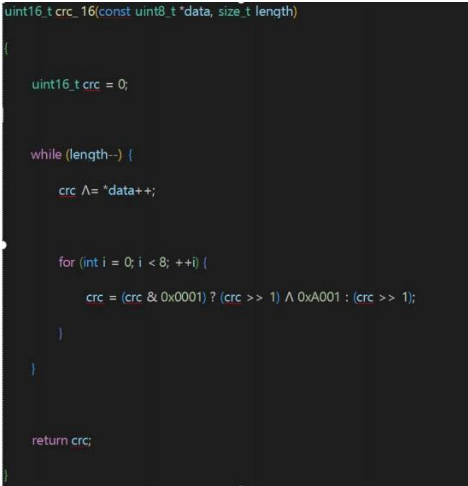

密级：秘密

# HiT华威科

# 灵巧手压力传感器串口通信协议

版本 V1.6.250303

武汉华威科智能技术有限公司

武汉市东湖新技术开发区高新大道 999 号武汉未来科技城龙山创新园C3 栋 1301

## 版本修正历史

<table><tr><td rowspan=1 colspan=1>版本</td><td rowspan=1 colspan=1>修订内容</td></tr><tr><td rowspan=1 colspan=1>V1.4.240210</td><td rowspan=1 colspan=1>首次发布</td></tr><tr><td rowspan=1 colspan=1>V1.6.250303</td><td rowspan=1 colspan=1>添加 $\mathrm { { 1 0 x 0 E } }$ 通道</td></tr><tr><td rowspan=1 colspan=1></td><td rowspan=1 colspan=1></td></tr><tr><td rowspan=1 colspan=1></td><td rowspan=1 colspan=1></td></tr><tr><td rowspan=1 colspan=1></td><td rowspan=1 colspan=1></td></tr><tr><td rowspan=1 colspan=1></td><td rowspan=1 colspan=1></td></tr><tr><td rowspan=1 colspan=1></td><td rowspan=1 colspan=1></td></tr></table>

## 目录

灵巧手压力传感器串口通信协议  
武汉华威科智能技术有限公司  
版本修正历史，  
目录.... 3  
一、UART 基本参数  
二、通信帧格式  
2.1 ID\CHANNEL 字段  
2.2 FLAGS 字段..  
2.3校验和 (CHECKSUM)  
三、指令集 (信道说明)  
3.1 CHANNEL #OxO1－ 设备信息 (ATTRIBUTE)  
3.2 CHANNEL #OxO2 － 请求上报数据 (DATA) 8  
3.3 CHANNEL #OxO7－校准与配置（ZERO) 9  
3.4 CHANNEL #Ox09－设备设置 (CONFIG) 10  
3.5 CHANNEL #OxOE－固件升级（OTA）  
四、指令示例详解

## 一、UART 基本参数

<table><tr><td rowspan=1 colspan=1>参数</td><td rowspan=1 colspan=1>值</td></tr><tr><td rowspan=1 colspan=1>波特率</td><td rowspan=1 colspan=1>921600</td></tr><tr><td rowspan=1 colspan=1>数据位</td><td rowspan=1 colspan=1>8</td></tr><tr><td rowspan=1 colspan=1>停止位</td><td rowspan=1 colspan=1>1</td></tr><tr><td rowspan=1 colspan=1>校验位</td><td rowspan=1 colspan=1>None</td></tr></table>

## 二、通信帧格式

所有通信都基于以下帧结构，字节顺序为小端模式（低位优先）。
<table><tr><td rowspan=1 colspan=1>字段</td><td rowspan=1 colspan=1>HEAD</td><td rowspan=1 colspan=1>ID\CHANNEL</td><td rowspan=1 colspan=1>FLAGS</td><td rowspan=1 colspan=1>LENGTH</td><td rowspan=1 colspan=1>PAYLOAD</td><td rowspan=1 colspan=1>CHECKSUM</td><td rowspan=1 colspan=1>TAIL</td></tr><tr><td rowspan=1 colspan=1>含义</td><td rowspan=1 colspan=1>帧头</td><td rowspan=1 colspan=1>地址+信道</td><td rowspan=1 colspan=1>标志位</td><td rowspan=1 colspan=1>负载长度</td><td rowspan=1 colspan=1>负载数据</td><td rowspan=1 colspan=1>校验和</td><td rowspan=1 colspan=1>帧尾</td></tr><tr><td rowspan=1 colspan=1>长度(字节)</td><td rowspan=1 colspan=1>2</td><td rowspan=1 colspan=1>1</td><td rowspan=1 colspan=1>1</td><td rowspan=1 colspan=1>2</td><td rowspan=1 colspan=1>N</td><td rowspan=1 colspan=1>2</td><td rowspan=1 colspan=1>2</td></tr><tr><td rowspan=1 colspan=1>值</td><td rowspan=1 colspan=1>0x3C,0x3C</td><td rowspan=1 colspan=1>(Addr&lt;&lt;4) |Chan</td><td rowspan=1 colspan=1>[7:2]ID[1:0]Type</td><td rowspan=1 colspan=1>1</td><td rowspan=1 colspan=1>1</td><td rowspan=1 colspan=1>CRC16 (PAYLOAD）</td><td rowspan=1 colspan=1>0x3E，0x3E</td></tr></table>

## 2.1 ID\CHANNEL 字段

<table><tr><td rowspan=1 colspan=1></td><td rowspan=1 colspan=1>高4位(Bit 7-4)</td><td rowspan=1 colspan=1>低4位(Bit 3-0)</td></tr><tr><td rowspan=1 colspan=1>含义</td><td rowspan=1 colspan=1>设备地址  (Addr)</td><td rowspan=1 colspan=1>信道号 (Chan)</td></tr><tr><td rowspan=1 colspan=1>作用</td><td rowspan=1 colspan=1>用于标识系统中不同的从设备。</td><td rowspan=1 colspan=1>用于区分不同的指令类型。</td></tr></table>

## 2.2 FLAGS 字段

FLAGS 字段定义了通信的类型和请求ID。

<table><tr><td rowspan=1 colspan=1></td><td rowspan=1 colspan=1>Bit 7-2 :</td><td rowspan=1 colspan=1>Bit 1-0:</td></tr><tr><td rowspan=1 colspan=1>含义</td><td rowspan=1 colspan=1>包ID (Package ID)</td><td rowspan=1 colspan=1>通信类型</td></tr><tr><td rowspan=1 colspan=1>作用</td><td rowspan=1 colspan=1>主机发送的请求标识，从机在响应中需保持此ID不变。</td><td rowspan=1 colspan=1>00-PUT：下发数据/设置命令01-GET：请求数据/信息（主机-&gt;从机）11-ACK：响应请求（从机-&gt;主机）</td></tr></table>

示例：0xA5（二进制10100101)。

高6位101001=包 ID0x29。

低2位 01= 这是一个 GET请求。

## 2.3校验和 (CHECKSUM)

校验和仅计算PAYLOAD部分。

## 三、指令集 (信道说明)

从机根据ID\CHANNEL 字段中的低4位Chan来执行相应的指令。

## 3.1 CHANNEL #Ox01 －设备信息 (ATTRIBUTE)

用于查询设备的各类属性信息。主机需要在PAYLOAD中指定要查询的子命令。

主机请求格式 (GET)
<table><tr><td rowspan=1 colspan=1>HEAD</td><td rowspan=1 colspan=1>ID\CHAN</td><td rowspan=1 colspan=1>FLAGS</td><td rowspan=1 colspan=1>LENGTH</td><td rowspan=1 colspan=1>PAYLOAD</td><td rowspan=1 colspan=1>CHECKSUM</td><td rowspan=1 colspan=1>TAIL</td></tr><tr><td rowspan=1 colspan=1>《</td><td rowspan=1 colspan=1>(Addr&lt;&lt;4）|0x1</td><td rowspan=1 colspan=1>(ID&lt;&lt;2) |0x01</td><td rowspan=1 colspan=1>0x0001</td><td rowspan=1 colspan=1>CMD</td><td rowspan=1 colspan=1>CRC16</td><td rowspan=1 colspan=1>&gt;&gt;</td></tr></table>

CMD：子命令字节，指定要查询的信息类型。

从机响应格式 (ACK)
<table><tr><td rowspan=1 colspan=1>HEAD</td><td rowspan=1 colspan=1>ID\CHAN</td><td rowspan=1 colspan=1>FLAGS</td><td rowspan=1 colspan=1>LENGTH</td><td rowspan=1 colspan=1>PAYLOAD</td><td rowspan=1 colspan=1>CHECKSUM</td><td rowspan=1 colspan=1>TAIL</td></tr><tr><td rowspan=1 colspan=1>《</td><td rowspan=1 colspan=1>(Addr&lt;&lt;4） |0x1</td><td rowspan=1 colspan=1>(ID&lt;&lt;2） |0x03</td><td rowspan=1 colspan=1>N</td><td rowspan=1 colspan=1>Data</td><td rowspan=1 colspan=1>CRC16</td><td rowspan=1 colspan=1>&gt;&gt;</td></tr></table>

FLAGS低2位变为Ox03（ACK)。

PAYLOAD内容根据请求的CMD而定。

可用的子命令 (CMD)

<table><tr><td rowspan=1 colspan=1>CMD</td><td rowspan=1 colspan=1>功能</td><td rowspan=1 colspan=1>响应数据格式</td><td rowspan=1 colspan=1>说明</td></tr><tr><td rowspan=1 colspan=1>0x01</td><td rowspan=1 colspan=1>查询应用版本号</td><td rowspan=1 colspan=1>char[]</td><td rowspan=1 colspan=1>返回以\0结尾的字符串，格式为MAJOR.MINOR.PATCH。</td></tr><tr><td rowspan=1 colspan=1>0x05</td><td rowspan=1 colspan=1>查询芯片序列号</td><td rowspan=1 colspan=1>uint8_t[32]</td><td rowspan=1 colspan=1>返回32字节的芯片UID，格式为XXXXXXXX-XXXXXXXX-XXXXXXXX（字符串）。</td></tr><tr><td rowspan=1 colspan=1>0x06</td><td rowspan=1 colspan=1>查询设备地址</td><td rowspan=1 colspan=1>uint8_t</td><td rowspan=1 colspan=1>返回1字节的设备当前地址。</td></tr><tr><td rowspan=1 colspan=1>0x02，0x03，0x04</td><td rowspan=1 colspan=1>（保留）</td><td rowspan=1 colspan=1></td><td rowspan=1 colspan=1>代码中已定义但未实现功能。</td></tr></table>

## 3.2 CHANNEL #Ox02 － 请求上报数据 (DATA)

主机请求指定地址的设备上报其传感器数据。

主机请求格式 (GET)
<table><tr><td rowspan=1 colspan=1>HEAD</td><td rowspan=1 colspan=1>ID\CHAN</td><td rowspan=1 colspan=1>FLAGS</td><td rowspan=1 colspan=1>LENGTH</td><td rowspan=1 colspan=1>PAYLOAD</td><td rowspan=1 colspan=1>CHECKSUM</td><td rowspan=1 colspan=1>TAIL</td></tr><tr><td rowspan=1 colspan=1>《</td><td rowspan=1 colspan=1>(Addr&lt;&lt;4) |0x2</td><td rowspan=1 colspan=1>(ID&lt;&lt;2） |0x01</td><td rowspan=1 colspan=1>0x0001</td><td rowspan=1 colspan=1>0xNN</td><td rowspan=1 colspan=1>CRC16</td><td rowspan=1 colspan=1>&gt;&gt;</td></tr></table>

PAYLOAD：目前代码中仅读取1字节(OxNN)，但其值未使用。请求本身即触发数据上报。

从机响应格式（ACK）－数据上报

设备收到请求后，会通过相同的信道（0x2）上报传感器数据。

<table><tr><td rowspan=1 colspan=1>HEAD</td><td rowspan=1 colspan=1>ID\CHAN</td><td rowspan=1 colspan=1>FLAGS</td><td rowspan=1 colspan=1>LENGTH</td><td rowspan=1 colspan=1>PAYLOAD</td><td rowspan=1 colspan=1>CHECKSUM</td><td rowspan=1 colspan=1>TAIL</td></tr><tr><td rowspan=1 colspan=1>《</td><td rowspan=1 colspan=1>(Addr&lt;&lt;4) |0x2</td><td rowspan=1 colspan=1>(ID&lt;&lt;2） |0x03</td><td rowspan=1 colspan=1>M*N*2</td><td rowspan=1 colspan=1>Data[]</td><td rowspan=1 colspan=1>CRC16</td><td rowspan=1 colspan=1>&gt;&gt;</td></tr></table>

FLAGS高6位与请求中的Package ID相同。

PAYLOAD为原始的传感器数据数组，长度为M\* N\*2字节（取决于传感器阵列的尺寸和配置）。

## 3.3 CHANNEL #Ox07－校准与配置 (ZERO)

用于设备的归零校准和相关参数配置。主机需要在PAYLOAD中指定子命令和参数。

## 主机请求格式 (PUT/GET)

<table><tr><td rowspan=1 colspan=1>HEAD</td><td rowspan=1 colspan=1>ID\CHAN</td><td rowspan=1 colspan=1>FLAGS</td><td rowspan=1 colspan=1>LENGTH</td><td rowspan=1 colspan=1>PAYLOAD</td><td rowspan=1 colspan=1>CHECKSUM</td><td rowspan=1 colspan=1>TAIL</td></tr><tr><td rowspan=1 colspan=1>《</td><td rowspan=1 colspan=1>(Addr&lt;&lt;4) |0x7</td><td rowspan=1 colspan=1>(ID&lt;&lt;2） |0x01</td><td rowspan=1 colspan=1>Var</td><td rowspan=1 colspan=1>CMD + Data</td><td rowspan=1 colspan=1>CRC16</td><td rowspan=1 colspan=1>&gt;&gt;</td></tr></table>

## 子命令（CMD）及参数

<table><tr><td rowspan=1 colspan=1>CMD</td><td rowspan=1 colspan=1>功能</td><td rowspan=1 colspan=1>参数(Data)</td><td rowspan=1 colspan=1>说明</td></tr><tr><td rowspan=1 colspan=1>0x01</td><td rowspan=1 colspan=1>归零校准开关</td><td rowspan=1 colspan=1>Value(1字节）</td><td rowspan=1 colspan=1>0x00：关闭校准0x01：开启校准0x02：清除校准值并重新校准</td></tr><tr><td rowspan=1 colspan=1>0x02</td><td rowspan=1 colspan=1>设置归零参数</td><td rowspan=1 colspan=1>多项参数</td><td rowspan=1 colspan=1>设置校准算法、帧数、各种系数和类型。</td></tr><tr><td rowspan=1 colspan=1>0x03</td><td rowspan=1 colspan=1>设置校准系数</td><td rowspan=1 colspan=1>float A，B，C</td><td rowspan=1 colspan=1>设置校准公式的系数。</td></tr></table>

## 3.4 CHANNEL #Ox09 － 设备设置 (CONFIG)

用于设置设备的运行参数，设置成功后设备会自动重启。

主机请求格式 (PUT)

<table><tr><td rowspan=1 colspan=1>HEAD</td><td rowspan=1 colspan=1>ID\CHAN</td><td rowspan=1 colspan=1>FLAGS</td><td rowspan=1 colspan=1>LENGTH</td><td rowspan=1 colspan=1>PAYLOAD</td><td rowspan=1 colspan=1>CHECKSUM</td><td rowspan=1 colspan=1>TAIL</td></tr><tr><td rowspan=1 colspan=1>《</td><td rowspan=1 colspan=1>（Addr&lt;&lt;4） |0x9</td><td rowspan=1 colspan=1>(ID&lt;&lt;2) |0x01</td><td rowspan=1 colspan=1>Var</td><td rowspan=1 colspan=1>CMD + Value</td><td rowspan=1 colspan=1>CRC16</td><td rowspan=1 colspan=1>&gt;&gt;</td></tr></table>

子命令（CMD）及参数

<table><tr><td rowspan=1 colspan=1>CMD</td><td rowspan=1 colspan=1>功能</td><td rowspan=1 colspan=1>参数(Value)</td><td rowspan=1 colspan=1>说明</td></tr><tr><td rowspan=1 colspan=1>0x01</td><td rowspan=1 colspan=1>多串口使能</td><td rowspan=1 colspan=1>uint8_t</td><td rowspan=1 colspan=1>启用或禁用多串口功能。</td></tr><tr><td rowspan=1 colspan=1>0x02</td><td rowspan=1 colspan=1>滤波器使能</td><td rowspan=1 colspan=1>uint8_t</td><td rowspan=1 colspan=1>0/1禁用/启用数据滤波器。</td></tr><tr><td rowspan=1 colspan=1>0x03</td><td rowspan=1 colspan=1>设置数据字节数</td><td rowspan=1 colspan=1>uint8_t</td><td rowspan=1 colspan=1>设置数据位宽（例如DOUBLE_BYTE）。</td></tr><tr><td rowspan=1 colspan=1>0x04</td><td rowspan=1 colspan=1>设置设备地址</td><td rowspan=1 colspan=1>uint8_t</td><td rowspan=1 colspan=1>设置设备的新地址。</td></tr></table>

## 3.5 CHANNEL #OxOE－固件升级(OTA)

触发设备进入Bootloader模式，准备接收新的固件。

主机请求格式 (PUT)

<table><tr><td rowspan=1 colspan=1>HEAD</td><td rowspan=1 colspan=1>ID\CHAN</td><td rowspan=1 colspan=1>FLAGS</td><td rowspan=1 colspan=1>LENGTH</td><td rowspan=1 colspan=1>PAYLOAD</td><td rowspan=1 colspan=1>CHECKSUM</td><td rowspan=1 colspan=1>TAIL</td></tr><tr><td rowspan=1 colspan=1>《</td><td rowspan=1 colspan=1>(Addr&lt;&lt;4) |0xE</td><td rowspan=1 colspan=1>(ID&lt;&lt;2） |0x01</td><td rowspan=1 colspan=1>0x0000</td><td rowspan=1 colspan=1></td><td rowspan=1 colspan=1>CRC16</td><td rowspan=1 colspan=1>&gt;&gt;</td></tr></table>

此命令无负载（LENGTH=O)。设备收到后即重置并进入IAP模式。

## 四、指令示例详解

<table><tr><td rowspan=1 colspan=1></td><td rowspan=1 colspan=1>ID</td><td rowspan=1 colspan=1>ROWS*COLS(十六进制)</td><td rowspan=1 colspan=1>获取数据命令</td></tr><tr><td rowspan=6 colspan=1>龙鳞72&amp;96</td><td rowspan=1 colspan=1>0X01</td><td rowspan=2 colspan=1></td><td rowspan=1 colspan=1>3C 3C 12 69 01 00 01 C1 C0 3E 3E</td></tr><tr><td rowspan=1 colspan=1>0X02</td><td rowspan=1 colspan=1>3C 3C 22 AD 01 00 01 C1 C0 3E 3E</td></tr><tr><td rowspan=1 colspan=1>0X03</td><td rowspan=1 colspan=1>12*6(0X0C*0X06)&amp;12*8（0X0C*0X08）</td><td rowspan=1 colspan=1>3C 3C 32 CD 01 00 01 C1 C0 3E 3E</td></tr><tr><td rowspan=1 colspan=1>0X04</td><td rowspan=2 colspan=1></td><td rowspan=1 colspan=1>3C 3C 42 3101 00 01C1C0 3E 3E</td></tr><tr><td rowspan=1 colspan=1>0X05</td><td rowspan=1 colspan=1>3C 3C 52 E101 00 01C1C0 3E 3E</td></tr><tr><td rowspan=1 colspan=1>0X06</td><td rowspan=1 colspan=1>14*8(0X0E*0X08)&amp;14*8(0X0E*0X08)</td><td rowspan=1 colspan=1>3C 3C 6275 01 00 01C1 C0 3E 3E</td></tr></table>

举例：

查看ID为0X05器件的数据：

<table><tr><td colspan="5">xCOM V2.3 × □ 3C3C52E294000101060C00000000000000000000000000000000000000 A 串口选择</td></tr><tr><td colspan="5">00000000000000000000000000000000000000000000000000000000.00 0000000000000000000000000000000000000000000000000000000000 COM19:USB-SERIAL 0000000000000000000000000000000000000000000000000000000000 0000000000000000000000000000000000000000000000000000000000 000000000000000000291C3E3E 波特率 921600 停止位 1</td></tr><tr><td colspan="5">数据位</td></tr><tr><td colspan="5">8 校验位 None</td></tr><tr><td colspan="5">串口操作 · 关闭串口</td></tr><tr><td colspan="5">保存窗口 清除接收 □ 16进制显示DTR</td></tr><tr><td colspan="5">□rts 延时 □时间戳 1000</td></tr><tr><td colspan="5">▼</td></tr><tr><td colspan="5">3C 3C52E1010001C1C03E3E A 发送 清除发送</td></tr><tr><td colspan="5">▼ 打开文件</td></tr><tr><td colspan="4">□定时发送周期：2</td><td colspan="3">停止发送</td></tr><tr><td colspan="4">ms 16进制发送口发送新行</td><td colspan="3">发送文件</td></tr><tr><td colspan="5"></td><td colspan="3">【火爆全网】正点原子DS100手持示波器上市</td></tr><tr><td></td><td></td><td></td><td>0%</td><td></td><td colspan="3"></td></tr><tr><td>www.openedv.com 欢 1</td><td>s:11</td><td></td><td>R:158</td><td></td><td>CTS=0DSR=0DCD=0|当前时间09:49:05</td><td colspan="3"></td></tr></table>

获取的数据：

$$
{ \begin{array} { c c c c c c c c c c c c c c c c c c c c c c } { 3 \mathcal { C } \mathcal { S } \mathcal { S } \mathcal { S } \mathcal { L } \mathcal { L } \mathcal { L } \mathcal { \mathcal { L } } \mathcal { \mathcal { Q } } \mathcal { 4 } \mathcal { \tiny { \Omega } \mathrm { \Lambda } } \mathrm { { 0 1 } \Lambda } \mathrm { 1 } \mathrm { 0 1 } \mathrm { 1 } \mathrm { 0 1 } \mathrm { 0 1 } \mathrm { 0 0 } \mathrm { 0 0 } \mathrm { 0 0 } \mathrm { 0 0 } \mathrm { 0 0 } \mathrm { 0 0 } \mathrm { 0 0 } \mathrm { 0 0 } \mathrm { 0 0 } \mathrm { 0 0 } \mathrm { 0 0 } \mathrm { 0 0 } \mathrm { 0 0 } \mathrm { 0 0 } \mathrm { 0 0 } \mathrm { 0 0 } \mathrm { 0 0 } \mathrm { 0 0 } \mathrm { 0 0 } \mathrm { 0 0 } \mathrm { 0 0 } \mathrm { 0 0 } \mathrm { 0 0 } \mathrm { 0 0 } \mathrm { 0 0 } } } \\  { 3 \mathrm { 0 0 } \mathrm { 0 0 } \mathrm { 0 } \mathrm { 0 0 } \mathrm { 0 0 } \mathrm { 0 } \mathrm { 0 0 } \mathrm { 0 } \mathrm { 0 0 } \mathrm { 0 0 } \mathrm { 0 0 } \mathrm { 0 0 } \mathrm { 0 0 0 } \mathrm { 0 0 } \mathrm { 0 0 } \mathrm { 0 0 } \mathrm { 0 0 } \mathrm { 0 0 } \mathrm { 0 0 } \mathrm { 0 0 } \mathrm { 0 0 } \mathrm { 0 0 } \mathrm { 0 0 } \mathrm { 0 0 } \mathrm { 0 0 } \mathrm { 0 0 } \mathrm { 0 0 } \mathrm { 0 0 } \mathrm { 0 0 } \mathrm { 0 0 } \mathrm { 0 0 } \mathrm { 0 0 } \mathrm { 0 0 } \mathrm { 0 0 } \mathrm { 0 0 } \mathrm { 0 0 } \mathrm { 0 0 } \mathrm { 0 0 } \mathrm { 0 0 } \mathrm { 0 0 } \mathrm { 0 0 } \mathrm { 0 0 } } \\   3 \mathrm { 0 0 } \mathrm { 0 0 } \mathrm { 0 0 } \mathrm { 0 0 } \mathrm { 0 0 0 } \mathrm { 0 0 } \mathrm { 0 0 0 } \mathrm { 0 0 0 } \mathrm { 0 0 0 } \mathrm { 0 0 0 } \mathrm { 0 0 0 } \mathrm { 0 0 } \mathrm { 0 0 } \mathrm { 0 0 } \ \end{array}
$$

数据解析：

3C 3C－帧头标识（'<’‘<）

52 －ID&通道号

E2 －标志位 (flags)

94 00- 载荷长度 (0x0094 = 148字节)

接下来是字节的负载数据

29 1C- CRC16校验码

3E 3E－ 帧尾标识（'>’‘>'）

负载数据：

第一个包信息（压阻):0101 06 0C

01－总包数 (1个包)

01－当前包序号 (第1包)

06－列数 (6列)

OC－行数 (12行)

<table><tr><td>00 00 00</td><td>00 00 00</td><td>00</td><td>00 00</td><td>00</td><td>00</td><td>00</td><td>00 00</td><td>00</td><td>00</td><td>00</td><td>00 00</td><td>00</td><td>00</td></tr><tr><td>00 00</td><td>00 00</td><td>00 00</td><td>00 00</td><td>00</td><td>00 00</td><td>00</td><td>00</td><td>00</td><td>00 00</td><td>00</td><td>00</td><td>00 00</td><td>00</td></tr><tr><td>00 00</td><td>00 00 00</td><td>00 00</td><td>00</td><td>00</td><td>00 00</td><td>00</td><td>00</td><td>00 00</td><td>00</td><td>00</td><td>00</td><td>00 00</td><td>00</td></tr><tr><td>00 00</td><td>00 00 00</td><td>00</td><td>00 00</td><td>00</td><td>00</td><td>00 00</td><td>00</td><td>00</td><td>00 00</td><td>00</td><td>00</td><td>00 00</td><td>00</td></tr><tr><td>00 00</td><td>00 00 00</td><td>00</td><td>00 00</td><td>00</td><td>00</td><td>00 00</td><td>00</td><td>00</td><td>00</td><td>00</td><td>00 00</td><td>00 00</td><td>00</td></tr><tr><td>00 00</td><td>00 00 00</td><td>00 00</td><td>00</td><td>00</td><td>00</td><td>00 00</td><td>00</td><td>00</td><td>00</td><td>00 00</td><td>00</td><td>0000</td><td>00</td></tr><tr><td>00 00</td><td>00 00</td><td>00 00</td><td>00 00</td><td>00</td><td>00</td><td>00 00</td><td>00</td><td>00</td><td>00</td><td>00 00</td><td>00</td><td></td><td></td></tr></table>

