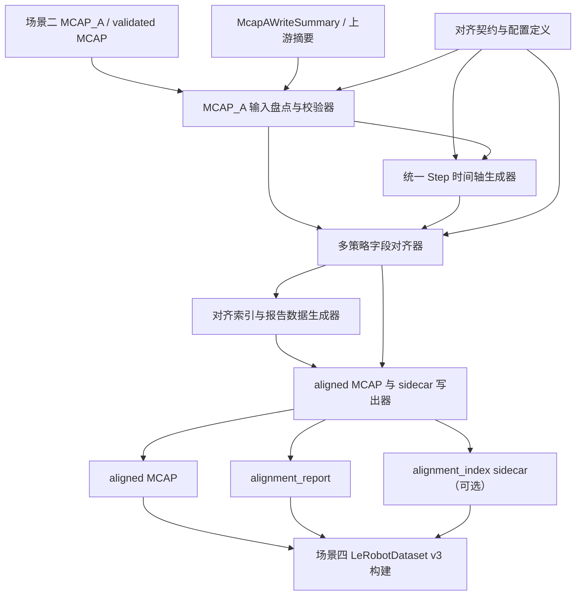

# 阶段二场景三：功能模块清单

## 一句话总结

场景三按“上游产物能不能吃 -> 目标时间轴是什么 -> 每个字段如何映射到 step -> 对齐事实如何表达 -> 产物如何落盘”的链路拆为 6 个 L2 功能模块：先确认场景二 `MCAP_A / validated MCAP` 可消费，再生成统一 step 时间轴，把图像、位姿、触觉、夹爪等字段映射到 step，最后写出 aligned MCAP、alignment report 和可选对齐索引 sidecar。

## 上游接口状态

场景三直接依赖场景二 P0 主线产物 `MCAP_A / validated MCAP`，不消费 `MCAP_B`、IK、关节限制检查或 MuJoCo 仿真诊断产物。

当前已稳定的上游接口结论：

- 场景三主输入是场景二 `McapA`，文档和人工讨论中也称为 `MCAP_A`。
- `McapA` 默认输出位置为 `asset/阶段二：数据清洗/dev/mcap_validated/`。
- `McapA` 默认命名为 `<cleaned_mcap_stem>_mcap_a.mcap`。
- `McapA` 保留 cleaned MCAP 的 topic 名称、消息类型、时间戳排序和样本数，不改变 topic/time 主结构。
- `McapA` 承载经过异常检测、可修复异常补全、位姿滤波和触觉滤波后的训练语义主数据。
- `McapAWriteSummary` 作为 sidecar JSON 追溯 MCAP_A 从哪个 cleaned MCAP 生成、替换了哪些 topic、复制了哪些 topic、是否成功和失败原因。
- 场景三可以读取场景二异常、修复、滤波、写出摘要作为对齐质量追溯依据，但不在本场景重新执行异常检测、补全或滤波。

仍需后续 L2 / L3 落地的事项：

- 目标 step 频率、起止策略和各 topic 对齐阈值需在场景三配置定义中固化。
- aligned MCAP 内部如何表达 step 对齐结果、alignment index 是否作为 sidecar 独立写出，需在场景三数据定义中固化。
- 场景三开发者入口的功能检验项名称、测试产物和运行日志字段需在后续 L2 中细化。

## 功能模块总览

| 序号 | 功能模块 | 模块类别 | 一句话目标 | 优先级 |
|---|---|---|---|---|
| 1 | 对齐契约与配置定义 | 数据定义类 | 定义场景三输入、输出、step 时间轴、topic 对齐策略、阈值和报告结构的统一契约。 | P0 |
| 2 | MCAP_A 输入盘点与校验器 | 数据计算类 | 读取 MCAP_A 和写出摘要，确认上游产物是否可被场景三消费。 | P0 |
| 3 | 统一 Step 时间轴生成器 | 数据计算类 | 根据可消费 topic 的时间范围和目标频率生成统一 step 时间戳序列。 | P0 |
| 4 | 多策略字段对齐器 | 数据计算类 | 按字段策略把图像、位姿、触觉、夹爪等源数据映射到统一 step。 | P0 |
| 5 | 对齐索引与报告数据生成器 | 数据计算类 | 汇总 step-field 对齐事实，生成 alignment index 和 report 所需统计数据。 | P0 |
| 6 | aligned MCAP 与 sidecar 写出器 | 数据读写类 | 写出 aligned MCAP、alignment report、可选 alignment index sidecar 和写出摘要。 | P0 |

## 整体协作链路

场景三不改变场景二的主数据清洗结果，也不决定哪些 step 可用于训练。它只把 MCAP_A 中异步 topic 数据投影到统一 step 时间轴，并把每个字段的来源、对齐方式、时间误差、缺失、复用、插值、聚合和超时事实记录清楚。训练质量判定、mask、episode 构建和 LeRobotDataset v3 目录结构属于场景四。

链路原则：

- `MCAP_A` 是场景三 P0 主输入；`MCAP_B` 不进入场景三 P0 主链路。
- 统一 step 时间轴是所有字段对齐的共同参考系，不允许各 topic 各自生成互不一致的 step。
- 图像等离散字段不做插值，只做最近邻或缺失 / 超时标记。
- 位姿插值必须正确处理四元数，姿态不得使用线性插值。
- 触觉等高频字段允许按窗口聚合或降采样，但必须记录窗口范围、样本数量和覆盖率。
- 场景三只记录对齐事实和质量统计，不做训练可用性裁决。
- aligned MCAP、alignment report 和可选 alignment index 必须可追溯到 MCAP_A、配置和本次 run。

## 01 对齐契约与配置定义

- 一句话目标：定义场景三输入、输出、step 时间轴、topic 对齐策略、阈值和报告结构的统一契约，避免各模块自行猜字段。
- 模块类别：数据定义类。
- 作用：为后续计算与写出模块提供同一套配置、状态枚举和产物语义。
- 上游依赖：场景二 `McapA`、`McapAWriteSummary`；场景三目标描述、背景信息和执行约束。
- 下游消费者：MCAP_A 输入盘点与校验器、统一 Step 时间轴生成器、多策略字段对齐器、对齐索引与报告数据生成器、aligned MCAP 与 sidecar 写出器。
- 需要定义的核心概念：场景三对齐配置、目标 topic 映射、step 时间轴、字段对齐策略、字段对齐状态、alignment index、alignment report、aligned MCAP 写出摘要。
- 优先级：P0。
- 边界：只定义契约和配置语义，不读取 MCAP，不执行对齐计算，不写出产物。
- 阻塞项 / 未知问题：目标 step 频率默认值、起止时间策略、每类字段默认阈值和 alignment index 的最终落盘格式尚未确定。
- 后续可拆 L3 方向：定义场景三配置与 schema；定义 step / field alignment record；定义 alignment report 与写出摘要。

## 02 MCAP_A 输入盘点与校验器

- 一句话目标：读取 MCAP_A 和写出摘要，确认上游产物是否可被场景三消费。
- 模块类别：数据计算类。
- 输入：`McapA` 文件路径、`McapAWriteSummary`、目标 topic 配置、必需 / 可选 topic 列表。
- 输出：source topic catalog、每个 topic 的消息类型、样本数、时间戳排序状态、时间范围、缺失 topic 列表、不可消费原因和输入盘点摘要。
- 上游依赖：场景二 MCAP_A 生成器；`McapA` 和 `McapAWriteSummary` 数据定义。
- 下游消费者：统一 Step 时间轴生成器、多策略字段对齐器、对齐索引与报告数据生成器、开发者功能检验项。
- 优先级：P0。
- 边界：只判断输入是否可消费和可如何消费，不生成 step，不执行字段对齐，不修改 MCAP_A。
- 典型失败：MCAP_A 不存在、写出摘要失败、必需 topic 缺失、消息类型不匹配、时间戳乱序、所有必需 topic 无共同有效时间范围。
- 后续可拆 L3 方向：定义 source topic catalog；实现 MCAP_A topic/time 盘点；实现输入失败报告；接入场景三开发者输入校验检验项。

## 03 统一 Step 时间轴生成器

- 一句话目标：根据可消费 topic 的时间范围和目标频率生成统一 step 时间戳序列。
- 模块类别：数据计算类。
- 输入：source topic catalog、目标 step 频率、起止时间策略、必需 topic 集合、最大允许空段策略。
- 输出：step 时间戳序列、step 数量、起止时间、时间轴生成摘要、无法生成时间轴的失败原因。
- 上游依赖：MCAP_A 输入盘点与校验器；对齐契约与配置定义。
- 下游消费者：多策略字段对齐器、对齐索引与报告数据生成器、aligned MCAP 与 sidecar 写出器。
- 优先级：P0。
- 边界：只生成统一时间轴，不读取具体消息值，不决定每个字段如何对齐，不做训练质量判定。
- 设计原则：同一次对齐 run 中所有目标字段必须共享同一条 step 时间轴；起止时间由配置和可消费 topic 时间范围共同决定。
- 后续可拆 L3 方向：定义 step timeline 类型；实现交集 / 配置起止策略；补充空时间轴和边界时间测试；接入时间轴开发者检验项。

## 04 多策略字段对齐器

- 一句话目标：按字段策略把图像、位姿、触觉、夹爪等源数据映射到统一 step。
- 模块类别：数据计算类。
- 输入：step 时间轴、source topic catalog、MCAP_A 源消息流、字段到 topic 映射、每个字段的对齐策略和阈值。
- 输出：step-field 对齐结果，包括对齐值或值引用、来源 topic、来源时间戳、对齐方式、时间误差、插值邻居、聚合窗口、样本数量、缺失 / 复用 / 超时 / 不可用状态。
- 上游依赖：统一 Step 时间轴生成器；MCAP_A 输入盘点与校验器；对齐契约与配置定义。
- 下游消费者：对齐索引与报告数据生成器、aligned MCAP 与 sidecar 写出器、场景三完整 smoke test。
- 优先级：P0。
- 边界：负责字段到 step 的映射事实，不负责汇总全局报告，不负责写 MCAP，不负责决定训练 mask。
- 内部策略：图像等离散字段使用最近邻；位姿字段使用位置插值和四元数 slerp；触觉高频字段使用窗口聚合或降采样；夹爪字段按配置使用最近邻或插值。
- 后续可拆 L3 方向：实现最近邻对齐策略；实现位姿插值和四元数 slerp；实现触觉窗口聚合；实现字段对齐状态记录；接入多模态对齐开发者检验项。

## 05 对齐索引与报告数据生成器

- 一句话目标：汇总 step-field 对齐事实，生成 alignment index 和 report 所需统计数据。
- 模块类别：数据计算类。
- 输入：step-field 对齐结果、step 时间轴摘要、source topic catalog、上游 MCAP_A 写出摘要引用、报告配置。
- 输出：alignment index 数据、每个 topic / 字段的误差统计、缺失率、复用率、插值比例、聚合覆盖率、超时数量、失败摘要和对齐报告数据对象。
- 上游依赖：多策略字段对齐器；统一 Step 时间轴生成器；MCAP_A 输入盘点与校验器。
- 下游消费者：aligned MCAP 与 sidecar 写出器、场景四 LeRobotDataset v3 构建、人工复查和开发者验收入口。
- 优先级：P0。
- 边界：只表达对齐事实和统计，不决定 step 是否用于训练，不生成 mask，不构建 episode，不写出最终文件。
- 设计原则：每个 observation 字段都必须能追溯来源或明确标记无效；报告必须机器可读。
- 后续可拆 L3 方向：定义 alignment index 数据结构；实现 step-field 汇总；实现误差 / 缺失 / 复用统计；接入 report 数据开发者检验项。

## 06 aligned MCAP 与 sidecar 写出器

- 一句话目标：写出 aligned MCAP、alignment report、可选 alignment index sidecar 和写出摘要。
- 模块类别：数据读写类。
- 输入：MCAP_A 源数据、step-field 对齐结果、alignment index 数据、alignment report 数据、写出配置和 run 目录上下文。
- 输出：aligned MCAP、`alignment_report`、可选 `alignment_index` sidecar、写出摘要和运行日志。
- 上游依赖：多策略字段对齐器；对齐索引与报告数据生成器；对齐契约与配置定义。
- 下游消费者：场景四 LeRobotDataset v3 构建、开发者入口 `./start_data_clean.sh --dev` 的场景三功能检验项和场景完整 smoke test。
- 优先级：P0。
- 边界：只负责产物持久化、路径命名、覆盖策略、临时文件和失败清理；不重新执行对齐计算，不修改 MCAP_A，不做训练质量判定。
- 写出要求：开发者调试输出必须进入独立 run 目录；正式阶段产物不得污染上游 MCAP_A；失败时不得留下误导性的完整 aligned MCAP。
- 后续可拆 L3 方向：定义 aligned MCAP 写出摘要；实现 report / index sidecar 写出；实现 aligned MCAP 最小写出；接入场景三完整 smoke test。

## 后续推进顺序

1. 先补齐场景三 L2 数据定义：对齐配置、source topic catalog、step timeline、field alignment record、alignment index、alignment report、aligned MCAP 写出摘要。
2. 先生成 P0 主链路 L2：MCAP_A 输入盘点与校验器、统一 Step 时间轴生成器、多策略字段对齐器。
3. 再生成对齐索引与报告数据生成器、aligned MCAP 与 sidecar 写出器的 L2。
4. 每个 L2 生成前必须按上游依赖接口对齐约束读取直接上游 L2 / 数据定义，不得重新定义与场景二 `McapA` 相似但字段不同的输入对象。
5. 所有场景三 L2 / L3 最终都必须说明如何通过 `./start_data_clean.sh --dev` 下的场景三功能检验项或场景完整 smoke test 被人工验收。
