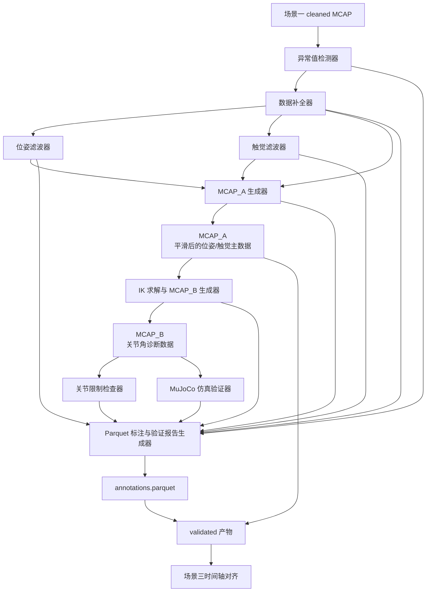

# 阶段二场景二：功能模块清单

## 一句话总结

场景二按 MCAP_A / MCAP_B / Parquet 标注链路拆为 9 个 L2 功能模块：先从 cleaned MCAP 生成平滑后的主数据 MCAP_A，再从 MCAP_A 生成关节角诊断文件 MCAP_B，最后用统一 `annotations.parquet` 标注异常、IK、关节约束和 MuJoCo 仿真问题；validated 产物由 MCAP_A 和 `annotations.parquet` 共同组成。

## 上游接口状态

场景二直接依赖场景一产出的 cleaned MCAP、清洗报告、标定/转换参数。场景一接口已开始按 L2 数据定义固化，后续编写场景二 L2 前必须优先读取：

- `DOCS/03_工程/阶段二：数据清洗/02_service/场景一/L2数据定义/CleanedMcap.md`
- `DOCS/03_工程/阶段二：数据清洗/02_service/场景一/L2数据定义/Scene1Config.md`
- `DOCS/03_工程/阶段二：数据清洗/02_service/场景一/L2数据定义/Scene1CleanReport.md`
- `DOCS/03_工程/阶段二：数据清洗/02_service/场景一/L2数据定义/ArmBaseTcpPose.md`
- `DOCS/03_工程/阶段二：数据清洗/02_service/场景一/L2数据定义/GripperWidthSample.md`

当前已稳定的接口结论：

- `CleanedMcap` 默认输出位置为 `asset/阶段二：数据清洗/dev/mcap_cleaned/*.mcap`。
- `/baton_mini_left/fast_odom`、`/baton_mini_right/fast_odom` 必须作为 raw pose 保留或可追溯。
- 场景二 P0 只消费 `/baton_mini_left/tcp_pose` 与 `/baton_mini_right/tcp_pose`，保持各自 source frame。
- `/gopro_left/gripper_width`、`/gopro_right/gripper_width` 为新增 gripper width topic，消息类型为 `std_msgs/msg/Float32`，值域为归一化 `[0, 1]`。
- `Scene1CleanReport` 第一轮先作为契约定义，独立 JSON 文件写出仍待后续 L3 实现。

仍需场景一后续 L3 落地的事项：

- 默认配置路径迁移到阶段二规范目录。
- cleaned MCAP 输出契约测试覆盖 raw pose 保留、camera/TCP common pose 数量、gripper 数量、topic 冲突和配置来源。
- 浏览器夹爪配置生成接口和 frame_alignment 配置生成接口仍需完成代码改造。
- 场景一清洗报告从终端/RAW_JSON 摘要收敛为可追溯机器可读报告。

## 功能模块总览

| 序号  | 功能模块               | 模块类别          | 一句话目标                                                    | 优先级 |
| --- | ------------------ | ------------- | -------------------------------------------------------- | --- |
| 1   | 异常值检测器             | 数据计算类         | 先在 cleaned MCAP 原始序列中识别样本级坏点、无样本缺失区间、非法值和异常变化，避免坏点被滤波扩散。 | P0  |
| 2   | 数据补全器              | 数据计算类         | 只消费异常检测器输出，只对字段级 `AUTO_REPAIR` 的已有样本执行严格双邻居插值，并记录不可补全问题。 | P0  |
| 3   | 位姿滤波器              | 数据计算类         | 对已完成明显坏点处理的 source-frame TCP pose 按精确 segment 平滑。                         | P0  |
| 4   | 触觉滤波器              | 数据计算类         | 对已完成明显坏点处理的触觉序列进行平滑，降低噪声且保留接触变化。                         | P0  |
| 5   | MCAP_A 生成器         | 数据读写类         | 按稳定消息引用将 source-frame TCP pose、触觉滤波值和成功 gripper 修复值写回 MCAP_A。 | P0  |
| 6   | IK 求解与 MCAP_B 生成器  | 数据计算类 / 数据读写类 | 从 MCAP_A 读取 arm-base TCP pose 并求解关节角，生成只用于机器人验证诊断的 MCAP_B。⚠️ 未在当前主路径启用。 | P1  |
| 7   | 关节限制检查器            | 数据计算类         | 基于 MCAP_B 检查 IK 无解、关节角、速度、加速度和 workspace 问题，并输出问题时间段。⚠️ 未在当前主路径启用。 | P1  |
| 8   | MuJoCo 仿真验证器       | 数据计算类         | 基于 MCAP_B 做仿真验证，输出碰撞、接触、力矩和仿真稳定性问题时间段。                   | P2  |
| 9   | Parquet 标注与验证报告生成器 | 数据读写类         | 汇总所有问题时间段，写出统一 `annotations.parquet` 和验证报告。              | P0  |

## 整体协作链路

场景二不裁剪 episode 时间轴，也不在关节检查或仿真阶段修改 MCAP_A / MCAP_B。MCAP_A 是后续场景三消费的主数据；MCAP_B 是关节角诊断派生产物；`annotations.parquet` 是所有问题段的统一标注表。

链路原则：

- `MCAP_A` 保留位姿、触觉、夹爪等训练语义主数据，不保存关节角序列。
- `MCAP_B` 只保存时间戳、左右臂关节角、IK 成功/失败状态和求解元数据，不作为 episode 主数据或训练输入。
- 关节限制检查器和 MuJoCo 仿真验证器只输出问题时间段，不修改、不删除 MCAP_A 或 MCAP_B 中的轨迹。
- `annotations.parquet` 的标注作用于 MCAP_A 的时间轴，而不是 MCAP_B 的关节角文件。
- 默认不删除问题时间段；是否局部 mask、整段 episode 丢弃或拆 episode，交给场景四 canonical dataset 构建阶段处理。

## 01 异常值检测器

- 一句话目标：先在 cleaned MCAP 原始序列中识别位姿、触觉、夹爪等序列的样本级坏点、无样本缺失区间、非法值和异常变化。
- 模块类别：数据计算类。
- 输入：cleaned MCAP 显式白名单中的 source-frame TCP pose、触觉、夹爪宽度序列，以及检测规则和阈值。
- 输出：样本级异常记录、无样本缺失区间、可选聚合摘要、异常类型、点级证据、异常原因摘要和建议处理方式；不直接修改序列。
- 上游依赖：场景一 `CleanedMcap`；只消费配置中声明的 stream inventory。
- 下游消费者：数据补全器、Parquet 标注与验证报告生成器。
- 优先级：P0。
- 已确认规划口径：异常检测先于补全和滤波运行；触觉纳入首版正式范围；输出以样本级异常为主，无样本缺失区间单独表达，连续问题聚合摘要只用于展示和报告；P0 主链路最终写出 `MCAP_A`。
- 阻塞项 / 未知问题：异常阈值、缺失段判定、速度/加速度异常规则、触觉突变规则和夹爪宽度异常规则的生产默认值尚未确定。
- 后续可拆 L3 方向：定义样本级异常检测数据概念；实现位姿/夹爪/触觉异常检测规则；接入开发者功能检验项。

## 02 数据补全器

- 一句话目标：只消费异常检测器输出，对字段级 `AUTO_REPAIR` 的已有样本执行严格双邻居线性插值或 SLERP。
- 模块类别：数据计算类。
- 输入：cleaned MCAP 原始序列、异常检测器输出的样本级异常记录、无样本缺失区间和补全策略。
- 输出：已完成可修复已有样本处理的位姿、触觉、夹爪序列引用；补全 run；样本级补全记录；未处理缺失区间；不可补全原因摘要。
- 上游依赖：异常值检测器。
- 下游消费者：位姿滤波器、触觉滤波器、MCAP_A 生成器、Parquet 标注与验证报告生成器。
- 优先级：P0。
- 阻塞项 / 未知问题：各替换单位 gap 上限、修复后序列 artifact 格式和触觉完整 diff 输出策略尚未确定。
- 后续可拆 L3 方向：定义补全策略和结果类型；实现 repair run 聚合与合法邻居查找；实现三模态补全规则；接入开发者功能检验项。

## 03 位姿滤波器

- 一句话目标：对已完成明显坏点处理的位姿序列进行平滑，降低高频噪声且保留真实运动趋势。
- 模块类别：数据计算类。
- 输入：数据补全器输出的 source-frame TCP pose、不可补全时间段、pose 相关未修复 / 跳过样本和位姿滤波配置。
- 输出：滤波后位姿序列、[[PoseFilterResult]]、滤波参数、样本级滤波审计和滤波前后差异摘要。
- 上游依赖：数据补全器；场景一 `CleanedMcap` 原始位姿作为追溯对照。
- 下游消费者：MCAP_A 生成器、Parquet 标注与验证报告生成器。
- 优先级：P0。
- 已确认规划口径：默认使用 Savitzky-Golay；对外配置 `window_duration_ms=200`、`polyorder=2`；按片段中位 `dt` 换算奇数样本窗口；位置 `x/y/z` 和姿态四元数都纳入滤波；姿态先做四元数符号连续化，再在旋转向量空间平滑并转回单位四元数；[[MissingIntervalIssue]] 和 pose 相关 `unrepaired` / `skipped` 样本都作为分段边界；guard 超过 2cm / 5deg 时保留原值并记录。
- 后续可拆 L3 方向：定义位姿滤波器数据类型；实现可靠片段切分与时间窗口换算；实现位置 / 姿态滤波与 guard 审计；接入 `scene2_pose_filter` 开发者功能检验项。

## 04 触觉滤波器

- 一句话目标：对已完成明显坏点处理的触觉序列进行平滑，降低噪声且保留接触变化。
- 模块类别：数据计算类。
- 输入：数据补全器输出的左右触觉序列，以及不可补全时间段。
- 输出：滤波后触觉序列，以及滤波参数、滤波前后差异摘要。
- 上游依赖：数据补全器；场景一 cleaned MCAP 原始触觉序列作为追溯对照。
- 下游消费者：MCAP_A 生成器、Parquet 标注与验证报告生成器。
- 优先级：P0。
- 阻塞项 / 未知问题：触觉数据 shape、单位、合理范围和噪声特征尚未稳定。
- 后续可拆 L3 方向：定义触觉序列输入契约；实现触觉滤波计算；补充尖峰抑制验收。

## 05 MCAP_A 生成器

- 一句话目标：按稳定消息引用将 source-frame TCP pose、触觉滤波值和成功 gripper 修复值精确写回 MCAP_A。
- 模块类别：数据读写类。
- 输入：cleaned MCAP 原文件、统一修复结果、滤波后 source-frame TCP pose、滤波后触觉、成功 gripper 修复值和稳定消息引用。
- 输出：MCAP_A 及 MCAP_A 写出摘要。
- 上游依赖：数据补全器、位姿滤波器、触觉滤波器；场景一 `CleanedMcap`。
- 下游消费者：IK 求解与 MCAP_B 生成器、场景三时间轴对齐、场景四 masks、Parquet 标注与验证报告生成器。
- 优先级：P0。
- 阻塞项 / 未知问题：MCAP_A 的正式命名、默认落点和与文件存放规范中 `dev/mcap_validated/` 的对应关系需在 L2 数据定义中固化。
- 后续可拆 L3 方向：定义 MCAP_A 数据概念；实现 MCAP_A 写出；补充场景三可读取兼容性验收。

## 06 IK 求解与 MCAP_B 生成器

> ⚠️ 当前不在主路径；保留以备未来。

- 一句话目标：从 MCAP_A 读取 arm-base TCP pose 并求解关节角，生成只用于机器人验证诊断的 MCAP_B。
- 模块类别：数据计算类 / 数据读写类。
- 输入：MCAP_A 中的左右 arm-base TCP pose 序列、common frame 到左右 RM65 base 的固定外参、睿尔曼 RM65 SDK 本地环境、左右初始关节角和 IK 求解配置。
- 输出：MCAP_B、IK 成功/失败时间段、逐样本求解摘要、SDK 自检结果和 IK 元数据。
- 上游依赖：MCAP_A 生成器；场景一位姿转换接口；机器人参数。
- 下游消费者：关节限制检查器、MuJoCo 仿真验证器、Parquet 标注与验证报告生成器。
- 优先级：P1。
- 已确认规划口径：首版面向睿尔曼 RM65 四代 6DOF，使用官方 Python SDK `Algo`，不自研 MDH IK；左右双臂分别求解；第一帧使用配置初始关节角，后续使用上一成功解作为 seed，失败帧不推进 seed；失败帧不写 NaN、不复制上一帧关节角；MCAP_B 只写成功 IK 的左右 `sensor_msgs/msg/JointState` topic，完整状态写 sidecar `IkSolveSummary`。
- 子功能拆解：
  1. `common_frame -> robot_base`：参考场景一 `common frame 位姿转换` 的齐次矩阵实现思路，复用或抽取 `src/data_clean/service/tcp_transform.py` 的 pose->matrix / matrix->pose / transform compose 能力，将左右 `CommonFrameTcpPose` 转成左右 `RobotBaseTcpPose`；该子功能独立测试单位外参、平移、旋转、左右隔离和非法外参 strict 失败。
  2. IK 求解生成关节角：自动部署 / 校验睿尔曼官方 SDK 后，对左右 `RobotBaseTcpPose` 分别调用 RM65 SDK `Algo.rm_algo_inverse_kinematics`，输出逐样本 `Rm65IkSampleResult`；该子功能独立测试 mock SDK、真实 SDK smoke、seed 连续策略、左右臂隔离和状态码映射。
  3. 生成 MCAP_B：把成功 IK 结果写出为左右 JointState topic，并写出覆盖所有输入 pose 的 `IkSolveSummary`；该子功能独立测试成功帧写出、失败帧跳过、sidecar 覆盖和 left/right 统计。
- SDK 本地部署要求：L3 必须能让无上下文 Agent 自动 clone `https://github.com/RealManRobot/RM_API2.git` 到 `vendor/RealManRobot/RM_API2`，安装 `RMDemo_AlgoInterface` 依赖，验证 `Robotic_Arm.rm_robot_interface` 可导入、`Algo(RM_MODEL_RM_65_E, RM_MODEL_RM_B_E)` 可初始化，并运行一次 RM65 IK smoke test；如官方 Demo 路径变化，必须先搜索 `RMDemo_AlgoInterface`，不得硬编码失败。
- 阻塞项 / 未知问题：左右 common frame 到 RM65 base 的真实外参数值、force type 是否固定标准版、MCAP_B JointState 关节名与后续 MuJoCo 映射仍需在后续 L3 或下游 L2 中固化。
- 后续可拆 L3 方向：建立睿尔曼 SDK 本地部署与 IK 自检；定义 IK 与 MCAP_B 数据契约；实现 arm-base 到 robot base 坐标转换；实现 RM65 SDK IK 求解适配器；写出 MCAP_B 并接入开发者功能检验项。

## 07 关节限制检查器

> ⚠️ 当前不在主路径；保留以备未来。

- 一句话目标：基于 MCAP_B 检查 IK 无解、关节角、关节速度、关节加速度和 workspace 问题，并输出问题时间段。
- 模块类别：数据计算类。
- 输入：MCAP_B 中的关节角序列、IK 状态、时间戳序列和机器人约束参数。
- 输出：关节约束问题时间段、违规类型、严重程度、涉及关节、建议 mask 类型和检查摘要。
- 上游依赖：IK 求解与 MCAP_B 生成器；机器人参数。
- 下游消费者：Parquet 标注与验证报告生成器；后续场景四 masks 和 robot constraint report。
- 优先级：P1。
- 阻塞项 / 未知问题：关节角范围、速度限制、加速度限制、workspace 边界和安全余量尚未稳定。
- 后续可拆 L3 方向：定义关节约束标注数据概念；实现约束检查；补充违规样例验收。

## 08 MuJoCo 仿真验证器

- 一句话目标：基于 MCAP_B 做仿真验证，输出碰撞、接触、力矩和仿真稳定性问题时间段。
- 模块类别：数据计算类。
- 输入：MCAP_B、MuJoCo 机器人模型、环境模型和必要的仿真参数。
- 输出：MuJoCo 仿真问题时间段、问题类型、严重程度、涉及 body / joint、建议 mask 类型和仿真摘要。
- 上游依赖：IK 求解与 MCAP_B 生成器；MuJoCo 机器人模型。
- 下游消费者：Parquet 标注与验证报告生成器；后续场景四 masks 和 robot constraint report。
- 优先级：P2。
- 阻塞项 / 未知问题：MuJoCo 是否作为首版强依赖、机器人模型准确性、环境模型、仿真耗时边界和失败处理策略尚未确定。
- 后续可拆 L3 方向：定义 MuJoCo 仿真标注数据概念；实现最小仿真验证；补充仿真问题摘要验收。

## 09 Parquet 标注与验证报告生成器

- 一句话目标：汇总所有问题时间段，写出统一 `annotations.parquet` 和验证报告。
- 模块类别：数据读写类。
- 输入：异常检测结果、不可补全时间段、滤波摘要、MCAP_A 写出摘要、IK 摘要、关节约束问题时间段、MuJoCo 仿真问题时间段。
- 输出：`annotations.parquet`、验证报告、MCAP_A / MCAP_B 产物索引和场景二 validated 产物摘要。
- 上游依赖：异常值检测器、数据补全器、位姿滤波器、触觉滤波器、MCAP_A 生成器、IK 求解与 MCAP_B 生成器、关节限制检查器、MuJoCo 仿真验证器。
- 下游消费者：场景三时间轴对齐；场景四 quality report、robot constraint report 和 masks；人工复查。
- 优先级：P0。
- 标注表最小字段：`start_time`、`end_time`、`source`、`issue_type`、`severity`、`training_usable`、`reason`、`related_topic_or_joint`、`suggested_mask`。
- 阻塞项 / 未知问题：严重程度枚举、mask 类型枚举、episode 级丢弃阈值需在 L2 数据定义中固化。
- 后续可拆 L3 方向：定义统一标注表数据概念；实现 Parquet 写出；补充场景四 masks 兼容性验收。

## 后续推进顺序

1. 先补齐场景二 L2 数据定义：MCAP_A、MCAP_B、统一问题标注表、IK 状态、关节约束问题、MuJoCo 仿真问题。
2. 先生成 P0 模块的 L2 能力模块说明：异常值检测器、数据补全器、位姿滤波器、触觉滤波器、MCAP_A 生成器、Parquet 标注与验证报告生成器。
3. 再生成 P1 模块的 L2：IK 求解与 MCAP_B 生成器、关节限制检查器。
4. 最后生成 P2 模块的 L2：MuJoCo 仿真验证器。
5. 任意 L2 生成前，必须先按 `L2能力模块与数据定义约束.md` 完成意图澄清，并按 `上游依赖接口对齐约束.md` 检查直接上游接口。
