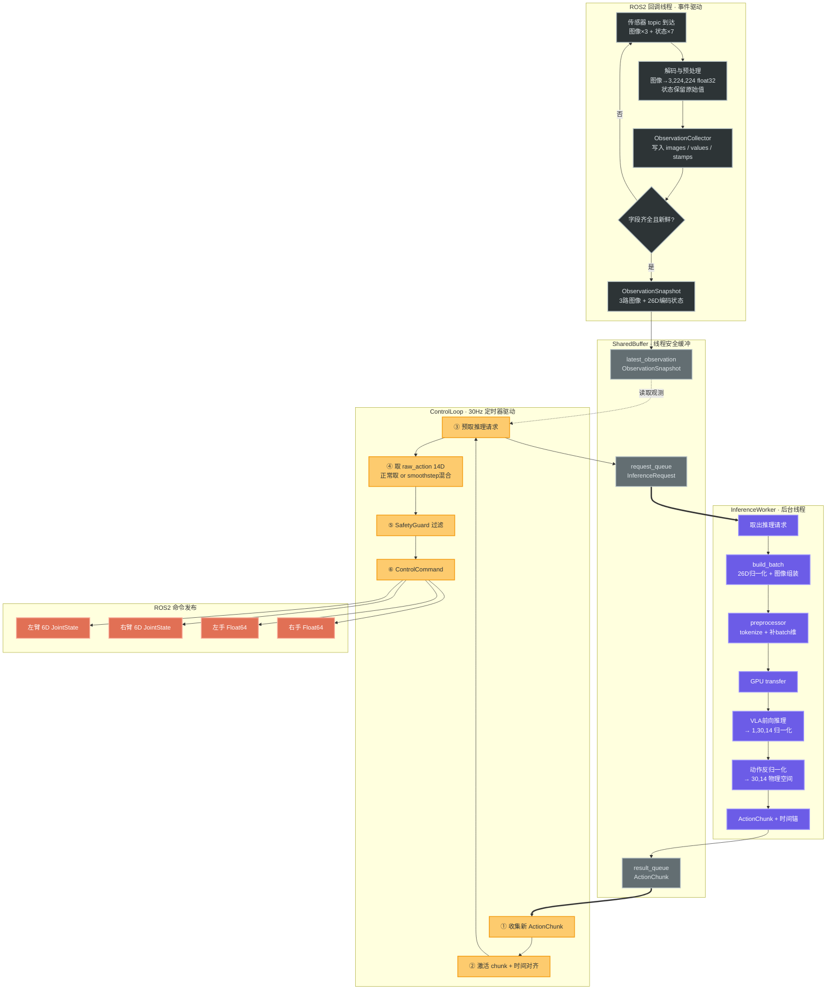

# AS-IS Contract：现有运行契约

## 0. System Dataflow Overview

> [!tip] 前置阅读
> [[01-doing/ROS/DOCS/99_learning/VLA Pi05 Prerequisites.md|VLA / Pi0.5 前置知识]]解释了阅读本契约前需要理解的背景概念。

本节先描述现有 Pi05 部署程序的宏观数据流。后续章节再展开启动入口、依赖、输入字段、内部数据结构、模型调用、输出命令、失败语义和可观测性。

### 0.1 一句话数据流

```text
ROS observation topics
→ Pi05VlaDeployNode subscriptions
→ ObservationCollector
→ ObservationSnapshot / encoded_state
→ SharedBuffer
→ ControlLoop submits InferenceRequest
→ InferenceWorker
→ Pi05PolicyRuntime.predict_action_chunk()
→ ActionChunk
→ ControlLoop selects one action step
→ SafetyGuard
→ /pi05_vla/command/*
→ Pi05BridgeNode
→ /vla/* candidate topics
→ CommandMuxNode
→ /mux/* execution topics
→ picotele / downstream robot execution stack
```

### 0.2 Pi05 节点内部数据流图
#### 0.3.0 runtime网络拓扑（微观）
下图描述的是 `Pi05VlaDeployNode` 内部从 ROS observation 回调到 `/pi05_vla/command/*` 命令发布的核心链路。bridge、mux 和 picotele 下游执行栈不在此图中展开，见后续宏观运行链路和输出契约。




本节从 ROS 网络视角描述 AS-IS 部署程序：Pi05 不直接调用机械臂 SDK，而是位于一条由 observation topics、VLA command topics、bridge candidate topics、mux execution topics 串起来的异步 ROS 数据流中。真机通信边界仍在 `picotele` 执行栈，Pi05 侧负责模型推理、命令 topic 发布、候选命令适配和 teleop/VLA 仲裁。

> [!note] 源码依据
> - 图谱确认了 `Pi0.5 real-time inference+control pipeline` 与 `VLA command publication chain` 两条核心关系，见 `graphify-out/GRAPH_REPORT.md` 的 Hyperedges。
> - `Pi05VlaDeployNode`：`pi05_test\pi05\deploy\src\pi05\deploy\ros_nodes\pi05_vla_deploy_node.py:L29`。
> - `Pi05BridgeNode`：`pi05_test\pi05\deploy\src\pi05\deploy\ros_nodes\pi05_bridge_node.py:L20`。
> - `CommandMuxNode`：`pi05_test\pi05\deploy\src\pi05\deploy\ros_nodes\command_mux_node.py:L28`。
> - topic 默认值与当前配置：`pi05_test\pi05\deploy\config\deploy.yaml:L39-L90`、`pi05_test\pi05\deploy\src\pi05\deploy\config\schema.py:L95-L174`。
> - 集成 launch remapping：`pi05_test\pi05\deploy\launch\pi05_picotele_mux.launch.py:L341-L412`。

#### 0.3.1 runtime网络拓扑（宏观）

```mermaid
flowchart LR
    subgraph OBS["观测数据发布者"]
        CAM["RealSense / 相机节点"]
        STATE["picotele 机器人状态发布者"]
        HANDSTATE["Inspire hand 状态发布者"]
        EE["机械臂末端位姿发布者"]
    end

    subgraph PI05["Pi05VlaDeployNode（ROS 节点）"]
        direction TB
        NODE["节点名: pi05_vla_deploy_node<br/>类名: Pi05VlaDeployNode<br/>类属性:<br/>- self.collector<br/>- self.shared_buffer<br/>- self.control_loop<br/>- self.inference_worker<br/>- ROS publishers"]
        OC["属性名: self.collector<br/>类名: ObservationCollector<br/>类属性:<br/>- _images<br/>- _values<br/>- _stamps<br/>核心方法: snapshot()"]
        SB["属性名: self.shared_buffer<br/>类名: SharedBuffer<br/>类属性:<br/>- _latest_observation<br/>- inference_request_queue<br/>- chunk_result_queue"]
        CL["属性名: self.control_loop<br/>类名: ControlLoop<br/>类属性:<br/>- active_chunk<br/>- pending_chunk<br/>- request_pending<br/>- last_command<br/>核心方法: tick()"]
        IW["属性名: self.inference_worker<br/>类名: InferenceWorker<br/>类属性:<br/>- policy_runtime<br/>- request_queue<br/>- result_queue<br/>运行方式: background thread"]
        PR["属性名: InferenceWorker.policy_runtime<br/>类名: Pi05PolicyRuntime<br/>类属性:<br/>- model / policy<br/>- preprocessor<br/>- state_normalizer<br/>- action_normalizer"]
        PUB["属性名: ROS publishers<br/>类型: rclpy publisher<br/>类属性:<br/>- left_arm_pub / right_arm_pub<br/>- left_hand_pub / right_hand_pub<br/>- status_pub / metrics_pub"]

        NODE -. "创建并保存为 self.collector" .-> OC
        NODE -. "创建并保存为 self.shared_buffer" .-> SB
        NODE -. "创建并保存为 self.control_loop" .-> CL
        NODE -. "创建并保存为 self.inference_worker" .-> IW
        NODE -. "创建并保存为 publisher 属性" .-> PUB

        OC -->|"ObservationSnapshot<br/>SharedBuffer.set_observation(...)"| SB
        SB -->|"latest_observation(...)"| CL
        SB -->|"chunk_result_queue.get_latest_or_none()"| CL
        CL -->|"InferenceRequest<br/>request_queue.put_latest(...)"| SB
        SB -->|"request_queue.get_latest_or_none()"| IW
        IW -->|"predict_action_chunk(observation)"| PR
        PR -->|"actions ndarray<br/>shape = chunk_size x 14"| IW
        IW -->|"ActionChunk<br/>chunk_result_queue.put_latest(...)"| SB
        CL -->|"ControlCommand<br/>safe BimanualAction"| PUB
    end

    subgraph ADAPT["Pi05 output adaptation"]
        BRIDGE["Pi05BridgeNode<br/>/pi05_vla/command/* -> /vla/*"]
    end

    subgraph ARB["Teleop / VLA arbitration"]
        MUX["CommandMuxNode<br/>select one owner"]
    end

    subgraph TELEOP["Teleop candidate path"]
        PICO["pico / XR teleop"]
        PLANNER["picotele_planner_node"]
    end

    subgraph EXEC["Downstream execution stack"]
        ARM["picotele_arm_node"]
        HAND["picotele_hand_node"]
        HW["robot arms / dexterous hands"]
    end

    CAM -->|"/realsense/* image topics"| OC
    STATE -->|"/vla_teleop/proprioception"| OC
    HANDSTATE -->|"/inspire/*/joint_states"| OC
    EE -->|"/left_arm/*, /right_arm/* EE pose"| OC

    PUB -->|"/pi05_vla/command/*"| BRIDGE
    PUB -->|"/pi05_vla/status + /pi05_vla/metrics"| METRICS["status / metrics topics"]
    BRIDGE -->|"/vla/* candidate topics"| MUX

    PICO -->|"/xr/pico/* hand/deadman topics"| MUX
    PLANNER -->|"/teleop/* arm candidate topics"| MUX
    MUX -->|"/mux/* selected execution topics"| ARM
    MUX -->|"/mux/* selected execution topics"| HAND
    ARM --> HW
    HAND --> HW

    classDef ros fill:#e8f2ff,stroke:#2b6cb0,stroke-width:1px,color:#1a202c;
    classDef internal fill:#f7fafc,stroke:#718096,stroke-dasharray:5 5,color:#2d3748;
    classDef topic fill:#fff7e6,stroke:#b7791f,color:#3d2a00;
    classDef hardware fill:#f0fff4,stroke:#2f855a,color:#22543d;

    class CAM,STATE,HANDSTATE,EE,BRIDGE,MUX,PICO,PLANNER ros;
    class NODE,OC,SB,CL,IW,PR,PUB internal;
    class METRICS topic;
    class ARM,HAND,HW hardware;
```



> [!note]- `Pi05VlaDeployNode` 内部类与属性交互补充
> 这张图只展开 `Pi05VlaDeployNode` 内部的运行时对象。`ObservationCollector`、`SharedBuffer`、`ControlLoop`、`InferenceWorker`、`Pi05PolicyRuntime` 都不是独立 ROS 节点，而是 `Pi05VlaDeployNode` 持有的 Python 对象。
> 图里的“创建并保存为 `self.xxx`”就是以前英文 `owns` 的含义：这个 ROS 节点在 `__init__()` 里创建这个对象，然后把它挂到自己身上，后面用 `self.xxx` 访问它。
>
>
> | 组件 / 类 | 关键属性 | 主要读什么 | 主要写什么 |
> |---|---|---|---|
> | `Pi05VlaDeployNode` | `collector`、`shared_buffer`、`control_loop`、`inference_worker`、`left_arm_pub`、`right_arm_pub`、`left_hand_pub`、`right_hand_pub` | ROS observation topic、`ControlLoop.tick()` 返回的 `ControlCommand` | `SharedBuffer`、`/pi05_vla/command/*`、`/pi05_vla/status`、`/pi05_vla/metrics` |
> | `ObservationCollector` | `_images`、`_values`、`_stamps`、`_required_image_keys` | 各个 ROS callback 写入的图像、关节、手部、末端位姿字段 | 字段齐全且未过期时生成 `ObservationSnapshot` |
> | `SharedBuffer` | `_latest_observation`、`inference_request_queue`、`chunk_result_queue`、`metrics` | `ObservationSnapshot`、`InferenceRequest`、`ActionChunk` | 给 `ControlLoop` 和 `InferenceWorker` 提供线程安全的数据交换区 |
> | `ControlLoop` | `active_chunk`、`pending_chunk`、`request_pending`、`last_command`、`blend_active` | `SharedBuffer.latest_observation()`、`chunk_result_queue`、上一帧命令 | `InferenceRequest`、安全过滤后的 `ControlCommand` |
> | `InferenceWorker` | `policy_runtime`、`request_queue`、`result_queue`、`period_s`、`action_dt` | `request_queue` 中最新的 `InferenceRequest` | 调用模型推理后写回 `ActionChunk` 到 `chunk_result_queue` |
> | `Pi05PolicyRuntime` | `model`、`policy`、`preprocessor`、`state_normalizer`、`action_normalizer`、`image_names` | `InferenceRequest.observation` 中的图像和 26D 状态 | 返回 `actions` 数组，形状通常是 `[chunk_size, 14]`；随后由 `InferenceWorker` 包装成 `ActionChunk` |
>
> 核心交互逻辑可以压缩成三条链：
>
> 1. **观测链**：ROS callback → `ObservationCollector` → `ObservationSnapshot` → `SharedBuffer._latest_observation`。
> 2. **推理请求链**：`ControlLoop.tick()` 判断需要新动作块 → 从 `SharedBuffer` 取最新 observation → 创建 `InferenceRequest` → 写入 `inference_request_queue`。
> 3. **动作返回链**：`InferenceWorker` 读取 `InferenceRequest` → `Pi05PolicyRuntime.predict_action_chunk()` → 生成 `ActionChunk` → 写入 `chunk_result_queue` → `ControlLoop` 接收后放入 `pending_chunk` / `active_chunk`。
>
>
> **B 轴（控制轴）可以这样理解：**
>
> `B 轴 = Pi05VlaDeployNode.control_timer + ControlLoop.tick()`
>
> - `control_timer` 每 `1 / control_hz` 秒调用一次 `_control_tick()`。默认 `control_hz = 30`，约等于 `0.033s` 一次。
> - `_control_tick()` 本身不做复杂编排；它主要调用 `self.control_loop.tick()`，然后把返回的 `ControlCommand` 发布到 `/pi05_vla/command/*`。
> - `ControlLoop.tick()` 每次做两类事：
>
>   1. **处理 C 轴返回的推理结果**
>      - 先去 `SharedBuffer.chunk_result_queue` 里看有没有新的 `ActionChunk`。
>      - 如果有，就存成 `pending_chunk`。
>      - 如果当前没有 `active_chunk`，就把 `pending_chunk` 立刻激活成 `active_chunk`。
>      - 如果当前 `active_chunk` 快执行到切换点，并且有 `pending_chunk`，就切换到新 chunk。
>      - 如果配置了 `blend_steps`，比如 `3`，就在后续几个 tick 中做平滑融合。
>
>   2. **调度新的推理请求**
>      - 如果当前 `active_chunk` 快执行到预取点；
>      - 并且没有正在等待的 `request`（`request_pending == False`）；
>      - 并且没有 `pending_chunk`；
>      - 就从 `SharedBuffer.latest_observation(...)` 取最新且未过期的 `ObservationSnapshot`。
>      - 然后封装成 `InferenceRequest`，放进 `inference_request_queue`。
>      - 由已经存在的 `InferenceWorker` 后台线程去推理，不会新建 `InferenceWorker` 实例。
>
> - 最后，`ControlLoop.tick()` 从 `active_chunk` 里取当前 tick 应该执行的一个 14D action，经过 `SafetyGuard`，返回 `ControlCommand`。
> - 真正的 ROS topic 发布发生在 `Pi05VlaDeployNode._control_tick()`，而不是 `ControlLoop` 内部。

图中最重要的改动是：`SharedBuffer`、`ControlLoop`、`InferenceWorker`、`Pi05PolicyRuntime` 不再画成与 ROS 节点平级的拓扑节点，而是收到 `Pi05VlaDeployNode` 内部。它们是这个 ROS 节点内的运行时组件，不会单独出现在 ROS graph 里。

宏观上只需抓住一条主线：

```text
observation topics
  -> Pi05VlaDeployNode
  -> /pi05_vla/command/*
  -> Pi05BridgeNode
  -> /vla/* candidate
  -> CommandMuxNode
  -> /mux/* selected execution topics
  -> picotele execution stack
```
#### 0.3.2 节点订阅 / 发布 topic 总表

| 节点 / 组件                  | 作用与边界                                                                                                                                                 | 订阅 topic                                                                                                                                                                                                                                                                                                                                                                 | 发布 topic                                                                                                                                                                                                        |
| ------------------------ | ----------------------------------------------------------------------------------------------------------------------------------------------------- | ------------------------------------------------------------------------------------------------------------------------------------------------------------------------------------------------------------------------------------------------------------------------------------------------------------------------------------------------------------------------ | --------------------------------------------------------------------------------------------------------------------------------------------------------------------------------------------------------------- |
| `Pi05VlaDeployNode`      | 汇总 observation，异步调用模型，经过 `SafetyGuard` 后发布 Pi05 command topics。若 runtime 是 `dry-run`，只日志输出，不发布 command topics；当前配置是 `shadow-run`。                     | 当前 `deploy.yaml` 的 `image.transport: raw`，因此订阅 `/realsense/top/color/image_raw`、`/realsense/left_hand/color/image_rect_raw`、`/realsense/right_hand/color/image_rect_raw`；同时订阅 `/vla_teleop/proprioception`、`/inspire/left_hand/joint_states`、`/inspire/right_hand/joint_states`、`/left_arm/ee_position`、`/left_arm/ee_rpy`、`/right_arm/ee_position`、`/right_arm/ee_rpy`  | `/pi05_vla/command/left_arm/joint_target`、`/pi05_vla/command/right_arm/joint_target`、`/pi05_vla/command/left_hand/target`、`/pi05_vla/command/right_hand/target`、`/pi05_vla/status`、`/pi05_vla/metrics`          |
| `Pi05BridgeNode`         | 只做 topic 适配和手部尺度到 trigger 的转换。它产出的是 VLA candidate，不决定 VLA 是否接管，也不直接碰硬件。当前配置 `bridge.enabled: true`、`forward_commands: true`、`publish_deadman: false`。 | `/pi05_vla/command/left_arm/joint_target`、`/pi05_vla/command/right_arm/joint_target`、`/pi05_vla/command/left_hand/target`、`/pi05_vla/command/right_hand/target`                                                                                                                                                                                                          | `/vla/left_arm/safe_joint_target`、`/vla/right_arm/safe_joint_target`、`/vla/left_hand/trigger`、`/vla/right_hand/trigger`；如果 `bridge.publish_deadman: true`，还会发布 `/vla/left_arm/deadman`、`/vla/right_arm/deadman` |
| `CommandMuxNode`         | 在 teleop 与 VLA 两路候选命令之间做控制权仲裁。进入 VLA 需要 `/mux/enable_vla` 请求且左右 VLA arm target 新鲜；teleop deadman 可触发 manual takeover。                                 | teleop arm：`/teleop/left_arm/safe_joint_target`、`/teleop/right_arm/safe_joint_target`；teleop hand/deadman：`/xr/pico/left/trigger`、`/xr/pico/right/trigger`、`/xr/pico/left/grip`、`/xr/pico/right/grip`；VLA candidate：`/vla/left_arm/safe_joint_target`、`/vla/right_arm/safe_joint_target`、`/vla/left_hand/trigger`、`/vla/right_hand/trigger`；VLA enable：`/mux/enable_vla` | `/mux/left_arm/safe_joint_target`、`/mux/right_arm/safe_joint_target`、`/mux/left_hand/trigger`、`/mux/right_hand/trigger`、`/mux/left_arm/deadman`、`/mux/right_arm/deadman`、`/mux/status`                          |
| `picotele_planner_node`  | 作为 teleop arm candidate 来源之一，位于 mux 上游。                                                                                                               | 原始 pico / planner 输入，具体由 picotele 内部决定                                                                                                                                                                                                                                                                                                                                   | 通过 launch remapping，把 `/picotele/left_arm/safe_joint_target`、`/picotele/right_arm/safe_joint_target` 接到 `/teleop/left_arm/safe_joint_target`、`/teleop/right_arm/safe_joint_target`                              |
| `pico` / XR teleop stack | 作为 teleop hand 和 deadman 来源，供 `CommandMuxNode` 仲裁。                                                                                                    | XR 设备输入，具体由 `pico` 包内部决定                                                                                                                                                                                                                                                                                                                                                 | `/xr/pico/left/trigger`、`/xr/pico/right/trigger`、`/xr/pico/left/grip`、`/xr/pico/right/grip`                                                                                                                     |
| `picotele_arm_node`      | 消费已仲裁 arm target 和 deadman，负责真实机械臂执行。                                                                                                                 | launch 把 `/picotele/left_arm/safe_joint_target` remap 到 `/mux/left_arm/safe_joint_target`，把 `/picotele/right_arm/safe_joint_target` remap 到 `/mux/right_arm/safe_joint_target`，并把 `/xr/pico/left/grip`、`/xr/pico/right/grip` remap 到 `/mux/left_arm/deadman`、`/mux/right_arm/deadman`                                                                                    | 机械臂底层控制输出，属于 picotele 内部 / 硬件通信边界                                                                                                                                                                               |
| `picotele_hand_node`     | 消费已仲裁 hand trigger，负责真实灵巧手执行。                                                                                                                         | launch 把 `/xr/pico/left/trigger`、`/xr/pico/right/trigger` remap 到 `/mux/left_hand/trigger`、`/mux/right_hand/trigger`                                                                                                                                                                                                                                                     | 灵巧手底层控制输出，属于 picotele 内部 / 硬件通信边界                                                                                                                                                                               |
| `picotele_tactile_node`  | 当前主链路不强依赖触觉 topic；如果 bundle 要求 tactile image，才需要在 `topics.observation` 中显式配置并由 `Pi05VlaDeployNode` 订阅。                                                | 硬件触觉输入，具体由 picotele 内部决定                                                                                                                                                                                                                                                                                                                                                 | 触觉相关 topic；Pi05 配置中预留 `left_tactile_image`、`right_tactile_image` 可选字段                                                                                                                                           |


### 0.3 数据边界（字段级版）

下表不再用“ROS msg”、“内部字段缓存”这类粗颗粒描述，而是按“边界两端实际传递什么字段”和“这一层只负责什么，不负责什么”来定义。

| 边界                                                                                | 本层只负责                                                                                                                                     | 精确输入                                                                                                                                                                                                                                                                                         | 精确输出                                                                                                                                                                                                                                                             | 不负责 / 不能推断                                                                             |
| --------------------------------------------------------------------------------- | ----------------------------------------------------------------------------------------------------------------------------------------- | -------------------------------------------------------------------------------------------------------------------------------------------------------------------------------------------------------------------------------------------------------------------------------------------- | ---------------------------------------------------------------------------------------------------------------------------------------------------------------------------------------------------------------------------------------------------------------- | -------------------------------------------------------------------------------------- |
| ROS callbacks -> `ObservationCollector.update_*()`                                | 把 ROS 消息解码成 Pi05 内部观测字段；按 `proprioception_order` 把 12D proprioception 拆成左臂 6D + 右臂 6D；给每个必需字段打单调时间戳                                       | 图像：`sensor_msgs/Image` 或 `CompressedImage`，按 policy image names 进入 `update_image(name, image)`；本体感知：`JointState.position` 中至少 12 个关节值；手部：左右手 `JointState.position[0]`；末端位姿：左右 `Point(x,y,z)` 和 `Vector3(x,y,z)`                                                                              | `_images[name] = torch.Tensor`；`_values["left_arm_q"]` / `right_arm_q` / `left_hand_q` / `right_hand_q` / `left_ee_pos` / `left_ee_rpy` / `right_ee_pos` / `right_ee_rpy`；`_stamps[...] = time.monotonic()`                                                      | 不判断观测是否齐全；不调用模型；不生成 action；不修复上游传感器或机械臂 SDK 数据异常                                       |
| `ObservationCollector.snapshot()` -> `SharedBuffer.set_observation()`             | 只在字段齐全且未过期时生成一个完整 policy observation；把最新 snapshot 写入 `SharedBuffer._latest_observation`                                                   | 已缓存的 `_images` + `_values` + `_stamps`；必须包含 policy 需要的图像 key，以及 `left_arm_q/right_arm_q/left_hand_q/right_hand_q/left_ee_pos/left_ee_rpy/right_ee_pos/right_ee_rpy`；所有必需字段不能超过 `stale_observation_timeout_s`                                                                                 | `ObservationSnapshot(images, state, encoded_state, captured_at_s)`：`images` 是 policy image tensors；`state` 是 `BimanualState`；`encoded_state` 是 26D numpy array；`captured_at_s` 是捕获时间                                                                             | 不保留历史 observation 序列；不对上游 topic 重采样或时间同步；不判断 observation 对任务是否“好”                      |
| `ControlLoop._maybe_submit_request()` -> `SharedBuffer.inference_request_queue`   | 按预取策略把最新 observation 提交给后台推理线程，使控制循环不等 GPU 推理                                                                                             | `SharedBuffer.latest_observation(max_age_s=...)` 返回的最新 `ObservationSnapshot`；当前 `active_cursor`、`execute_horizon`、`prefetch_steps`、`request_pending` 状态                                                                                                                                      | `InferenceRequest(observation, obs_time, request_id, trigger_step)` 被放入 `LatestQueue`；旧请求可被新请求覆盖                                                                                                                                                                 | 不调用 GPU 推理；不保证每个 observation 都会被推理；不生成 action chunk                                    |
| `InferenceWorker` -> `SharedBuffer.chunk_result_queue`                            | 从 request queue 取最新请求；调用 `Pi05PolicyRuntime.predict_action_chunk(observation)`；把模型输出包装成带时间信息的 `ActionChunk`                               | `InferenceRequest.observation`：包含 `images` + 26D `encoded_state` + `BimanualState`；`request_id`；`obs_time`；调度节流参数 `inference_hz`                                                                                                                                                             | `ActionChunk(actions, obs_time, infer_start_time, ready_time, action_dt, request_id)`；`actions` 应为 rank-2 numpy array，典型形状是 `[chunk_size, 14]`                                                                                                                   | 不决定哪一步 action 被执行；不做关节 delta 限幅；不发布 ROS command；不直接控制机械臂                               |
| `ControlLoop._collect_result/_next_raw_action()` -> `SafetyGuard.filter_action()` | 校验 chunk 形状、时效和 NaN/Inf；按 cursor 取单步 14D action；在 chunk 边界做 switch 或 smoothstep blend；调用 SafetyGuard 把 raw action 变成可发布的 `BimanualAction` | `ActionChunk.actions` 中的当前单步 raw 14D action；可选 `pending_chunk`；当前时间、`max_action_age_s`、`execute_horizon`、`blend_steps`；最新 observation 和上一步 `BimanualAction`                                                                                                                                  | `SafetyResult(action=BimanualAction, accepted=True)` 或 `SafetyResult(accepted=False, reason=...)`；成功时 `ControlLoop.tick()` 返回 `ControlCommand(action, held=False, fallback=False)`                                                                               | 不自己解码 14D action 的左右臂/手部字段；不调用 ROS publisher；不直接进入 bridge/mux                          |
| `SafetyGuard.filter_action()` -> `ControlCommand`                                 | 确认 action 是 14D、数值有限；拆分成左臂 6D + 右臂 6D + 左手 + 右手；执行关节限位、delta 限幅和手部安全范围 clip                                                               | raw 14D action vector；`ObservationSnapshot.state.left_arm_q/right_arm_q` 或上一步 `BimanualAction` 作为 delta anchor；`safety.max_joint_delta_rad`、`hand_min/hand_max`、可选 joint limits                                                                                                              | `BimanualAction(left_arm[6], right_arm[6], left_hand, right_hand)`；左右臂是 float32 6D，左右手是被 clip 到安全范围的 float                                                                                                                                                       | 不判断 VLA 是否接管；不把 hand command 转成 trigger；不调用机械臂 SDK；不知道硬件是否真的执行                         |
| `Pi05VlaDeployNode._control_tick()` -> Pi05 command topics                        | 在 `shadow-run` / `safe-run` 模式把安全后的 `BimanualAction` 映射为 ROS command topic；`dry-run` 只打日志不发布 command                                      | `ControlCommand.action`：`left_arm[6]`、`right_arm[6]`、`left_hand`、`right_hand`；`runtime.mode` 决定是否发布                                                                                                                                                                                          | `sensor_msgs/JointState` -> `/pi05_vla/command/left_arm/joint_target` 和 `/right_arm/joint_target`；`std_msgs/Float64` -> `/pi05_vla/command/left_hand/target` 和 `/right_hand/target`；metrics/status 另发 `/pi05_vla/metrics`、`/pi05_vla/status`                     | 不生成 `/vla/*`；不做 teleop/VLA 仲裁；不与机械臂 SDK 建立连接                                           |
| `Pi05BridgeNode` -> `/vla/*` candidate topics                                     | 把 Pi05 command topic 转成下游 VLA candidate topic；对 arm target 做 finite 检查和相对上一次输出的 delta 限幅；把手部数据集尺度转为 0-1 trigger                           | `/pi05_vla/command/left_arm/joint_target` 和 `/right_arm/joint_target` 中的 `JointState.position[:6]`；`/pi05_vla/command/left_hand/target` 和 `/right_hand/target` 中的 `Float64.data`；`bridge.enabled/forward_commands/publish_to_picotele`；`safety.max_joint_delta_rad`；`bridge.speed_scale`     | `/vla/left_arm/safe_joint_target`、`/vla/right_arm/safe_joint_target`：`JointState.name=ARM_JOINT_NAMES`、`position=filtered 6D target`、`velocity=[speed_scale,0,1]`；`/vla/left_hand/trigger`、`/vla/right_hand/trigger`：`Float64(trigger)`；可选 `/vla/*/deadman`      | 不判断当前是 teleop 还是 VLA 接管；不输出 `/mux/*`；不保证候选命令会到达硬件                                      |
| `CommandMuxNode` -> `/mux/*` execution topics                                     | 维护 `mode=teleop/vla`、`vla_requested`、左右 VLA arm target 新鲜度；只转发当前模式的候选命令；在 VLA 模式发布 VLA deadman；teleop deadman 达阈值时切回 teleop               | teleop arm `JointState`：`/teleop/left_arm/safe_joint_target`、`/teleop/right_arm/safe_joint_target`；teleop hand/deadman `Float64`：`/xr/pico/*/trigger`、`/xr/pico/*/grip`；VLA arm/hand candidate：`/vla/*`；VLA enable `Bool`：`/mux/enable_vla`；`mux.vla_command_timeout_s` 和 manual takeover 阈值 | 被选中的 arm `JointState` -> `/mux/left_arm/safe_joint_target`、`/mux/right_arm/safe_joint_target`；被选中的 hand `Float64` -> `/mux/left_hand/trigger`、`/mux/right_hand/trigger`；deadman `Float64` -> `/mux/left_arm/deadman`、`/mux/right_arm/deadman`；`/mux/status` JSON | 不改写 arm target 数值；不做模型推理；不做 Pi05 action 解码；不调用机械臂 SDK；不代表硬件已执行                         |
| `/mux/*` -> `picotele_arm_node`                                                   | 将“已仲裁的机械臂命令”交给真机执行栈；这是 Pi05 和机械臂 SDK 之间的真实边界                                                                                              | launch remap 后的 `/mux/left_arm/safe_joint_target`、`/mux/right_arm/safe_joint_target`；`/mux/left_arm/deadman`、`/mux/right_arm/deadman`；硬件参数 `right_arm_ip/left_arm_ip/arm_port` 等                                                                                                             | `picotele_arm_node` 内部的机械臂目标执行请求；进一步进入机械臂 SDK / CANFD / 底层控制器                                                                                                                                                                                                    | Pi05 仓库不包含 `picotele` 源码，所以本契约不能继续断言 SDK 内部 class/function；不能把 `/mux/*` 有输出等同于机械臂已成功运动 |
| `/mux/*` -> `picotele_hand_node`                                                  | 将“已仲裁的手部 trigger”交给真机手部执行栈                                                                                                                | launch remap 后的 `/mux/left_hand/trigger`、`/mux/right_hand/trigger`                                                                                                                                                                                                                           | `picotele_hand_node` 内部的灵巧手触发命令；进一步进入灵巧手通信 / 寄存器写入                                                                                                                                                                                                               | 不由 Pi05 确认手部硬件是否到位；手部寄存器、超时、返回码属于 picotele/downstream 边界                               |

> [!warning] 不要把边界名称当成硬件执行保证
> `/pi05_vla/command/*` 只表示 Pi05 已经产生安全后的命令；`/vla/*` 只表示 VLA candidate 已产生；`/mux/*` 只表示 teleop/VLA 仲裁后的执行 topic 已输出。只有进入 `picotele_arm_node` / `picotele_hand_node` 之后，才进入真实硬件通信边界。

## 1. Runtime Entry

这个模块只回答两个问题：**终端输入什么？运行后拉起哪些节点？**

### 1.1 终端输入的指令

```bash
ros2 launch deploy/launch/pi05_picotele_mux.launch.py
```

这条指令读取默认配置：

```text
deploy/config/deploy.yaml
```

可以理解为：一次启动完整的真机推理拓扑，而不是只启动一个模型节点。

### 1.2 运行后会拉起的节点（对应 0.3.1 拓扑图）

| 拓扑位置                       | 默认启动对象                  | 在拓扑中的角色                                                           | 来源                                                           |
| -------------------------- | ----------------------- | ----------------------------------------------------------------- | ------------------------------------------------------------ |
| Observation publishers     | RealSense launch        | 相机图像 topics；默认 `launch_realsense=false`，不启动                       | external launch `realsense_triple_compressed.launch.py`      |
| Pi05 VLA runtime           | `Pi05VlaDeployNode`     | observation collect + inference + safety，输出 `/pi05_vla/command/*` | script `run_inference.sh`                                    |
| Pi05 output adaptation     | `Pi05BridgeNode`        | `/pi05_vla/command/* -> /vla/* candidate`                         | script `run_bridge.sh`                                       |
| Teleop / VLA arbitration   | `CommandMuxNode`        | 在 teleop candidate 和 VLA candidate 之间仲裁，输出 `/mux/*`               | script `run_command_mux.sh`                                  |
| Teleop / XR 输入             | `pico`                  | 产生 XR teleop 候选输入                                                 | ROS2 package `pico` / executable `pico`                      |
| Downstream execution stack | `picotele_planner_node` | 规划 / 整理 teleop arm candidate                                      | ROS2 package `picotele` / executable `picotele_planner_node` |
| Downstream execution stack | `picotele_arm_node`     | 消费 `/mux/*` 中的机械臂执行 topic                                         | ROS2 package `picotele` / executable `pico_teleop_node`      |
| Downstream execution stack | `picotele_hand_node`    | 消费 `/mux/*` 中的灵巧手 trigger                                         | ROS2 package `picotele` / executable `pico_hand_node`        |
| Observation publishers     | `picotele_tactile_node` | 发布触觉 / 手部相关 observation                                           | ROS2 package `picotele` / executable `pico_tactile_node`     |

> [!note] 这张表不是“执行先后顺序”
> ROS2 launch 会把这些进程拉起来，但系统真正能工作，要看拓扑中的 topic 是否就绪：`observation -> /pi05_vla/command/* -> /vla/* -> /mux/* -> picotele hardware execution`。
## 2. Pi05VlaDeployNode的外部依赖文件

| 必要外部文件 | 该文件在整个部署流程中的作用 |
|---|---|
| `deploy/config/deploy.yaml` | 部署总入口配置。启动时先由 `load_deploy_config(path)` 读取，生成 `DeployConfig`。它告诉程序：到哪里找 `deploy bundle`，用哪个 device，订阅和发布哪些 topic，以及使用哪些 safety / bridge / mux 规则。 |
| `<bundle_dir>/manifest.json` | 模型包清单。 `load_policy_runtime(config)` 中通过 `load_bundle_manifest(bundle_dir)` 读取。它描述模型期望的相机列表、state/action 维度和 chunk 等输入输出契约；相机列表会变成 `policy_image_names`，用来要求 `ObservationCollector` 收齐对应图像。 |
| `<bundle_dir>/experiment_config.yaml` | 训练时的模型配置。 `_load_bundle_experiment_config(...)` 读取后，部分 runtime 字段会被 `deploy.yaml` 覆盖；随后交给 `build_pi05_with_lora(...)` 重建 Pi0.5 + LoRA 模型骨架。 |
| `<bundle_dir>/adapter/adapter_model.safetensors` | LoRA 权重文件。 `_load_adapter(...)` 把它注入到已重建的模型中。没有它，程序虽然知道模型结构，但没有当前任务训出来的策略能力。 |
| `<bundle_dir>/normalizers.json` | state/action 归一化参数。 `load_bundle_normalizers(bundle_dir)` 将它读成 `state_normalizer` 和 `action_normalizer`。前者把真实机器人状态变成模型输入尺度；后者把模型输出还原成真实 action 尺度。 |

## 3. Pi05VlaDeployNode 内部数据流契约

本节把原来的 Input / Internal Model / Policy / Output / Failure / Observability / Guarantees 合并成一个聚焦 `Pi05VlaDeployNode` 的数据流板块。第一性原则是：如果要无歧义描述这个节点，必须同时说清楚 **节点边界、时钟、输入字段、内部数据结构、异步队列、模型调用、动作消费、安全过滤、发布出口、失败语义和可观测性**。

> [!note] 源码依据
> - `Pi05VlaDeployNode` 初始化、订阅、发布和定时器：`pi05_test\pi05\deploy\src\pi05\deploy\ros_nodes\pi05_vla_deploy_node.py:L29-L218`。
> - `ObservationCollector` 字段缓存和 snapshot 生成：`pi05_test\pi05\deploy\src\pi05\deploy\runtime\observation_collector.py:L20-L154`。
> - `SharedBuffer`、`ObservationSnapshot`、`InferenceRequest`、`ActionChunk`：`pi05_test\pi05\deploy\src\pi05\deploy\runtime\shared_buffer.py:L22-L69`、`L156-L242`。
> - `ControlLoop` 请求提交、chunk 消费、blend 和 fallback：`pi05_test\pi05\deploy\src\pi05\deploy\runtime\control_loop.py:L111-L340`。
> - `InferenceWorker` 后台推理线程：`pi05_test\pi05\deploy\src\pi05\deploy\runtime\inference_worker.py:L15-L91`。
> - `Pi05PolicyRuntime.predict_action_chunk()` batch 构造、推理和反归一化：`pi05_test\pi05\deploy\src\pi05\deploy\models\policy_loader.py:L63-L95`。
> - `SafetyGuard.filter_action()`：`pi05_test\pi05\deploy\src\pi05\deploy\runtime\safety_guard.py:L35-L73`。

### 3.1 节点边界：这个节点只到 `/pi05_vla/command/*`

`Pi05VlaDeployNode` 的职责边界是：

```text
ROS observation topics
  -> Pi05VlaDeployNode callbacks
  -> ObservationCollector
  -> ObservationSnapshot
  -> SharedBuffer
  -> ControlLoop / InferenceWorker
  -> SafetyGuard
  -> /pi05_vla/command/*
```

它 **不包含**：

- `/vla/*` candidate topic 适配；这是 `Pi05BridgeNode`。
- `/mux/*` teleop/VLA 仲裁；这是 `CommandMuxNode`。
- 机械臂 SDK / CANFD / 灵巧手寄存器写入；这是 `picotele` / downstream execution stack。

因此，`Pi05VlaDeployNode` 的最后一个确定输出边界是 `/pi05_vla/command/*`、`/pi05_vla/status`、`/pi05_vla/metrics`。只要越过 `/pi05_vla/command/*`，就已经进入本节点之外。

### 3.2 节点内部运行时对象

| 对象                                    | 创建位置                                                                 | 数据职责                                                                                      | 不负责                                      |
| ------------------------------------- | -------------------------------------------------------------------- | ----------------------------------------------------------------------------------------- | ---------------------------------------- |
| `ImagePreprocessConfig`               | `Pi05VlaDeployNode.__init__()`                                       | 固定图像预处理参数：`image_size`、`resize_mode`。                                                     | 不决定相机 topic；不做 ROS 订阅。                   |
| `ObservationCollector`                | `Pi05VlaDeployNode.__init__()`                                       | 接收 callback 写入的 image / state / stamp，并在字段齐全且未过期时生成 `ObservationSnapshot`。                | 不调用模型；不发布命令。                             |
| `SharedBuffer`                        | `Pi05VlaDeployNode.__init__()`                                       | 保存最新 observation、推理请求队列、chunk 结果队列和 runtime metrics。                                      | 不保证保存历史全量序列；旧请求 / 旧 observation 可能被新值覆盖。 |
| `SafetyGuard`                         | `Pi05VlaDeployNode.__init__()`                                       | 校验 raw 14D action，拆成 `BimanualAction`，执行 NaN/Inf、joint limit、delta clamp、hand range clip。 | 不判断 VLA 是否接管；不发 ROS topic。               |
| `ControlLoop`                         | `Pi05VlaDeployNode.__init__()`                                       | 在 `runtime.control_hz` 下消费 action chunk、预取推理请求、做 chunk 切换 / blend / fallback。             | 不调用 GPU；不直接发布 ROS topic。                 |
| `Pi05PolicyRuntime`                   | `load_policy_runtime(config)`                                        | 从 bundle 加载模型、normalizer、preprocessor，并提供 `predict_action_chunk(observation)`。            | 不决定 action 何时被执行。                        |
| `InferenceWorker`                     | `Pi05VlaDeployNode.__init__()` 后启动线程                                 | 后台取 `InferenceRequest`，调用 `Pi05PolicyRuntime`，产出 `ActionChunk`。                           | 不做 safety；不发布命令。                         |
| ROS subscribers / publishers / timers | `_create_subscriptions()`、`_create_publishers()`、`create_timer(...)` | 把 ROS 世界接入内部数据流，并把安全后的命令发布出去。                                                             | 不保证下游硬件执行成功。                             |

### 3.3 时钟与并发模型

`Pi05VlaDeployNode` 内部至少有三条并发路径：

1. **ROS callback 路径**：外部 observation topic 到达时触发 `_image_cb()`、`_proprio_cb()`、`_hand_cb()`、`_point_cb()`、`_vec3_cb()`。这些回调只更新 `ObservationCollector`，然后尝试生成 snapshot。
2. **控制定时器路径**：`control_timer = create_timer(1 / runtime.control_hz, _control_tick)`。默认 `control_hz = 30Hz`，每个 tick 从 `ControlLoop.tick()` 取一个安全动作，并在允许发布的 mode 下发布 command topic。
3. **推理线程路径**：`InferenceWorker` 是后台 daemon thread，按 `runtime.inference_hz` 节流，默认 `10Hz`。它从 `SharedBuffer.inference_request_queue` 取最新请求，产出 `ActionChunk` 放入 `chunk_result_queue`。

关键含义：

- 控制循环不等待 GPU 推理完成。
- `LatestQueue` 语义是“保留最新，丢弃旧项”，所以这里追求低延迟而不是完整历史回放。
- `ObservationSnapshot` 也是 latest-only：`SharedBuffer.set_observation()` 会用新 snapshot 覆盖旧 snapshot。

### 3.4 输入路径：ROS topic 到内部观测字段

| ROS 输入                                                        | 写入的内部字段                              | 关键转换                                                                                                                                  | ROS 类型                                              | 回调                     |
| ------------------------------------------------------------- | ------------------------------------ | ------------------------------------------------------------------------------------------------------------------------------------- | --------------------------------------------------- | ---------------------- |
| `top` / `left_wrist` / `right_wrist` / 可选 tactile image topic | `ObservationCollector._images[name]` | `_decode_image()` 转 RGB，再 `preprocess_rgb_image()` 转成 policy image tensor。                                                            | `sensor_msgs/Image` 或 `sensor_msgs/CompressedImage` | `_image_cb(name, msg)` |
| `topics.observation.proprioception`                           | `left_arm_q`、`right_arm_q`           | `ObservationCollector.update_proprioception()` 按 `proprioception_order` 解码；默认 `right_left` 表示上游顺序是 `[right6, left6]`，内部改成 left/right。 | `sensor_msgs/JointState`                            | `_proprio_cb(msg)`     |
| `left_hand_state` / `right_hand_state`                        | `left_hand_q`、`right_hand_q`         | 只取 `msg.position[0]`，作为数据集手部尺度。                                                                                                       | `sensor_msgs/JointState`                            | `_hand_cb(side, msg)`  |
| `left_ee_position` / `right_ee_position`                      | `left_ee_pos`、`right_ee_pos`         | 写入 `[x, y, z]`，Pi05 节点不做坐标系转换。                                                                                                        | `geometry_msgs/Point`                               | `_point_cb(key, msg)`  |
| `left_ee_rpy` / `right_ee_rpy`                                | `left_ee_rpy`、`right_ee_rpy`         | 写入 `[x, y, z]`，单位语义沿用上游 topic。                                                                                                        | `geometry_msgs/Vector3`                             | `_vec3_cb(key, msg)`   |

图像订阅不是固定写死三路。启动时先加载 bundle，`policy_runtime.image_names` 来自 manifest；随后 `collector.set_required_image_keys(policy_runtime.image_names)`，再按这些 image names 建立订阅。因此，**required image keys 的真实来源是 bundle manifest，而不是文档里写死的 camera 列表**。

### 3.5 ObservationSnapshot 生成条件

`ObservationCollector.snapshot(max_age_s=...)` 只有在两个条件同时满足时才返回 `ObservationSnapshot`：

1. **字段齐全**：
   - 所有 `policy_image_names` 对应的 images 已经到达。
   - 必需值字段存在：`left_arm_q`、`right_arm_q`、`left_hand_q`、`right_hand_q`、`left_ee_pos`、`left_ee_rpy`、`right_ee_pos`、`right_ee_rpy`。
2. **字段未过期**：
   - 每个必需字段的 stamp 距离当前 `time.monotonic()` 不超过 `safety.stale_observation_timeout_s`。

成功时生成：

```text
ObservationSnapshot(
  images: Mapping[str, torch.Tensor],
  state: BimanualState,
  encoded_state: np.ndarray[26],
  captured_at_s: float
)
```

其中 26D `encoded_state` 顺序是：

```text
[left_arm_q6,
 right_arm_q6,
 left_hand_q1,
 right_hand_q1,
 left_ee_pos3,
 left_ee_rpy3,
 right_ee_pos3,
 right_ee_rpy3]
```

如果 snapshot 生成失败，`Pi05VlaDeployNode` 不会写入 `SharedBuffer`；它只会定期记录 missing fields。

### 3.6 推理请求路径：最新 observation 到 ActionChunk

控制循环通过 `_maybe_submit_request()` 决定是否提交推理请求。提交条件不是“每个 observation 到了就推理”，而是：

- 当前没有 `request_pending`。
- 当前没有 `pending_chunk`。
- 当前不在 blend 中。
- 如果已有 active chunk，只有当 `active_cursor >= execute_horizon - prefetch_steps` 后才预取新请求。
- `SharedBuffer.latest_observation(max_age_s=...)` 能取到未过期 snapshot。

提交的对象是：

```text
InferenceRequest(
  observation=ObservationSnapshot,
  obs_time=observation.captured_at_s,
  request_id=monotonic counter,
  trigger_step=active_cursor
)
```

后台 `InferenceWorker` 取最新 request 后调用：

```text
Pi05PolicyRuntime.predict_action_chunk(observation)
```

`Pi05PolicyRuntime` 内部做四步：

1. `_build_batch(observation)`：
   - `observation.encoded_state` 先经过 `state_normalizer.normalize(...)`。
   - batch 至少包含 `observation.state`、`task`、`observation.images.<image_name>`。
2. `preprocessor(batch)`：走 LeRobot Pi05 preprocessor。
3. `_predict_fn(batch)`：调用 policy 的 `predict_action_chunk`，可选 `torch.compile`。
4. `action_normalizer.unnormalize(norm_chunk)`：把模型输出反归一化成真实 action 尺度，最后返回 `[chunk_size, action_dim]`，当前 `action_dim = 14`。

`InferenceWorker` 再把它包装成：

```text
ActionChunk(
  actions=np.ndarray[chunk_size, 14],
  obs_time=request.obs_time,
  infer_start_time=...,
  ready_time=...,
  action_dt=1 / control_hz,
  request_id=request.request_id
)
```

### 3.7 控制路径：ActionChunk 到单步安全命令

`ControlLoop.tick()` 每个控制周期做以下顺序：

```text
1. 从 chunk_result_queue 取最新 ActionChunk
2. 校验 chunk 是否可用：rank、action_dim、finite、max_action_age_s、aligned_index 是否太接近末尾
3. 如果没有 active_chunk，则尝试激活 pending_chunk
4. 如满足预取条件，则提交新的 InferenceRequest
5. 从 active_chunk 按 cursor 取出单步 raw 14D action
6. 到 chunk 边界时切换 chunk，或用 smoothstep 做 blend
7. 调用 SafetyGuard.filter_action(raw_action, observation, previous_action)
8. 返回 ControlCommand(action=BimanualAction)
```

14D action 的固定拆分语义是：

```text
[left_arm6, right_arm6, left_hand, right_hand]
```

`SafetyGuard` 对它做：

- shape 检查：必须是 14D。
- NaN / Inf 检查。
- 可选 joint limits clamp。
- `max_joint_delta_rad` 限幅：anchor 优先使用上一帧 `BimanualAction`，没有上一帧时使用当前 observation 的 `left_arm_q/right_arm_q`。
- 手部范围 clip：默认 `hand_min=300`、`hand_max=1000`。

成功后得到：

```text
BimanualAction(
  left_arm=np.ndarray[6],
  right_arm=np.ndarray[6],
  left_hand=float,
  right_hand=float
)
```

### 3.8 发布路径：ControlCommand 到 Pi05 command topics

`Pi05VlaDeployNode._control_tick()` 只处理 `ControlLoop.tick()` 的返回值：

1. 如果 `command is None`：不发布。
2. 如果 `runtime.publishes_command_topics` 为 false：进入 `dry-run`，只打印 rounded command。
3. 如果允许发布：把 `BimanualAction` 映射成 ROS command topics。

发布映射如下：

| `BimanualAction` 字段 | ROS 消息 | topic |
|---|---|---|
| `left_arm[0:6]` | `sensor_msgs/JointState`，`name=ARM_JOINT_NAMES`，`position=<left_arm>` | `/pi05_vla/command/left_arm/joint_target` |
| `right_arm[0:6]` | `sensor_msgs/JointState`，`name=ARM_JOINT_NAMES`，`position=<right_arm>` | `/pi05_vla/command/right_arm/joint_target` |
| `left_hand` | `std_msgs/Float64(data=<left_hand>)` | `/pi05_vla/command/left_hand/target` |
| `right_hand` | `std_msgs/Float64(data=<right_hand>)` | `/pi05_vla/command/right_hand/target` |

这里的输出仍然是 Pi05 command topic，不是硬件执行命令：

- 左右臂输出是关节目标语义，不是 TCP delta。
- 左右手输出仍是数据集手部尺度，不是 0-1 trigger；trigger 转换发生在 `Pi05BridgeNode`。
- 节点内没有机械臂 SDK 返回值，也不确认硬件是否运动成功。

### 3.9 Metrics、日志和失败语义

`Pi05VlaDeployNode` 的可观测性分两类：

| 来源 | 记录内容 |
|---|---|
| node 启动日志 | bundle 路径、runtime mode、`inference_hz`、`control_hz`、`torch.compile` 是否启用。 |
| observation 路径 | missing fields，每 2 秒节流记录一次。 |
| inference 路径 | inference request 提交、inference latency、inference error、action chunk shape。 |
| control 路径 | chunk 激活 / 丢弃、chunk switch、fallback、rejected action、held action、published action 计数。 |
| telemetry topic | `/pi05_vla/metrics` 发布 JSON；`/pi05_vla/status` 发布 mode + metrics 文本。 |

失败语义必须按发生位置区分：

| 失败位置 | 触发条件 | 节点内处理 | 后果 |
|---|---|---|---|
| 图像解码 / 预处理 | `_decode_image()` 或 `preprocess_rgb_image()` 抛异常 | warning 日志 | 本次 image 不写入 collector。 |
| proprioception 解码 | `JointState.position` 不足或顺序不支持 | warning 日志 | 本次 proprioception 不写入 collector。 |
| observation 不完整 / 过期 | `snapshot(...) is None` | 定期记录 missing fields | `SharedBuffer` 不更新最新 observation。 |
| 无可用 observation | `ControlLoop` 取不到未过期 snapshot | fallback 计数和日志 | 不提交新的 `InferenceRequest`。 |
| 模型推理异常 | `predict_action_chunk()` 抛异常 | 记录 `inference_error_count` 和 warning | 本次请求不产出 `ActionChunk`。 |
| chunk 不可用 | action rank / dim 错误、NaN/Inf、过旧、aligned index 太靠近末尾 | 丢弃 chunk，记录 `discarded_chunk_count` | 控制循环继续用 fallback 或已有 chunk。 |
| raw action 被拒绝 | `SafetyGuard` shape / finite 检查失败 | 记录 `rejected_action_count` | 进入 fallback。 |
| fallback | 无 active action、action rejected、无新 chunk 等 | `safe_stop` 返回 `None`；`hold_last_action` / `continue_old_chunk` 尝试重新过滤上一帧动作 | 返回 `None` 时不发布；返回 held command 时继续发布上一帧安全动作。 |

### 3.10 本节点当前保证与不能保证

`Pi05VlaDeployNode` 当前能保证：

- 从 deploy bundle 加载 Pi0.5 policy、normalizers、manifest 和 LoRA adapter。
- 根据 manifest image names 建立必需图像输入契约。
- 从 ROS topic 聚合 `ObservationSnapshot(images, BimanualState, encoded_state[26])`。
- 用后台线程异步生成 `ActionChunk(actions[chunk_size,14])`。
- 控制循环按 `runtime.control_hz` 消费 action chunk，并通过 `SafetyGuard` 产出 `BimanualAction`。
- 在 `shadow-run` / `safe-run` 下发布 `/pi05_vla/command/*`；在 `dry-run` 下只记录命令摘要。

`Pi05VlaDeployNode` 不能保证：

- `/pi05_vla/command/*` 会被 bridge 转成 `/vla/*`。
- `/vla/*` 会被 mux 选中并输出到 `/mux/*`。
- `/mux/*` 会被 picotele 成功执行。
- 机械臂 SDK / CANFD / 灵巧手寄存器写入成功。
- 每个 observation 都被模型推理；队列语义是 latest-only。

因此，排查时应按节点内边界定位：

```text
输入是否齐全：看 missing fields / observation topics
snapshot 是否生成：看 SharedBuffer metrics 与 stale_observation_timeout_s
推理是否完成：看 inference_count / inference_error_count / latency
chunk 是否可用：看 discarded_chunk_count / chunk_switch_count
action 是否被 SafetyGuard 接受：看 rejected_action_count / fallback_count
Pi05 是否发布命令：看 /pi05_vla/command/* 与 published_action_count
下游是否执行：已经超出 Pi05VlaDeployNode，继续看 bridge / mux / picotele
```

