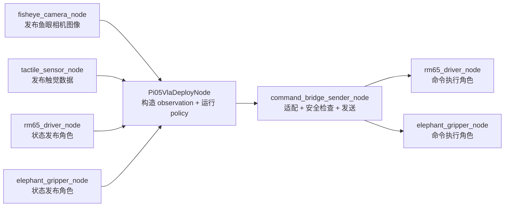
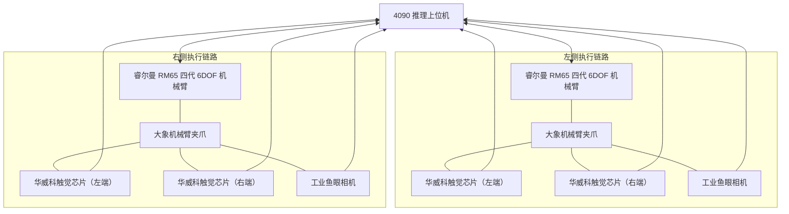
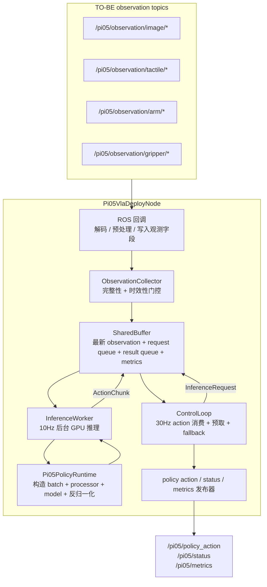

# 节点网络拓扑

```text
fisheye_camera_node -> Pi05VlaDeployNode
tactile_sensor_node -> Pi05VlaDeployNode
rm65_driver_node（状态发布角色） -> Pi05VlaDeployNode
elephant_gripper_node（状态发布角色） -> Pi05VlaDeployNode

Pi05VlaDeployNode
  -> command_bridge_sender_node
  -> rm65_driver_node（命令执行角色）
  -> elephant_gripper_node（命令执行角色）
```



> [!note] 节点实现约定
> 表格中将 `rm65_driver_node` 和 `elephant_gripper_node` 拆成“状态发布角色”与“命令执行角色”两行，是为了把 topic 订阅 / 发布契约说清楚。实际实现时，同一类硬件的状态读取和指令发送可以耦合在同一个 driver node 内。

| 节点                              | 职责                                                    | 边界                                      |
| ------------------------------- | ----------------------------------------------------- | --------------------------------------- |
| `fisheye_camera_node`           | 发布左右夹爪鱼眼相机图像。                                         | 只处理相机数据。                                |
| `tactile_sensor_node`           | 发布四个华威科触觉芯片数据。                                        | 只处理触觉数据。                                |
| `rm65_driver_node`（状态发布角色）      | 发布左右 RM65的TCP 状态。                                     | 作为传感器时只发布状态，不订阅命令 topic。                |
| `elephant_gripper_node`（状态发布角色） | 发布左右大象夹爪开合状态。                                         | 作为传感器时只发布状态，不订阅命令 topic。                |
| `Pi05VlaDeployNode`             | 读取各类 observation topics，构造模型输入，运行推理，输出 policy action。 | 不直接驱动 RM65 或夹爪硬件。                       |
| `command_bridge_sender_node`    | 将 policy action 转成 RM65 / 夹爪可执行指令，并执行安全检查与发送。         | 负责硬件面向的指令语义。                            |
| `rm65_driver_node`（命令执行角色）      | 订阅 RM65 目标指令，驱动左右机械臂执行。                               | 作为执行器时只订阅命令 topic，不在此角色下发布 observation。 |
| `elephant_gripper_node`（命令执行角色） | 订阅夹爪目标指令，驱动左右夹爪执行。                                    | 作为执行器时只订阅命令 topic，不在此角色下发布 observation。 |

## 节点 topic 契约（TO-BE 草案）

| 节点                           | 角色      | 订阅 topic                                                                                                                                                                                         | 发布 topic                                                                                                                                                                     |
| ---------------------------- | ------- | ------------------------------------------------------------------------------------------------------------------------------------------------------------------------------------------------ | ---------------------------------------------------------------------------------------------------------------------------------------------------------------------------- |
| `fisheye_camera_node`        | 相机数据发布  | 无                                                                                                                                                                                                | `/pi05/observation/image/left_gripper_fisheye`<br>`/pi05/observation/image/right_gripper_fisheye`                                                                            |
| `tactile_sensor_node`        | 触觉数据发布  | 无                                                                                                                                                                                                | `/pi05/observation/tactile/l1`<br>`/pi05/observation/tactile/l2`<br>`/pi05/observation/tactile/r1`<br>`/pi05/observation/tactile/r2`                                         |
| `rm65_driver_node`           | 状态发布角色  | 无                                                                                                                                                                                                | `/pi05/observation/arm/left_tcp_pose`<br>`/pi05/observation/arm/right_tcp_pose`                                                                                              |
| `elephant_gripper_node`      | 状态发布角色  | 无                                                                                                                                                                                                | `/pi05/observation/gripper/left_state`<br>`/pi05/observation/gripper/right_state`                                                                                            |
| `Pi05VlaDeployNode`          | 模型推理    | `/pi05/observation/image/left_gripper_fisheye`<br>`/pi05/observation/image/right_gripper_fisheye`<br>`/pi05/observation/tactile/*`（**第一版可选/不订阅**，后续版本必需）<br>`/pi05/observation/arm/*`<br>`/pi05/observation/gripper/*` | `/pi05/policy_action`<br>`/pi05/status`<br>`/pi05/metrics`                                                                                                                   |
| `command_bridge_sender_node` | 指令适配与发送 | `/pi05/policy_action`<br>`/pi05/observation/arm/*`<br>`/pi05/observation/gripper/*`                                                                                                              | `/pi05/command/arm/left_target`<br>`/pi05/command/arm/right_target`<br>`/pi05/command/gripper/left_target`<br>`/pi05/command/gripper/right_target`<br>`/pi05/command/status` |
| `rm65_driver_node`           | 命令执行角色  | `/pi05/command/arm/left_target`<br>`/pi05/command/arm/right_target`                                                                                                                              | 无                                                                                                                                                                            |
| `elephant_gripper_node`      | 命令执行角色  | `/pi05/command/gripper/left_target`<br>`/pi05/command/gripper/right_target`                                                                                                                      | 无                                                                                                                                                                            |

## topic 数据特征契约（TO-BE 草案）

### 相机视频流读取约定

| 项 | 契约 |
|---|---|
| 读取接口 | 优先复用阶段一 `gopro_camera_launch` + `v4l2_camera_node` 链路，从工业鱼眼相机的 V4L2 视频流读取图像。只有 V4L2 无法稳定接入时，才新增厂商 SDK adapter。 |
| 输入视频流编码 | 与阶段一采集模块对齐，默认 `pixel_format = YUYV`、`output_encoding = rgb8`。若工业鱼眼相机 / 采集卡只稳定支持 `MJPG`，可配置为 `MJPG`，但必须显式记录。 |
| 节点内部图像格式 | `uint8` RGB 图像，通道顺序为 `RGB`。 |
| ROS 发布格式 | `sensor_msgs/msg/Image`，`encoding = rgb8`。 |
| 禁止事项 | 不在 observation image topic 里发布未标明编码的原始字节流；不把左右相机图像拼成一个 topic。 |

### RM65 TCP pose 来源约定

TO-BE 中，Pi05 侧 observation 默认只消费 RM65 末端 TCP pose，不强制消费关节角 topic。

**为什么用 quaternion（不是 euler）**：阶段二数据清洗的 observation.state / action 都用 quaternion xyzw 归一化（`数据清洗交付说明.md:42,49`）。为让"送去 pi0.5 的 batch"与训练语义零转换，observation topic 必须发布 quaternion。

**RM65 硬件支持两种姿态表示**（均为权威文档确认）：
- `rm_pose_t`（`rm_pose_t.md`）同时含 `quaternion`（`rm_quat_t`，xyzw）和 `euler`（rad），二选一由调用方决定。
- UDP 实时状态推送 `rm_realtime_arm_joint_state_t.waypoint` 就是 `rm_pose_t`（`rm_realtime_arm_joint_state_t.md:23`），**可直接取 quaternion 字段**，无需从 euler 反转。
- 运动控制接口 `movep_canfd` 的 `pose_quat` 模式（`JSON 协议：运动指令集.md:587-591`）原生接收 `[x,y,z,qx,qy,qz,qw]` 定点数（×1e6），所以命令侧也是端到端 quaternion。

**`rm65_driver_node` 的职责**：把厂商 `rm_pose_t` / UDP 推送的 `waypoint.quaternion` 统一转成 `/pi05/observation/arm/*_tcp_pose`（`PoseStamped`，quaternion xyzw 归一化，position 单位 m）。若厂商某路状态只给 euler（如 `/rm_driver/udp_joint_pose_euler`），则在 driver node 内 euler→quaternion 转换一次，下游全部走 quaternion。关节角仅作调试、安全检查或 IK 兜底，不属于 observation 契约。

> [!warning] quaternion 归一化
> RM65 文档 `movep_canfd` 示例里的四元数数值（w:0.4,x:0.5,y:0.6,z:0.7）非归一化（模长≠1），仅作演示。实际发布前必须归一化，否则模型输入与训练分布不符。

### 夹爪状态/命令语义约定（width ↔ angle 转换边界）

大象夹爪硬件寄存器值是 `gripper_angle[0,100]`，但阶段二数据清洗的 state/action 夹爪段落是 `gripper_width[0,1]`（0=闭合,1=全开，`数据清洗交付说明.md:17-18,50`）。为让"送去 pi0.5 的 batch"与训练语义零转换，整个 **observation 和 policy_action 链路统一用 `gripper_width[0,1]`**；只有发往硬件的 command topic 用 `gripper_angle[0,100]`。

| 链路环节 | 表示 | 转换责任 |
|---|---|---|
| `/pi05/observation/gripper/*_state` | `gripper_width[0,1]` | `elephant_gripper_node`（状态发布角色）把硬件寄存器 `angle[0,100]` 映射成 `width[0,1]` |
| Pi05 节点内部 state（喂模型） | `gripper_width[0,1]` | 零转换（直接用 observation topic 的值） |
| `/pi05/policy_action` 夹爪段 | `gripper_width[0,1]` | 零转换（模型输出即此语义） |
| `/pi05/command/gripper/*_target` | `gripper_angle[0,100]` | `command_bridge_sender_node` 把 `width[0,1]` 映射成 `angle[0,100]` |

> [!warning] width↔angle 映射系数需硬件标定
> 理论上 `width = angle/100`（线性），但闭合点/全开点的真实寄存器值需用大象夹爪实物实测标定（modbus/pymycobot 文档值域 0..100 是名义值，实物可能有零点偏移）。标定完成前不接真机。

### topic 格式总表

| topic | ROS msg 格式 | 发布节点 | 现实语义 | 数据特征 |
|---|---|---|---|---|
| `/pi05/observation/image/left_gripper_fisheye` | `sensor_msgs/msg/Image`<br>`encoding: rgb8` | `fisheye_camera_node` | 左夹爪末端鱼眼相机看到的现场画面。 | `header.stamp` 为采集时间，`header.frame_id = left_gripper_fisheye`。 |
| `/pi05/observation/image/right_gripper_fisheye` | `sensor_msgs/msg/Image`<br>`encoding: rgb8` | `fisheye_camera_node` | 右夹爪末端鱼眼相机看到的现场画面。 | `header.stamp` 为采集时间，`header.frame_id = right_gripper_fisheye`。 |
| `/pi05/observation/tactile/l1` | `std_msgs/msg/Float32MultiArray` | `tactile_sensor_node` | 左夹爪第 1 片触觉芯片感受到的接触压力分布。 | `layout.dim[0].label = rows`，`layout.dim[1].label = cols`，`data` 按行优先展平。 |
| `/pi05/observation/tactile/l2` | `std_msgs/msg/Float32MultiArray` | `tactile_sensor_node` | 左夹爪第 2 片触觉芯片感受到的接触压力分布。 | `layout.dim[0].label = rows`，`layout.dim[1].label = cols`，`data` 按行优先展平。 |
| `/pi05/observation/tactile/r1` | `std_msgs/msg/Float32MultiArray` | `tactile_sensor_node` | 右夹爪第 1 片触觉芯片感受到的接触压力分布。 | `layout.dim[0].label = rows`，`layout.dim[1].label = cols`，`data` 按行优先展平。 |
| `/pi05/observation/tactile/r2` | `std_msgs/msg/Float32MultiArray` | `tactile_sensor_node` | 右夹爪第 2 片触觉芯片感受到的接触压力分布。 | `layout.dim[0].label = rows`，`layout.dim[1].label = cols`，`data` 按行优先展平。 |
| `/pi05/observation/arm/left_tcp_pose` | `geometry_msgs/msg/PoseStamped` | `rm65_driver_node` | 左 RM65 末端 TCP 在左臂基座坐标系下的当前位姿（step t 的 state 输入）。**与阶段二数据清洗 observation.state 同构。** | `header.frame_id = left_arm_base`，`position` 单位 `m`，`orientation` 使用 quaternion **xyzw 归一化**（喂给模型的 state 必须是 quaternion，不是 euler；转换见下方"RM65 TCP pose 来源约定"）。 |
| `/pi05/observation/arm/right_tcp_pose` | `geometry_msgs/msg/PoseStamped` | `rm65_driver_node` | 右 RM65 末端 TCP 在右臂基座坐标系下的当前位姿（step t 的 state 输入）。**与阶段二数据清洗 observation.state 同构。** | `header.frame_id = right_arm_base`，`position` 单位 `m`，`orientation` 使用 quaternion **xyzw 归一化**。 |
| `/pi05/observation/gripper/left_state` | `std_msgs/msg/Float32` | `elephant_gripper_node` | 左大象夹爪当前开合宽度（step t 的 state 输入）。**与阶段二数据清洗 observation.state 同构。** | `data = gripper_width`，归一化 `[0,1]`（0=闭合,1=全开）。**这是喂给模型的语义，不是大象夹爪寄存器值**；`elephant_gripper_node` 负责把硬件寄存器值 `gripper_angle[0,100]` 线性映射成 `gripper_width[0,1]` 后发布（见下方"夹爪状态/命令语义约定"）。 |
| `/pi05/observation/gripper/right_state` | `std_msgs/msg/Float32` | `elephant_gripper_node` | 右大象夹爪当前开合宽度（step t 的 state 输入）。**与阶段二数据清洗 observation.state 同构。** | `data = gripper_width`，归一化 `[0,1]`（0=闭合,1=全开）。转换同左。 |
| `/pi05/policy_action` | `std_msgs/msg/Float32MultiArray` | `Pi05VlaDeployNode` | 模型根据当前 observation 预测出的下一步双臂 TCP 目标和夹爪目标。**与阶段二数据清洗的 action 定义完全同构（零转换）。** | `data` 固定为 **16D**，段落交替排列：`[0,7)` left_tcp(x,y,z,qx,qy,qz,qw) `[7,8)` left_gripper_width `[8,15)` right_tcp(x,y,z,qx,qy,qz,qw) `[15,16)` right_gripper_width。pose 为绝对 TCP 目标（`action_t = target at step t+1`），单位 m + quaternion **xyzw 归一化**；夹爪 `gripper_width` 归一化 `[0,1]`（0=闭合,1=全开），**不是**大象夹爪寄存器值 `0..100`。坐标系左 `left_arm_base` / 右 `right_arm_base`。语义依据：阶段二 `数据清洗交付说明.md` action 段。 |
| `/pi05/status` | `std_msgs/msg/String` | `Pi05VlaDeployNode` | Pi05 推理节点当前是否可用、是否缺数据、是否报错。 | JSON 字符串，至少包含 `mode`、`observation_ready`、`policy_ready`、`last_error`。 |
| `/pi05/metrics` | `std_msgs/msg/String` | `Pi05VlaDeployNode` | Pi05 推理节点的运行统计和诊断指标。 | JSON 字符串，至少包含 `inference_count`、`latency_ms`、`rejected_action_count`、`fallback_count`、`last_error`。 |
| `/pi05/command/arm/left_target` | `geometry_msgs/msg/PoseStamped` | `command_bridge_sender_node` | 已通过安全检查、准备发送给左 RM65 的末端 TCP 目标。 | `header.frame_id = left_arm_base`，`position` 单位 `m`，`orientation` quaternion **xyzw 归一化**。**bridge 无需姿态转换**：`/pi05/policy_action` 里的 `[0,7)` 段（x,y,z,qx,qy,qz,qw）直接拆进 PoseStamped；RM65 `movep_canfd` 的 `pose_quat` 模式原生支持 quaternion，端到端无 euler 往返。 |
| `/pi05/command/arm/right_target` | `geometry_msgs/msg/PoseStamped` | `command_bridge_sender_node` | 已通过安全检查、准备发送给右 RM65 的末端 TCP 目标。 | `header.frame_id = right_arm_base`，`position` 单位 `m`，`orientation` quaternion **xyzw 归一化**。bridge 取 `/pi05/policy_action` 的 `[8,15)` 段填入。 |
| `/pi05/command/gripper/left_target` | `std_msgs/msg/Float32` | `command_bridge_sender_node` | 已通过安全检查、准备发送给左大象夹爪的角度目标（**硬件格式**）。 | `data = gripper_angle`，大象夹爪文档寄存器值域 `0..100`。**bridge 负责**把 `/pi05/policy_action` 里的 `left_gripper_width[0,1]` 线性映射成 `gripper_angle[0,100]` 后发布（见下方"夹爪状态/命令语义约定"）。 |
| `/pi05/command/gripper/right_target` | `std_msgs/msg/Float32` | `command_bridge_sender_node` | 已通过安全检查、准备发送给右大象夹爪的角度目标（**硬件格式**）。 | `data = gripper_angle`，大象夹爪文档寄存器值域 `0..100`。转换同左。 |
| `/pi05/command/status` | `std_msgs/msg/String` | `command_bridge_sender_node` | 指令桥接与发送节点对最近一次动作发送结果的反馈。 | JSON 字符串，至少包含 `action_id`、`safety_ok`、`sent_to_driver`、`failure_reason`。 |

> [!note] 命名状态
> 上表是 TO-BE topic 草案。它先固定每个 topic 的 ROS msg 格式、语义、坐标系、单位和数据结构。若后续需要自定义 msg，必须在 Contract Delta 中说明替换原因。

# 硬件拓扑

```text
4090 推理上位机
↔ 左侧睿尔曼 RM65 四代 6DOF 机械臂
↔ 左侧大象机械臂夹爪
← 左夹爪左端华威科触觉芯片
← 左夹爪右端华威科触觉芯片
← 左夹爪工业鱼眼相机 

4090 推理上位机
↔ 右侧睿尔曼 RM65 四代 6DOF 机械臂
↔ 右侧大象机械臂夹爪
← 右夹爪左端华威科触觉芯片
← 右夹爪右端华威科触觉芯片
← 右夹爪工业鱼眼相机 
```

| 硬件                   |  数量 | 说明             |
| -------------------- | --: | -------------- |
| 4090 推理上位机           |   1 | 运行模型推理与部署程序的主机 |
| 睿尔曼 RM65 四代 6DOF 机械臂 |   2 | 左右各一台机械臂       |
| 大象机械臂夹爪              |   2 | 每台机械臂末端安装一个夹爪  |
| 华威科触觉芯片              |   4 | 每个夹爪左右两端各一片    |
| 工业鱼眼相机               |   2 | 每个夹爪上安装一个      |



# 传感器数据发送节点

| 节点                              | 对应硬件                                | 读取来源                                                                  | 发布 topic                                                                                                                             | ROS msg 格式                                  | 现实语义                             | 关键开发契约                                                                                                  |
| ------------------------------- | ----------------------------------- | --------------------------------------------------------------------- | ------------------------------------------------------------------------------------------------------------------------------------ | ------------------------------------------- | -------------------------------- | ------------------------------------------------------------------------------------------------------- |
| `fisheye_camera_node`           | 左 / 右夹爪工业鱼眼相机                       | 优先复用阶段一 `gopro_camera_launch` + `v4l2_camera_node`；默认 `YUYV -> rgb8`，必要时配置 `MJPG -> rgb8`        | `/pi05/observation/image/left_gripper_fisheye`<br>`/pi05/observation/image/right_gripper_fisheye`                                    | `sensor_msgs/msg/Image`<br>`encoding: rgb8` | 左 / 右夹爪末端视角下的现场画面                | [[fisheye_camera_node 契约]]：阶段一复用、稳定设备路径、分辨率、帧率、编码转换、断流处理                                                        |
| `tactile_sensor_node`           | 四片华威科触觉芯片：`l1` / `l2` / `r1` / `r2` | 串口 / USB-Serial；按华威科协议解帧，校验 checksum / CRC                            | `/pi05/observation/tactile/l1`<br>`/pi05/observation/tactile/l2`<br>`/pi05/observation/tactile/r1`<br>`/pi05/observation/tactile/r2` | `std_msgs/msg/Float32MultiArray`            | 四片触觉芯片分别感受到的接触压力分布               | [[tactile_sensor_node 契约]]：芯片编号映射、串口参数、矩阵行列、展平顺序、坏帧处理                                                   |
| `rm65_driver_node`（状态发布角色）      | 左 / 右睿尔曼 RM65 四代 6DOF 机械臂           | 睿尔曼 `rm_driver` 末端位姿来源，例如 `/rm_driver/udp_joint_pose_euler` 或当前状态 API | `/pi05/observation/arm/left_tcp_pose`<br>`/pi05/observation/arm/right_tcp_pose`                                                      | `geometry_msgs/msg/PoseStamped`             | 左 / 右 RM65 末端 TCP 在各自基座坐标系下的当前位姿 | [[rm65_driver_node 状态发布契约]]：`left_arm_base` / `right_arm_base`、`m`、quaternion、厂商 topic 到 Pi05 topic 的转换 |
| `elephant_gripper_node`（状态发布角色） | 左 / 右大象机械臂夹爪                        | 夹爪串口 / SDK / 驱动状态读取                                                   | `/pi05/observation/gripper/left_state`<br>`/pi05/observation/gripper/right_state`                                                    | `std_msgs/msg/Float32`                      | 左 / 右夹爪当前开合程度                    | [[elephant_gripper_node 状态发布契约]]：`gripper_angle`、`0..100`值域、状态读取失败处理                                    |

# Pi05VlaDeployNode

## 宏观运行逻辑

`Pi05VlaDeployNode` 的核心运行逻辑保持和原始部署程序一致：它仍然是 **观测汇聚 + 模型推理 + policy action 产生节点**，不是直接驱动 RM65 机械臂或大象夹爪的硬件执行节点。

TO-BE 改造的主要变化不是推倒原有内部架构，而是替换节点边界上的输入 / 输出 topic。

```text
fisheye_camera_node / tactile_sensor_node / rm65_driver_node / elephant_gripper_node
  -> Pi05VlaDeployNode ROS 回调
  -> ObservationCollector
  -> ObservationSnapshot
  -> SharedBuffer.latest_observation
  -> ControlLoop 提交 InferenceRequest
  -> InferenceWorker 后台推理线程
  -> Pi05PolicyRuntime.predict_action_chunk(...)
  -> ActionChunk
  -> ControlLoop 按 control_hz 选择单步 action
  -> policy action 检查 / fallback / metrics
  -> /pi05/policy_action + /pi05/status + /pi05/metrics
```

这个节点需要保留 AS-IS 中已经成立的并发和调度模型：

- ROS 回调只负责解码 observation topic，并把字段写入 `ObservationCollector`。
- `ObservationCollector` 只在必需字段齐全且未过期时，才产生一个完整的 `ObservationSnapshot`。
- `SharedBuffer` 仍然是 latest-only 缓冲区，新 observation、新 request 和新 action chunk 可以覆盖旧值，优先保证低延迟而不是保留全量历史。
- `ControlLoop` 仍然以 `runtime.control_hz` 运行，不等待 GPU 推理完成，只在当前 action chunk 接近预取点时提交新的 `InferenceRequest`。
- `InferenceWorker` 仍然作为后台线程运行，按 `runtime.inference_hz` 消费最新推理请求，调用 `Pi05PolicyRuntime.predict_action_chunk()`，并写回 `ActionChunk`。
- `ControlLoop` 仍然检查 chunk 的 shape、时效性和 NaN / Inf，然后每个 tick 消费一步 action。
- TO-BE 中，该节点只发布 `/pi05/policy_action`，不直接控制 RM65 或夹爪；硬件指令转换和真正发送由 `command_bridge_sender_node` 负责。



## 保持不变的内部组件职责

| 运行时对象 | 沿用 AS-IS 的内容 | TO-BE 边界变化 |
|---|---|---|
| `Pi05VlaDeployNode` | 持有 collector、shared buffer、control loop、inference worker、publisher 和 timer。 | 替换订阅 topic 和最终发布 topic。 |
| `ObservationCollector` | 缓存最新观测字段，并控制 snapshot 的完整性和时效性。 | 字段集从旧 Realsense / picotele 语义改成鱼眼相机 / 触觉 / RM65 / 夹爪语义。 |
| `SharedBuffer` | 作为 callback、control loop 和 inference worker 之间的 latest-only 线程安全交接区。 | 架构上不建议改动。 |
| `InferenceWorker` | 后台消费 `InferenceRequest`，调用 policy，写回 `ActionChunk`。 | 架构上不建议改动。 |
| `Pi05PolicyRuntime` | 加载 bundle、构造 policy batch、执行模型前向、对 action chunk 反归一化。 | batch adapter 必须匹配 TO-BE observation 字段和新 bundle manifest。 |
| `ControlLoop` | 按 `control_hz` 消费 action chunk，预取推理请求，在 chunk 边界切换 / 平滑，并处理 fallback。 | 最终输出改为 `/pi05/policy_action`，不再发布四个硬件命令 topic。 |
| `SafetyGuard` | 保留 action shape、finite、单步变化约束等和 policy action 相关的检查。 | 硬件安全检查下移到 `command_bridge_sender_node`，本节点不假装掌握 RM65 SDK 或夹爪执行结果。 |


## 必须修正的数据语义清单

本次改造不以改动 `ControlLoop`、`InferenceWorker`、`SharedBuffer` 等核心调度结构为目标。需要明确修正的是数据在管线内的语义：同样是 observation、state 和 action，但它们代表的真实物理含义已经改变。

| 数据类别                         | AS-IS 语义                                                                   | TO-BE 语义                                                                                                                                         | 必须修改的代码边界                                                                                                                            |
| ---------------------------- | -------------------------------------------------------------------------- | ------------------------------------------------------------------------------------------------------------------------------------------------ | ------------------------------------------------------------------------------------------------------------------------------------ |
| 图像 observation               | `top` / `left_wrist` / `right_wrist` 等旧相机 key                              | 左夹爪鱼眼图像 + 右夹爪鱼眼图像                                                                                                                                | topic schema、`_image_topic_map()`、`required_image_keys`、bundle manifest 中的 camera names、`_build_batch()` 中的 image key                |
| 机械臂状态                        | 左 / 右 6D 关节角 `left_arm_q` / `right_arm_q`，外加 EE pos / rpy                  | **只需要左 / 右 RM65 末端 TCP 位姿**（quaternion xyzw + m，与数据清洗 state 同构），不再把机械臂关节角作为模型输入必需字段                                                              | `ObservationCollector._required_value_keys()`、TCP pose callback、state codec、`ObservationSnapshot`、`Pi05PolicyRuntime._build_batch()` |
| 夹爪状态                         | `left_hand_q` / `right_hand_q`，旧数据集手部尺度                                    | 左 / 右大象夹爪**归一化开合宽度 `gripper_width[0,1]`**（0=闭合,1=全开，与数据清洗 state 同构）；硬件寄存器 `gripper_angle[0,100]` 仅在 `elephant_gripper_node`/`command_bridge_sender_node` 边界转换 | gripper state topic、`update_gripper_state()`、state codec、action codec、safety range                                                   |
| 触觉 observation               | AS-IS 中没有四片触觉芯片的必需语义                                                       | `l1`、`l2`、`r1`、`r2` 四路华威科触觉数组                                                                                                                    | topic schema、tactile callback、`update_tactile()`、snapshot 字段、batch adapter、bundle manifest                                           |
| policy state / encoded state | AS-IS 固定为 26D：关节角 + 手部 + EE pos/rpy                                        | **分两版**：第一版 **16D**（`left_tcp_pose[7] + right_tcp_pose[7] + left_gripper_width[1] + right_gripper_width[1]`，无触觉，bundle 用 16D 训练）；后续版本 **32D**（追加触觉×4片[16]，每片聚合为 4D）。pose 用 quaternion xyzw 归一化。**第一版代码必须预留触觉段落位置**（config 开关），后续加触觉不必重写 batch 装配。                                                          | `state_codec.py`、normalizer 维度、bundle manifest、`_build_batch()`                                                                      |
| policy action                | AS-IS 14D：`left_arm_joint6 + right_arm_joint6 + left_hand + right_hand`（关节绝对命令） | TO-BE **16D**（与数据清洗 action 同构，零转换）：`left_tcp(x,y,z,qx,qy,qz,qw)[7] + left_gripper_width[1] + right_tcp(x,y,z,qx,qy,qz,qw)[7] + right_gripper_width[1]`，绝对 TCP 目标，pose 用 quaternion xyzw 归一化，夹爪 width[0,1] | `action_spec.py`、`action_codec.py`、`SafetyGuard`、`ControlLoop` 中的 action 命名、`/pi05/policy_action` publisher                          |
| safety 尺度                    | 关节空间检查：`max_joint_delta_rad`、joint limits、`hand_min=300` / `hand_max=1000` | policy-action 层检查：TCP 位移步长、TCP 姿态步长(quaternion delta)、gripper_width 值域[0,1]、NaN / Inf；硬件限幅（angle 0..100）下移到 bridge                         | `SafetyConfig`、`SafetyGuard`、metrics 中的 rejected reason                                                                              |
| 最终发布语义                       | 直接发布 `/pi05_vla/command/*` 四路硬件候选命令                                        | 只发布 `/pi05/policy_action`，下游 `command_bridge_sender_node` 负责转成 RM65 / 大象夹爪可执行命令                                                                  | publisher 创建、`_control_tick()`、status / metrics                                                                                      |


> [!note] 大象夹爪值域依据
> 已核对 [[01-doing/ROS/DOCS/01_知识/阶段四：模型部署/硬件开发文档/大象夹爪开发/modbus rtu协议控制.md]] 和 [[01-doing/ROS/DOCS/01_知识/阶段四：模型部署/硬件开发文档/大象夹爪开发/pymycobot库控制.md]]：“设置 / 读取夹爪角度”的文档值域是 `0..100`。`300..800` 或 `300..1000` 不应写成大象夹爪的 TO-BE 开合值域。
特别约束：**机械臂状态只使用左 / 右末端 TCP 位姿作为模型输入语义**。`Pi05VlaDeployNode` 不再要求左 / 右 6D 关节角作为 policy observation 的必需字段。如果下游 `command_bridge_sender_node` 为 IK、workspace 或安全检查需要关节状态，应在下游硬件执行链路内部自行获取，不应把其反向引入 `Pi05VlaDeployNode` 的 policy input contract。

## 源码修改角度

### 1. 配置和 topic schema

相关 AS-IS 文件：

- `pi05/deploy/src/pi05/deploy/config/schema.py`
- `pi05/deploy/config/deploy.yaml`

TO-BE 修改方向：

- 用本契约中已定义的新 observation topic 替换旧 observation topic。
- 将原本面向 `/pi05_vla/command/*` 的四路 command publisher 改为一个 `/pi05/policy_action` publisher。
- 保留 `inference_hz`、`control_hz`、`chunk_size`、`execute_horizon`、`prefetch_steps`、`blend_steps`、`max_action_age_sec`、`fallback_policy` 等调度配置。

### 2. `pi05_vla_deploy_node.py` 中的 ROS 订阅

相关 AS-IS 文件：

- `pi05/deploy/src/pi05/deploy/ros_nodes/pi05_vla_deploy_node.py`

TO-BE 修改方向：

- 保留 `__init__()` 中创建 `ObservationCollector`、`SharedBuffer`、`ControlLoop`、`Pi05PolicyRuntime`、`InferenceWorker` 的顺序和职责。
- 将 `_image_topic_map()` 改为两路夹爪鱼眼相机的 topic map。
- 将旧的 aggregate proprioception / hand JointState / EE Point / EE Vector3 订阅替换为 TO-BE 订阅：
  - 左右鱼眼图像
  - 四片触觉芯片数据
  - 左右 RM65 TCP pose
  - 左右夹爪开合状态
- 保留 `_publish_observation_if_ready()` 语义：完整且未过期就写入 `SharedBuffer`，否则节流记录 missing fields。

### 3. `observation_collector.py` 中的 observation 组装

相关 AS-IS 文件：

- `pi05/deploy/src/pi05/deploy/runtime/observation_collector.py`

TO-BE 修改方向：

- 保持 `ObservationCollector` 作为判断 observation 是否齐全的唯一边界。
- 将 AS-IS 中的必需字段替换为 TO-BE 必需字段：
  - 左 / 右夹爪鱼眼图像
  - `l1`、`l2`、`r1`、`r2` 四路触觉数组
  - 左 / 右 RM65 TCP pose
  - 左 / 右夹爪开合状态
- 增加按语义分组的 update 方法，例如 `update_tactile(...)`、`update_tcp_pose(...)`、`update_gripper_state(...)`。
- 保留基于 `time.monotonic()` 的字段时效性检查。
- 不要把 state vector 构造逻辑分散到 ROS 回调里；observation 到 policy 输入的编码必须集中在 collector / codec / policy adapter 边界内。

### 4. `ObservationSnapshot` 和 policy batch adapter

相关 AS-IS 文件：

- `pi05/deploy/src/pi05/deploy/runtime/shared_buffer.py`
- `pi05/deploy/src/pi05/deploy/models/policy_loader.py`
- `pi05/common/src/pi05/common/data/state_codec.py`

TO-BE 修改方向：

- 保留 `ObservationSnapshot` 作为从 callback 传到 inference 的不可变观测单元。
- 扩展或适配 `ObservationSnapshot`，使其能承载鱼眼图像、触觉数组、左 / 右 RM65 末端 TCP pose、左 / 右夹爪开合状态和模型需要的新 encoded state。
- `Pi05PolicyRuntime._build_batch()` 必须是唯一的 `ObservationSnapshot -> model processor input` 映射位置。
- 新 bundle 应显式声明新的 state schema，不应默认继续沿用 AS-IS 26D state 语义。
- 如果新 bundle 期望 TCP / tactile native input，则必须同步更新 state / tactile codec 和 bundle manifest，不能静默复用旧 26D 语义。

### 5. `ControlLoop` 和 `InferenceWorker`

相关 AS-IS 文件：

- `pi05/deploy/src/pi05/deploy/runtime/control_loop.py`
- `pi05/deploy/src/pi05/deploy/runtime/inference_worker.py`

TO-BE 修改方向：

- 优先不重写这两个组件。
- 保留 latest-only queue。
- 保留异步推理。
- 保留推理请求预取行为。
- 保留 chunk 的 shape / freshness / finite 检查。
- 保留 `safe_stop`、`hold_last_action`、`continue_old_chunk` 等 fallback policy。
- 只调整最终发布边界，让当前选中的单步 action 发布为 `/pi05/policy_action`，而不是直接发布机械臂 / 夹爪命令 topic。

### 6. policy action 发布器

相关 AS-IS 文件：

- `pi05/deploy/src/pi05/deploy/ros_nodes/pi05_vla_deploy_node.py`

TO-BE 修改方向：

- 移除或停用 AS-IS 中的四路命令 publisher：`left_arm_pub`、`right_arm_pub`、`left_hand_pub`、`right_hand_pub`。
- 新增 `policy_action_pub`，发布到 `/pi05/policy_action`。
- 按本契约 topic 表中的 **16D** 语义（与阶段二数据清洗 action 同构），用 `std_msgs/msg/Float32MultiArray` 发布单步 policy action。
- `Pi05VlaDeployNode` 不将这个向量转成 RM65 API 调用或大象夹爪命令，这些工作属于下游 `command_bridge_sender_node`。

### 7. 安全检查和职责切分

相关 AS-IS 文件：

- `pi05/deploy/src/pi05/deploy/runtime/safety_guard.py`

TO-BE 修改方向：

- 本节点只保留 policy-action 层的通用检查：action shape、NaN / Inf、chunk 时效性、单步变化约束。
- 以下硬件相关检查下移到 `command_bridge_sender_node`：RM65 workspace、IK / 可执行性、机械臂 SDK 返回码、夹爪发送结果、急停 / deadman / real-robot enable gate。
- `Pi05VlaDeployNode` 不应宣称机器人命令已执行，它只能宣称 policy action 已产生并已发布。

### 8. metrics 和 status

相关 AS-IS 文件：

- `pi05/deploy/src/pi05/deploy/runtime/shared_buffer.py`
- `pi05/deploy/src/pi05/deploy/ros_nodes/pi05_vla_deploy_node.py`

TO-BE 修改方向：

- 保留 `/pi05/status` 和 `/pi05/metrics` 作为节点级可观测性 topic。
- metrics 至少继续暴露 `inference_count`、`inference_error_count`、`inference_request_count`、`chunk_result_count`、`discarded_chunk_count`、`fallback_count`、`rejected_action_count`、`published_action_count`、`last_inference_latency_s`、`ema_inference_latency_s` 和 `last_error`。
- 新增 TO-BE observation 诊断：缺失的 image / tactile / arm / gripper 字段、过期字段原因、最近一次 policy action 发布时间。

## 修改边界

本节点允许修改：

- topic config schema
- ROS 订阅创建
- ROS 回调字段 adapter
- observation collector 必需字段集
- observation snapshot / policy batch adapter
- 最终 policy action publisher
- status 和 metrics payload

除非 Contract Delta 明确要求，否则不建议修改：

- `LatestQueue` 语义
- 异步 `InferenceWorker` 架构
- `ControlLoop` 的预取 / chunk / blend 机制
- 模型 bundle 加载流程
- 下游硬件命令执行逻辑

禁止把以下职责移入 `Pi05VlaDeployNode`：

- 直接发送 RM65 机械臂命令。
- 直接发送大象夹爪命令。
- 把硬件 SDK 错误伪装成 `Pi05VlaDeployNode` 已经处理的执行结果。
- 把 topic 适配、policy 推理和硬件发送揉成一个大节点。

# 指令桥接与发送节点

本模块位于 `Pi05VlaDeployNode` 下游。它的输入必须严格对齐 `Pi05VlaDeployNode` 发布的 `/pi05/policy_action`：

```text
/pi05/policy_action
= 16D Float32MultiArray（与阶段二数据清洗 action 同构，零转换）
= left_tcp(x, y, z, qx, qy, qz, qw)[7]   # m + quaternion xyzw 归一化
+ left_gripper_width[1]                   # normalized [0,1]，0=闭合 1=全开
+ right_tcp(x, y, z, qx, qy, qz, qw)[7]
+ right_gripper_width[1]
```

`Pi05VlaDeployNode` 只承诺产生 policy action，不承诺硬件已执行。因此，本模块是 **policy action 到硬件可执行指令** 的语义边界，负责安全门控、坐标系转换、输出 topic 适配和硬件发送结果记录。

| 节点                              | 对应硬件 / 上游                              | 读取来源                                                                              | 订阅 topic                                                                                                                                                                                      | 发布 topic                                                                                                                                                                     | ROS msg 格式                                                                                                                 | 现实语义                                                                   | 关键开发契约                                                                                                                    |
| ------------------------------- | -------------------------------------- | --------------------------------------------------------------------------------- | --------------------------------------------------------------------------------------------------------------------------------------------------------------------------------------------- | ---------------------------------------------------------------------------------------------------------------------------------------------------------------------------- | -------------------------------------------------------------------------------------------------------------------------- | ---------------------------------------------------------------------- | ------------------------------------------------------------------------------------------------------------------------- |
| `command_bridge_sender_node`    | 上游 `Pi05VlaDeployNode`；下游 RM65 双臂和大象夹爪 | `/pi05/policy_action`；左 / 右 RM65 当前 TCP pose；左 / 右夹爪当前角度；急停 / enable / deadman 状态 | `/pi05/policy_action`<br>`/pi05/observation/arm/left_tcp_pose`<br>`/pi05/observation/arm/right_tcp_pose`<br>`/pi05/observation/gripper/left_state`<br>`/pi05/observation/gripper/right_state` | `/pi05/command/arm/left_target`<br>`/pi05/command/arm/right_target`<br>`/pi05/command/gripper/left_target`<br>`/pi05/command/gripper/right_target`<br>`/pi05/command/status` | 输入：`std_msgs/msg/Float32MultiArray`<br>输出：`geometry_msgs/msg/PoseStamped` + `std_msgs/msg/Float32` + `std_msgs/msg/String` | 将 **16D** policy action 解析为左 / 右 RM65 TCP 目标（quaternion 直接拆装）和左 / 右大象夹爪角度目标（width→angle 映射），并在发送前进行硬件相关安全检查 | [[command_bridge_sender_node 契约]]：policy action **16D** 解析顺序、TCP 坐标系、workspace / IK 检查、gripper_angle `0..100` 限幅、quaternion 归一化校验、失败不发送、回执状态记录 |
| `rm65_driver_node`（命令执行角色）      | 左 / 右睿尔曼 RM65 四代 6DOF 机械臂              | `command_bridge_sender_node` 发布的左 / 右 TCP 目标                                      | `/pi05/command/arm/left_target`<br>`/pi05/command/arm/right_target`                                                                                                                           | 可选：执行结果 / SDK 返回码 topic；若暂不单独发布，则由 `command_bridge_sender_node` 写入 `/pi05/command/status`                                                                                    | `geometry_msgs/msg/PoseStamped`                                                                                            | 接收已通过桥接节点安全检查的末端 TCP 目标，调用 RM65 驱动 / SDK 执行                            | [[rm65_driver_node 命令执行契约]]：`left_arm_base` / `right_arm_base`、单位 `m`、quaternion 姿态、超时、SDK 返回码、急停时拒绝执行                    |
| `elephant_gripper_node`（命令执行角色） | 左 / 右大象机械臂夹爪                           | `command_bridge_sender_node` 发布的左 / 右夹爪角度目标                                       | `/pi05/command/gripper/left_target`<br>`/pi05/command/gripper/right_target`                                                                                                                   | 可选：夹爪执行结果 topic；若暂不单独发布，则由 `command_bridge_sender_node` 写入 `/pi05/command/status`                                                                                            | `std_msgs/msg/Float32`                                                                                                     | 接收已限幅的大象夹爪角度值，通过夹爪串口 / SDK / Modbus RTU 执行开合                           | [[elephant_gripper_node 命令执行契约]]：`gripper_angle` 文档值域 `0..100`、不沿用 `300..800`、失败返回、指令间隔、串口异常处理                            |

## 与 `Pi05VlaDeployNode` 的接口对齐

`command_bridge_sender_node` 必须把 `/pi05/policy_action` 当作上游唯一的 policy action 来源。它不应重新调用模型，也不应读取 `Pi05VlaDeployNode` 内部的 `SharedBuffer`、`ActionChunk` 或 `ControlLoop` 状态。

### `/pi05/policy_action` 解析契约

action 为 **16D**，与阶段二数据清洗 action 同构。pose 段是 quaternion（端到端 quaternion，**无 rpy↔quaternion 转换**）；夹爪段是 `gripper_width[0,1]`，bridge 负责映射成硬件 `gripper_angle[0,100]`。

| 维度范围 | 字段 | 单位 | 坐标系 / 值域 | 下游用法 |
|---|---|---|---|---|
| `[0:3]` | `left_tcp_xyz` | `m` | `left_arm_base` | 直接填 `/pi05/command/arm/left_target.position` |
| `[3:7]` | `left_tcp_quat` | quaternion xyzw 归一化 | `left_arm_base` | 直接填 `/pi05/command/arm/left_target.orientation`（**无需 rpy 转换**，RM65 `movep_canfd.pose_quat` 原生支持 quaternion） |
| `[7]` | `left_gripper_width` | normalized `[0,1]` | 0=闭合,1=全开 | 映射成 `gripper_angle = width*100`（或按硬件标定系数），限幅 `[0,100]` 后发布到 `/pi05/command/gripper/left_target` |
| `[8:11]` | `right_tcp_xyz` | `m` | `right_arm_base` | 直接填 `/pi05/command/arm/right_target.position` |
| `[11:15]` | `right_tcp_quat` | quaternion xyzw 归一化 | `right_arm_base` | 直接填 `/pi05/command/arm/right_target.orientation` |
| `[15]` | `right_gripper_width` | normalized `[0,1]` | 0=闭合,1=全开 | 映射成 `gripper_angle`，限幅后发布到 `/pi05/command/gripper/right_target` |

## 指令发送前必须执行的检查

| 检查项 | 执行节点 | 失败时行为 |
|---|---|---|
| action 维度必须为 **16D** | `command_bridge_sender_node` | 不发送任何硬件命令，写入 `/pi05/command/status.failure_reason` |
| action 必须全部 finite | `command_bridge_sender_node` | 不发送，记录 NaN / Inf 原因 |
| quaternion 必须归一化（模长≈1） | `command_bridge_sender_node` | 不发送，记录未归一化原因（或配置为自动归一化） |
| TCP 目标必须在 RM65 workspace 内 | `command_bridge_sender_node` | 不发送机械臂命令，记录越界侧和越界值 |
| TCP 目标必须能被 IK 解析（**发送前预检**） | `command_bridge_sender_node`（调 `rm_inverse_kinematics`，`flag=0` 四元数模式，不执行只查） | 可解才发；不可解则**不发送**，记录 IK 不可解原因到 `/pi05/command/status.failure_reason`（坏命令不到达控制器） |
| `gripper_width` 必须在 `[0,1]`；映射后 `gripper_angle` 限幅 `0..100` | `command_bridge_sender_node` | width 越界则不发送；angle 映射后限幅，strict mode 下直接拒绝 |
| real-robot enable / 急停 / deadman 必须允许执行 | `command_bridge_sender_node` | 不发送任何机械臂或夹爪命令 |
| 硬件发送超时或 SDK 返回错误 | `rm65_driver_node` / `elephant_gripper_node` 或 `command_bridge_sender_node` | 写入 `/pi05/command/status`，不把失败伪装成成功 |

## 边界约束

- `command_bridge_sender_node` 可以订阅当前 TCP pose 和夹爪状态，用于做步长限制、workspace 检查和诊断；但它不应改写 `Pi05VlaDeployNode` 的 observation 语义。
- `/pi05/policy_action` 中的 TCP 目标默认是绝对目标位姿，坐标系分别为 `left_arm_base` 和 `right_arm_base`。如果后续改成 delta 语义，必须写入 Contract Delta。
- `rm65_driver_node` 和 `elephant_gripper_node` 可以在实现上同时具备“状态发布”和“命令执行”能力，但文档中必须把两种角色分开描述，避免 topic 边界混乱。
- 真机执行成功 / 失败的权威记录应来自硬件执行节点或 `command_bridge_sender_node` 的 `/pi05/command/status`，不应由 `Pi05VlaDeployNode` 的 `/pi05/status` 替代。
