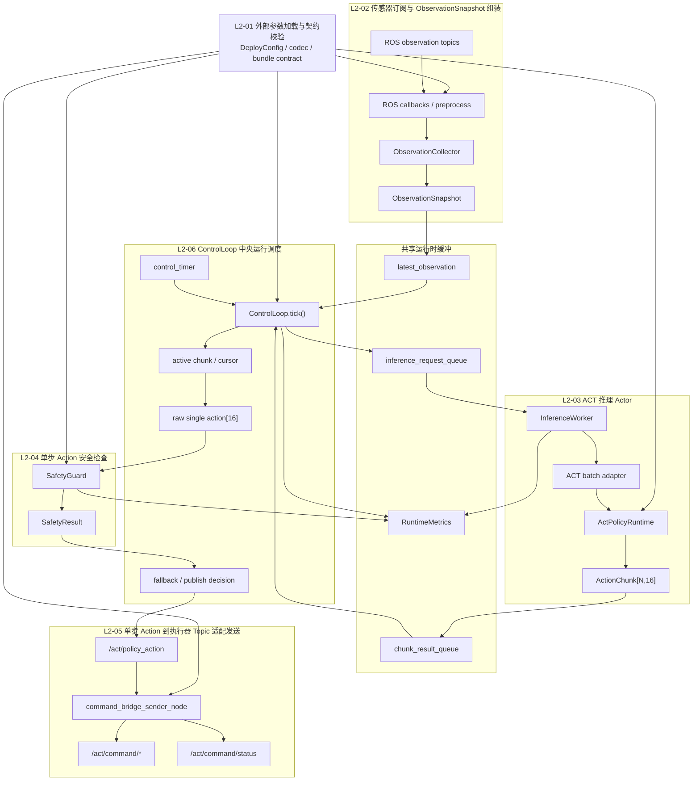
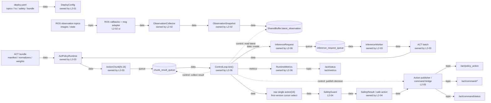
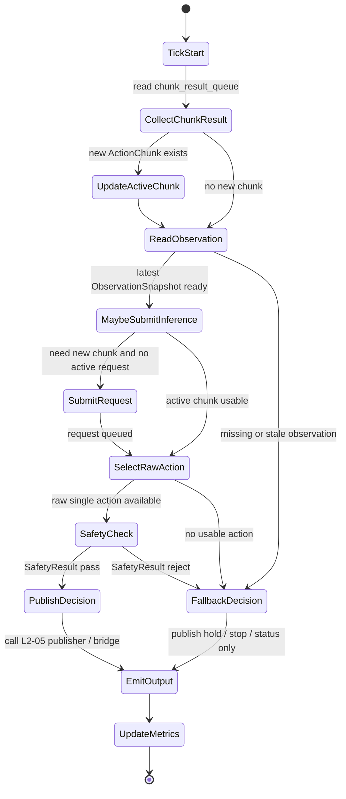
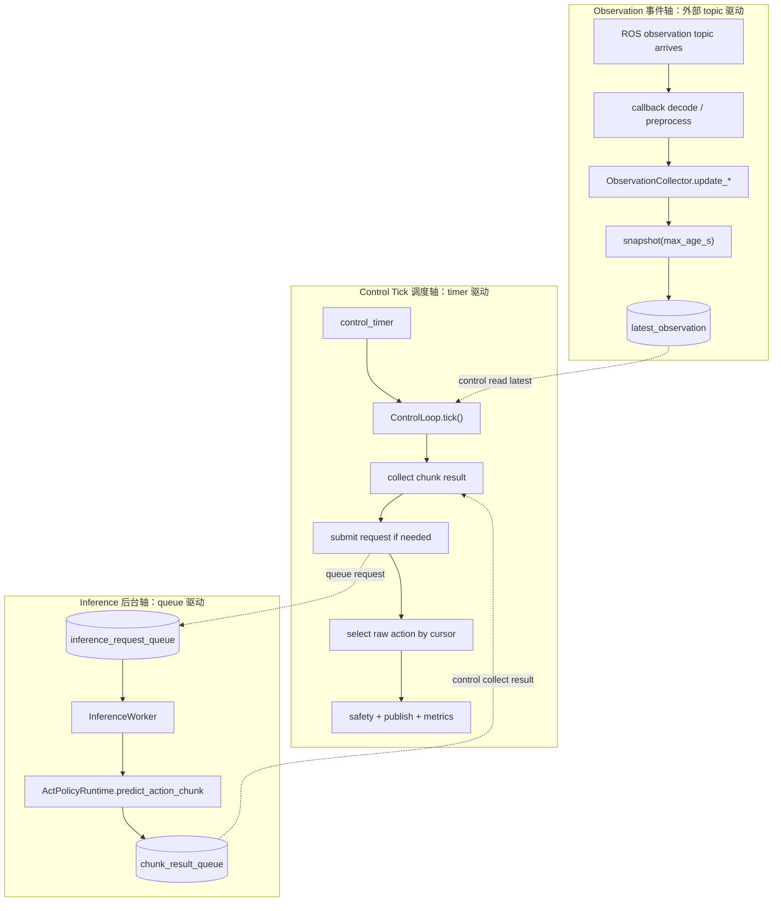
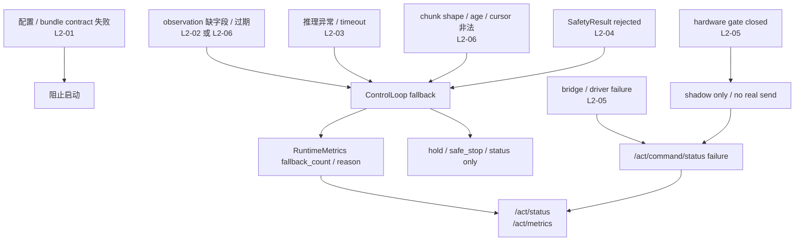
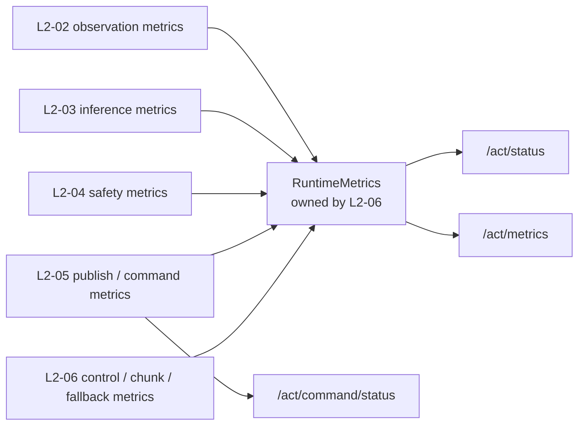
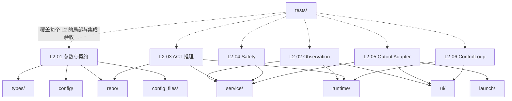

# L1 ACT 功能模块协作架构（Agent 上下文版）

> [!info] 产物归属
> - 类型：L1 架构协作包中的 Agent 权威协作上下文（阶段四：模型部署）。
> - 目标路径：`DOCS/03_工程/阶段四：模型部署/02_implement/agent_context/03_L1_ACT功能模块协作架构.md`。
> - 上游任务文档：`01_L1_ACT部署程序任务文档.md`。
> - 上游边界文档：`02_L1_ACT功能模块边界.md`。
> - 适用对象：第一版 ACT 部署程序的 L2 功能模块协作、运行时数据关系和控制关系。
> - Agent 消费目的：完整理解各功能模块之间的协作方式，支持后续 L2 功能设计和 L3 微元任务生成。
> - 本文职责：作为 Agent 权威上下文说明 6 个第一版 L2 功能模块之间如何协作，不重复定义单模块边界（指向 `02_L1_ACT功能模块边界.md`），不替代 L2 任务卡片和 L3 实施文件。
> - 人类消费入口：`../ACT架构交互可视化.html`。

## 0. 消费者分工与本文定位

L1 架构协作包按消费对象拆分为 4 个产物：

| 消费者 | 消费产物 | 消费目的 | 信息密度 |
|---|---|---|---|
| Agent | `01_L1_ACT部署程序任务文档.md` | 获取 L1 总目标、L2 清单与开发顺序、L1 验收口径。 | 中。任务管理属性。 |
| Agent | `02_L1_ACT功能模块边界.md` | 完整理解每个 L2 的功能边界。 | 高。逐模块边界契约。 |
| Agent | 本文档（功能模块协作架构） | 完整理解模块间协作关系，减少数据流和接口歧义。 | 高。协作关系契约。 |
| 人类 | `../ACT架构交互可视化.html` | 快速理解整体架构、模块协作和模块边界，更好地指挥 Agent。 | 低。可视化为主。 |

权威关系：

- HTML 是人类理解入口，不作为 L3 生成依据。
- 本文是 Agent 的协作权威上下文；HTML 与本文冲突时以本文为准。
- 本文不重复定义单模块边界，单模块的输入/输出/负责/不负责见 `02_L1_ACT功能模块边界.md`。
- L2 设计 Agent 和 L3 生成 Agent 必须同时读取本文与边界 MD，确认协作接口和模块边界后再展开内部设计。

后续 Agent 使用本文时，必须至少抽取以下信息：

1. 当前 L2 的上下游模块。
2. 当前 L2 消费和生产的 RAM 对象。
3. 当前 L2 与 `ControlLoop.tick()` 的控制关系。
4. 当前 L2 的同步 / 异步边界。
5. 当前 L2 的失败传播方式。
6. 当前 L2 贡献或消费的 metrics / status。

## 1. 架构总览

ACT 部署程序第一版由 6 个运行时功能闭环组成：

| 运行角色 | 核心职责 | 对应 L2 |
|---|---|---|
| 外部输入角色 | 把外部参数和传感器数据带入当前 Python 进程 RAM。 | L2-01、L2-02 |
| 后台计算角色 | 把稳定的 RAM 内部对象加工成模型输出或安全动作。 | L2-03、L2-04 |
| 外部输出角色 | 把内部动作对象转换成外部执行器可消费的 topic 消息。 | L2-05 |
| 中央调度角色 | 按时间、状态和失败条件组织各服务持续运行。 | L2-06 |

整体协作关系：

```text
L2-01 外部参数加载与契约校验
  -> 为所有模块提供 DeployConfig、数据规格、topic 名、bundle 契约

L2-02 传感器订阅与 ObservationSnapshot 组装
  -> 持续写入 SharedBuffer.latest_observation

L2-06 ControlLoop 中央运行调度
  -> 读取 latest_observation
  -> 提交 InferenceRequest
  -> 接收 ActionChunk
  -> 第一版维护 active chunk 与 cursor，直取 raw single action
  -> 调 L2-04 得到 safe action
  -> 调 L2-05 发布或发送

L2-03 ACT 推理 Actor
  -> 从 InferenceRequest 读取 ObservationSnapshot
  -> 写入 ActionChunk

L2-05 执行器 Topic 适配发送
  -> 将 safe action 发布为 /act/policy_action
  -> 必要时通过 command_bridge 转成 /act/command/*
```

第一版不设置独立的 ActionChunk 平滑 L2。smoothstep blend、跨 chunk 融合、RTC 类平滑和复杂时间对齐全部降级为后续优化方向，不作为第一版 Gate 条件。

## 2. 模块协作图



## 3. 宏观数据流契约



边界判断：

- `ObservationSnapshot` 是外部 observation 世界进入 RAM 后的冻结对象。
- `InferenceRequest` 是 ControlLoop 对后台推理发出的异步请求，不是模型输入 batch。
- `ActionChunk` 是模型输出的动作块，不是当前 tick 一定会发布的单步 action。
- 第一版 `raw single action` 由 L2-06 从 active chunk 按 cursor 直取，不做 smoothstep blend。
- `SafetyResult` 是动作能否进入输出边界的判断结果。
- `/act/policy_action` 和 `/act/command/*` 是外部输出，不再属于纯 RAM 内部数据流。

## 4. 关键 RAM 对象与所有权

| 对象 | 创建 / 维护方 | 主要消费者 | 说明 |
|---|---|---|---|
| `DeployConfig` | L2-01 | 全部 L2 | 外部静态参数进入 RAM 后形成的配置对象。 |
| `StateSpec / ActionSpec` | L2-01 | L2-02、L2-03、L2-04、L2-05 | 定义 16D state/action 的维度、段序、字段语义和值域。 |
| `ObservationSnapshot` | L2-02 | L2-03、L2-06 | 一次完整、新鲜的观测冻结对象。 |
| `SharedBuffer.latest_observation` | L2-02 写入，L2-06 读取 | L2-06 | latest-only，不保存历史队列。 |
| `InferenceRequest` | L2-06 创建 | L2-03 | 总控决定何时请求后台推理。 |
| `ActionChunk` | L2-03 创建 | L2-06 | 后台推理产出的动作块。 |
| `active chunk / cursor` | L2-06 维护 | L2-06 | 第一版只维护当前 chunk 和 step cursor，不做跨 chunk 平滑。 |
| `raw single action` | L2-06 创建 | L2-04 | 从 active chunk 中直取的单步动作。 |
| `SafetyResult` | L2-04 创建 | L2-06、L2-05 | 表示安全检查通过、拒绝或 fallback 依据。 |
| `RuntimeMetrics` | L2-06 统一汇总，各模块贡献事件 | L2-05 / status publisher | 记录推理、chunk、发布、安全、fallback 等状态。 |

## 5. ControlLoop 调控契约

`ControlLoop.tick()` 不是普通加工函数，而是中央总控。第一版允许它持有最小 chunk 消费状态，因为该状态直接决定调度和 fallback；但不得把 ACT batch、模型前向、安全检查或硬件适配实现塞进 `tick()`。



控制原则：

- `tick()` 可以决定是否提交 `InferenceRequest`，但不构造 ACT batch。
- `tick()` 可以收集 `ActionChunk`，并在第一版中按 cursor 直取单步 action。
- `tick()` 不实现 action 平滑、smoothstep blend、跨 chunk 融合或 RTC 类优化。
- `tick()` 必须在每个待发布动作前调用 safety。
- `tick()` 必须在没有 observation、没有可用 chunk、推理失败或 safety reject 时进入 fallback。
- `tick()` 必须更新 metrics/status，使外部能判断系统当前处于 normal、waiting、fallback 还是 blocked。

## 6. 启动阶段协作

启动阶段只做静态装配，不进入控制循环。

```text
1. L2-01 读取 deploy.yaml（command_output_enabled 由 CLI keyword-only 决定，YAML 不开真实命令）。
2. L2-01 校验 topic、runtime、safety、bundle contract。
3. L2-01 派生冻结启动资源合同：PolicyInputSpec（camera key / image shape / 16D 等）
   与 ActRuntimeResources（policy + normalizer + cross_check）。该合同的唯一 owner 是 L2-01；
   L2-03 只通过注入的 load_policy 提供已加载权重，L2-06 只消费该合同，不得各自重建 spec。
4. 程序用 DeployConfig + ActRuntimeResources 创建 L2-02 的 observation 订阅入口。
5. 程序用 ActRuntimeResources 创建 L2-03 的 ActPolicyRuntime 或 fake-policy runtime。
6. 程序用 DeployConfig 创建 L2-04 的 SafetyGuard。
7. 程序用 DeployConfig 创建 L2-05 的 publisher / command bridge。
8. 程序创建 L2-06 ControlLoop，但此时还不一定有 observation 或 action chunk。
```

启动阶段失败应直接停止程序，不进入半初始化状态。典型失败包括：

- `deploy.yaml` 缺字段。
- topic 名非法。
- `state_dim / action_dim` 不是 16。
- bundle 缺 `manifest.json` 或 `normalizers.json`。
- normalizer 长度与 16D 契约不一致。
- mode / hz / chunk 参数非法。

## 7. 稳态运行协作

稳态运行包含三个并行但互相协作的轴。



### 7.1 Observation 事件轴

```text
ROS topic 到达
-> callback 解码消息
-> 图像预处理或数值提取
-> ObservationCollector.update_*
-> ObservationCollector.snapshot(max_age_s)
-> 若字段齐全且新鲜，写入 SharedBuffer.latest_observation
```

责任边界：

- L2-02 负责把外部消息变成 `ObservationSnapshot`。
- L2-02 不负责决定什么时候推理。
- L2-06 只读取 latest snapshot，不直接管理每个传感器 callback。

### 7.2 Inference 后台轴

```text
ControlLoop.tick()
-> 判断需要新 chunk
-> 创建 InferenceRequest
-> 写入 inference_request_queue
-> InferenceWorker 取最新 request
-> ActPolicyRuntime.predict_action_chunk(snapshot)
-> 写入 chunk_result_queue
```

责任边界：

- L2-06 决定何时提交 request。
- L2-03 只负责消费 request 并生成 action chunk。
- L2-03 不决定 chunk 何时被执行。
- request queue 是 latest-only，优先低延迟，不保留所有历史请求。

### 7.3 Control Tick 调度轴

```text
control_timer
-> ControlLoop.tick()
-> 收集最新 ActionChunk
-> 判断是否需要提交下一次 InferenceRequest
-> 从 active chunk 按 cursor 直取 raw single action
-> 调 L2-04 安全检查
-> 调 L2-05 发布或发送
-> 更新 metrics/status
```

责任边界：

- L2-06 是中央调度器。
- L2-06 不把 L2-02 至 L2-05 的实现细节塞进 `tick()`。
- `tick()` 负责调用和状态转移，不负责具体业务计算。

## 8. L2 之间的调用关系

| 调用方 | 被调用方 | 协作方式 | 说明 |
|---|---|---|---|
| L2-02 | L2-01 | import 数据规格 / 读取 topic 配置 | 用 state codec 和 topic config 组装 snapshot。 |
| L2-03 | L2-01 | 读取 bundle / normalizer / runtime 配置 | 构造 ACT runtime 和 batch。 |
| L2-03 | L2-02 | 消费 `ObservationSnapshot` 契约 | 不依赖 ROS callback，只依赖 snapshot。 |
| L2-04 | L2-01 | 读取 action spec / safety config | 对单步 action 做通用安全检查。 |
| L2-05 | L2-01 | 读取 topic / hardware / bridge 配置 | 发布 policy_action 和 command topic。 |
| L2-05 | L2-04 | 消费 safe action / SafetyResult | 不替代通用 safety 检查。 |
| L2-06 | L2-02 | 读取 latest observation | 只取最新 snapshot。 |
| L2-06 | L2-03 | 通过 request/result queue 协作 | 异步推理，避免 tick 阻塞。 |
| L2-06 | L2-04 | 调用安全检查能力 | 得到 safe action 或失败原因。 |
| L2-06 | L2-05 | 调用发布/发送能力 | 输出本 tick 决策。 |

## 9. 同步与异步边界

| 边界 | 类型 | 原因 |
|---|---|---|
| ROS topic -> callback -> collector | 事件驱动 | 传感器数据按外部频率到达。 |
| collector -> latest_observation | 同步写入 | callback 内完成轻量更新，避免长耗时。 |
| ControlLoop -> inference_request_queue | 异步解耦 | GPU 推理不能阻塞控制 tick。 |
| InferenceWorker -> chunk_result_queue | 异步解耦 | 推理结果到达时间不固定。 |
| ControlLoop active chunk -> raw action | 同步调度状态更新 | 每个 tick 必须立即得到当前 raw action 或 fallback。 |
| ControlLoop -> SafetyGuard | 同步调用 | 每个待发布 action 必须先过安全检查。 |
| ControlLoop -> publisher / bridge | 同步提交 | 本 tick 决策应立即反映为 topic 或 status。 |
| command_bridge -> hardware driver | 可 shadow / 可 real | 真机发送必须受 gate 控制。 |

## 10. 成功路径时序

```text
启动：
L2-01 载入 DeployConfig 和契约
-> 创建 L2-02/L2-03/L2-04/L2-05/L2-06 对象

传感器输入：
ROS observation topic 到达
-> L2-02 生成 ObservationSnapshot
-> 写入 latest_observation

第一次推理请求：
L2-06 tick
-> 读取 latest_observation
-> 创建 InferenceRequest
-> 写入 request_queue

后台推理：
L2-03 InferenceWorker
-> 读取 InferenceRequest
-> 构造 ACT batch
-> predict_action_chunk
-> 写入 ActionChunk

动作消费：
L2-06 tick
-> 收 ActionChunk
-> 激活 chunk 并按 cursor 直取 raw single action
-> L2-04 检查安全
-> L2-05 发布 /act/policy_action 或 /act/command/*
-> L2-06 更新 metrics
```

## 11. 失败传播关系

| 失败来源 | 发现模块 | 传播方式 | 下游行为 |
|---|---|---|---|
| 配置非法 | L2-01 | 抛错并阻止启动 | 不进入运行循环。 |
| bundle contract 非法 | L2-01 | 抛错或 env-blocked | 不启动真实 policy，可切 fake-policy。 |
| observation 缺字段 | L2-02 | `snapshot=None` / missing_fields | L2-06 不提交推理或 fallback。 |
| observation 过期 | L2-02 / L2-06 | latest_observation 返回 None | L2-06 fallback。 |
| 推理失败 | L2-03 | 记录 inference_error | L2-06 继续 hold / safe_stop。 |
| chunk shape 错误 | L2-06 | discard chunk + reason | L2-06 fallback。 |
| chunk 太旧 | L2-06 | discard chunk + reason | L2-06 fallback 或继续旧 chunk。 |
| raw action 非法 | L2-04 | SafetyResult rejected | L2-06 fallback。 |
| hardware gate 关闭 | L2-05 | sent_to_driver=false | 只 shadow，不真机执行。 |
| bridge / driver 失败 | L2-05 | `/act/command/status.failure_reason` | 不伪装成功，等待人工处理。 |

失败传播图：



## 12. Metrics 与可观测性协作

Metrics 不是某一个 L2 的私有输出，而是所有 L2 共同贡献、由 runtime 统一发布的运行状态。



| 指标来源 | 典型字段 |
|---|---|
| L2-02 | observation_ready、missing_fields、stale_observation_count |
| L2-03 | inference_request_count、inference_count、inference_latency、inference_error_count |
| L2-04 | rejected_action_count、last_safety_reason |
| L2-05 | published_action_count、sent_to_driver、command_failure_reason |
| L2-06 | chunk_result_count、discarded_chunk_count、chunk_switch_count、fallback_count、active_request_id、active_cursor、request_pending |

发布建议：

```text
/act/status  -> 人类快速判断节点是否可用
/act/metrics -> 工程调试判断每个运行环节是否正常
/act/command/status -> 硬件发送链路是否真的放行或失败
```

## 13. 模块边界不变量

以下边界在后续 L2/L3 编写时必须保持：

1. L2-01 可以检查 bundle contract，但不做真实模型前向推理。
2. L2-02 只生成 `ObservationSnapshot`，不决定推理节奏。
3. L2-03 只消费 `InferenceRequest`，不决定 action 何时执行。
4. L2-04 只做 policy-action 通用安全检查，不做硬件 workspace / IK / gate。
5. L2-05 只做外部 topic / 硬件命令适配，不做 ACT batch 和模型推理。
6. L2-06 只做调度、首版 chunk 直取和状态机，不吞并前面各 service 的实现细节。
7. 第一版不实现 action 平滑；smoothstep blend、跨 chunk 融合和 RTC 类平滑属于后续优化方向。
8. 任何真机发送都必须经过 shadow-run / gate / command_status，不得由模型节点直接调用硬件 SDK。

## 14. 与代码分层的对应关系

L2 功能模块和代码目录不是一一对应关系。对应关系如下：



| L2 | 可能涉及的代码层 | 说明 |
|---|---|---|
| L2-01 | `types/`、`config/`、`repo/`、`config_files/` | 数据规格、配置 schema、bundle contract。 |
| L2-02 | `service/`、`runtime/`、`ui/`、`tests/` | observation collector、shared buffer、ROS callback。 |
| L2-03 | `repo/`、`service/`、`runtime/`、`tests/` | ACT policy runtime、batch adapter、inference worker。 |
| L2-04 | `service/`、`tests/` | safety guard。 |
| L2-05 | `ui/`、`service/`、`launch/`、`tests/` | publisher、command bridge、driver adapter。 |
| L2-06 | `runtime/`、`ui/`、`tests/integration/` | ControlLoop 总控、首版 chunk 直取和节点装配。 |

代码分层仍按 `ACT代码树分层与产物落点约束.md` 执行。任务拆分不改变依赖方向约束。

## 15. 开发顺序中的协作验收

每个 L2 完成时，不只检查本 L2 内部函数，还要检查它与上下游的协作接口：

| 完成 L2 | 协作验收重点 |
|---|---|
| L2-01 | 下游能 import `DeployConfig`、state/action spec、topic config。 |
| L2-02 | L2-06 可读取 `latest_observation`；L2-03 可消费 `ObservationSnapshot`。 |
| L2-03 | L2-06 可通过 queue 得到 `ActionChunk`。 |
| L2-04 | L2-06 可根据 `SafetyResult` 决定 publish 或 fallback；L2-05 可消费 safe action。 |
| L2-05 | L2-06 可调用发布接口；shadow-run 可观察 `/act/policy_action` 或 `/act/command/status`。 |
| L2-06 | 前面所有服务被持续调度，mock 闭环能跑多个 tick。 |

## 16. 后续优化方向：Action 平滑

以下能力明确不属于第一版 L2/L3：

- smoothstep blend。
- 跨 chunk 平滑融合。
- RTC 类对齐与引导。
- 根据 `obs_time` / `ready_time` 做复杂时间重采样。

后续如果要恢复这些能力，应新增独立优化任务或重新设计 L2 边界，并同步更新 `01_L1_ACT部署程序任务文档.md`、`02_L1_ACT功能模块边界.md`、本文和人类可视化 HTML。不得把平滑逻辑隐式塞进 L2-03 推理或 L2-04 safety。
