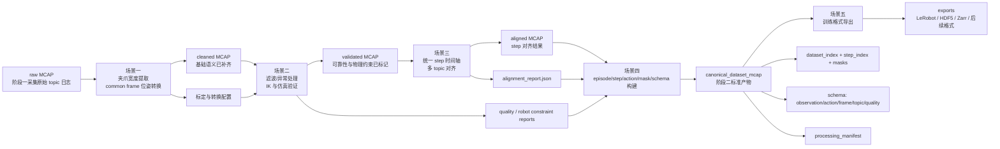
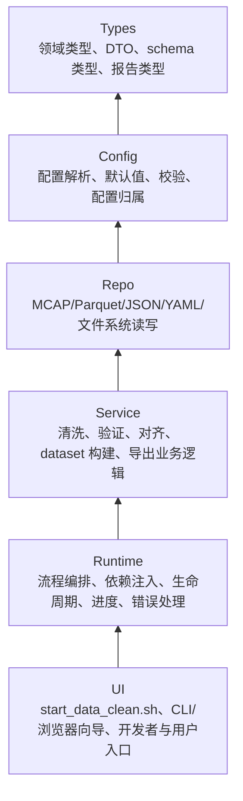

# 阶段二产物架构设计

## 文档定位

本文是阶段二数据清洗产物的架构文件，用于指导后续程序开发。它基于：

- `数据清洗pipeline宏观蓝图.md`
- `架构设计约束.md`
- `阶段二实现路线图.md`
- 阶段二五个场景的目标、背景和输出清单

本文固定的是阶段二的产物契约、数据流边界、程序分层方式和开发护栏；不提前冻结未来源码文件名、类名或内部函数名。后续实现某个场景时，可以按实际代码结构拆分模块，但必须保持本文定义的单向依赖、输入输出契约、报告追溯和 canonical dataset 不变量。

## 一、总体架构目标

阶段二的目标是把阶段一产生的 raw MCAP，从硬件 topic 日志转换为可追溯、可校验、可导出的 canonical dataset。

阶段二最终产物不是单个“清洗后文件”，而是一组数据资产：

| 资产类别 | 代表产物                                       | 职责                                                       |
| -------- | ---------------------------------------------- | ---------------------------------------------------------- |
| 原始输入 | raw MCAP                                       | 保存阶段一采集得到的原始 topic 日志，作为不可变追溯源。    |
| 中间产物 | cleaned MCAP、validated MCAP、aligned MCAP     | 逐级补齐语义、可靠性和 step 对齐信息，便于调试和定位问题。 |
| 标准产物 | `canonical_dataset_mcap/`                    | 阶段二交付给阶段三的唯一可信数据契约。                     |
| 报告产物 | alignment、quality、robot constraint、manifest | 解释数据如何生成、哪些片段可信、哪些 step 不可训练。       |
| 导出产物 | `exports/<format>/`                          | 从 canonical dataset 可重复生成的训练框架专用格式。        |

核心原则：

- raw MCAP 必须保留，不被覆盖或原地修改。
- 每一级产物都必须能被下一级明确消费，不依赖人工记忆补充隐含语义。
- canonical dataset 是训练格式导出器唯一可信输入，导出器不得回头读取 raw、cleaned、validated 或 aligned 来修复数据。
- 所有会影响数据语义的配置、软件版本、输入文件和处理步骤，必须进入运行日志或 `processing_manifest.json`。
- 不可训练、不可对齐或机器人不可执行的数据必须进入 masks 和报告，不能静默进入训练集。

## 二、阶段二产物架构图



这个图表达两层含义：

- 主路径是数据语义逐级增强：原始 topic 日志 -> 基础语义 -> 可靠信号 -> step 对齐 -> episode/observation/action 数据集 -> 训练格式。
- 报告、配置和 manifest 不是旁路产物，而是 canonical dataset 能独立解释自己的组成部分。

## 三、后续程序分层架构

后续实现阶段二程序时，所有模块必须遵循 `Types -> Config -> Repo -> Service -> Runtime -> UI` 的单向依赖。后面的层可以调用前面的层，前面的层不能反向依赖后面的层。



### 各层职责

| 层级    | 阶段二职责                                                                                       | 禁止事项                                               |
| ------- | ------------------------------------------------------------------------------------------------ | ------------------------------------------------------ |
| Types   | 定义 MCAP topic inventory、pose、gripper、step、episode、mask、report、manifest、schema 等结构。 | 不读取文件、不解析命令行、不依赖 Runtime 或 UI。       |
| Config  | 解析并校验 YAML/JSON 配置，集中管理默认值、单位、坐标系、阈值、必需/可选配置。                   | 不直接执行业务处理，不把配置散落在 Service 或 UI。     |
| Repo    | 封装 MCAP、Parquet、JSON、YAML 和目录读写，隐藏底层存储细节。                                    | 不做业务判断，不在 UI 层直接写文件查询逻辑。           |
| Service | 实现五个场景的核心业务：夹爪提取、位姿转换、可靠性验证、时间对齐、dataset 构建、导出。           | 不解析命令行，不直接管理交互菜单，不写裸日志输出。     |
| Runtime | 编排全流程或单场景流程，管理依赖、运行目录、进度、失败恢复、结构化日志和 manifest 写入。         | 不把业务算法写在流程编排里。                           |
| UI      | 面向用户或开发者的入口，包括 `./start_data_clean.sh`、CLI 菜单、浏览器标定/配置向导。          | 不直接读写 MCAP/Parquet，不跳过 Runtime 调用 Service。 |

### 横切关注点入口

横切关注点必须由 Runtime 统一接入：

- 结构化日志：每次运行写入独立 run 目录，记录场景、功能、输入、配置、输出、错误摘要和耗时。
- 进度汇报：生产模式至少表达全流程场景进度和当前场景步骤进度。
- manifest：凡影响数据语义、处理结果或训练可用性的配置和软件信息，都必须被 Runtime 收集并写入 manifest。
- 错误处理：失败必须定位到场景、步骤、文件、episode、step 或字段；不能只返回笼统异常。
- 功能开关：调试、轻量保留模式、导出格式选择等由配置或 Runtime 管理，不在算法模块里硬编码。

## 四、产物契约

### 1. raw MCAP

职责：

- 作为阶段一输出的不可变原始数据。
- 保存图像、Baton Mini 位姿、触觉等原始 topic 日志。
- 支持回放、问题追溯和重新清洗。

约束：

- 阶段二程序不得原地修改 raw MCAP。
- raw MCAP topic 是否满足处理要求，由场景一边界校验负责。

### 2. cleaned MCAP

来源：

- raw MCAP。
- topic 映射、夹爪标定参数、左右 Baton Mini 位姿转换参数。

新增语义：

- 左右夹爪宽度。
- common frame 下的左右相机 pose。
- 基础 topic/schema/config 校验结果。

消费者：

- 场景二可靠性验证。

边界：

- cleaned MCAP 不负责滤波、IK、MuJoCo 仿真和统一 step 时间轴。
- TCP pose 不在场景一强行固化，后续由 common-frame 相机 pose 叠加相机到 TCP 外参得到。

### 3. validated MCAP

来源：

- cleaned MCAP。
- 质量阈值、滤波参数、异常处理策略、机器人约束和仿真配置。

新增语义：

- 滤波后的位姿、触觉和夹爪序列。
- 异常、缺失、非法值、速度/加速度异常标记。
- 可修复异常的补全记录。
- IK、关节限制、workspace、仿真检查结论。

消费者：

- 场景三时间对齐。
- 场景四 masks、quality report 和 robot constraint report。

边界：

- 对不可修复或不可执行片段必须标记，不允许静默删除后让下游失去追溯。

### 4. aligned MCAP

来源：

- validated MCAP。
- step 频率、起止策略、插值策略、聚合策略和超时阈值。

新增语义：

- 统一 step 时间轴。
- 每个 observation 字段的来源、对齐方式、时间误差、缺失和复用情况。
- `alignment_report.json`。

消费者：

- 场景四 canonical dataset 构建。

边界：

- aligned MCAP 仍是 topic/时间序列世界，不直接承担 episode/action/mask 的完整数据集语义。

### 5. canonical dataset

来源：

- aligned MCAP。
- alignment report。
- quality、robot constraint 和修复记录。
- schema、action、frame、topic、quality 契约。

目录契约：

```text
canonical_dataset_mcap/
├── dataset_meta.json
├── dataset_index.parquet
├── schema/
│   ├── observation_schema.json
│   ├── action_schema.json
│   ├── frame_schema.json
│   ├── topic_schema.json
│   └── quality_schema.json
├── episodes/
│   └── episode_xxxxxx/
│       ├── episode_meta.json
│       ├── data.mcap
│       ├── step_index.parquet
│       ├── masks.parquet
│       ├── alignment_report.json
│       ├── quality_report.json
│       ├── robot_constraint_report.json
│       └── processing_manifest.json
└── exports/
```

必须满足的不变量：

- dataset 级 schema 能解释所有 episode。
- `dataset_index.parquet` 登记的 episode 路径真实存在。
- `step_index.parquet` 能定位 `data.mcap` 中的消息或派生字段。
- observation 必需字段要么可定位，要么在 masks 中标记无效。
- action 计算方式可从 common-frame TCP 轨迹和夹爪宽度复现。
- `frame_schema.json` 能解释所有位姿的坐标系、单位和四元数顺序。
- masks 能让 exporter 过滤不可训练 step，并给出 invalid reason。
- `processing_manifest.json` 能追溯输入、配置、软件版本、处理步骤和关键报告。

### 6. exports

来源：

- canonical dataset。
- 目标训练格式配置。

职责：

- 面向 LeRobot、HDF5、Zarr 或后续确定模型格式生成训练数据。
- 根据 masks 过滤不可训练 step。
- 记录字段映射、样本数量、过滤数量和导出校验结果。

边界：

- exports 是可再生产物。删除 `exports/` 后，应能从 canonical dataset 重新导出。
- exporter 不负责修复上游数据，只做格式适配和训练侧校验。

## 五、五个场景的软件边界

| 场景   | 主输入                                       | 主输出                                | Service 层核心能力                                                                     | Repo 层核心能力                       | Runtime/UI 要求                                              |
| ------ | -------------------------------------------- | ------------------------------------- | -------------------------------------------------------------------------------------- | ------------------------------------- | ------------------------------------------------------------ |
| 场景一 | raw MCAP + 标定/转换配置                     | cleaned MCAP + 清洗报告               | 夹爪宽度提取、common frame 位姿转换、基础校验                                          | MCAP 读写、ROS2 编解码、YAML 配置读写 | 支持生产批处理和开发者 smoke test；配置缺失时引导标定/填写。 |
| 场景二 | cleaned MCAP + 质量/机器人配置               | validated MCAP + 异常/修复/机器人报告 | 滤波、异常检测、补全、IK、关节限制、仿真验证                                           | MCAP 序列读写、报告 JSON 写入         | 失败定位到数据段；不可执行片段进入报告和后续 masks。         |
| 场景三 | validated MCAP + 对齐配置                    | aligned MCAP + alignment report       | step 时间轴生成、topic 对齐、插值、聚合、误差统计                                      | MCAP 读取、对齐索引/报告写入          | 展示对齐进度和缺失率；产出机器可读对齐报告。                 |
| 场景四 | aligned MCAP + 上游报告 + schema/action 配置 | canonical dataset                     | dataset 初始化、episode 构建、step_index、action chunk、masks、reports、manifest、校验 | Parquet/JSON/MCAP/目录写入            | 必须执行 dataset 完整性校验；失败定位到 episode/step/字段。  |
| 场景五 | canonical dataset + 目标格式配置             | exports                               | canonical 读取、样本过滤、格式适配、导出校验                                           | 目标格式文件写入、报告写入            | 用户可选择格式；导出失败不修改 canonical dataset。           |

## 六、控制流架构

阶段二统一入口是 `./start_data_clean.sh`。

### 开发者模式

```text
./start_data_clean.sh --dev
  -> 选择阶段二场景
  -> 选择功能检验或场景完整 smoke test
  -> 确认小样本输入、配置和调试输出目录
  -> Runtime 创建独立 run 目录
  -> 调用对应 Service
  -> 写出测试产物和结构化运行日志
  -> 返回产物路径、日志路径和失败摘要
```

约束：

- 开发者输出必须和正式生产输出隔离。
- 临时配置覆盖只对本次运行生效；只有明确选择保存时才写回正式配置。
- 每个场景至少保留一个完整 smoke test。

### 用户生产模式

```text
./start_data_clean.sh
  -> 用户生产引导界面
  -> 配置配置文件 / 运行全流程 / 运行单个流程
  -> Runtime 执行输入、配置、输出覆盖风险预检查
  -> 按场景顺序执行或执行单场景完整流程
  -> 写出正式产物、报告、运行日志和 manifest
  -> 返回状态、输出路径、日志路径和下一步动作
```

约束：

- 用户端单个流程只暴露场景级完整流程，不暴露场景内部单功能。
- 缺少必需配置时不能继续运行受影响流程，必须跳转到对应配置分组。
- 运行失败时必须停留在失败场景和失败步骤，并给出一行失败原因摘要和日志路径。

## 七、配置归属与演进

配置参数不要求一次性全量设计，而是随场景开发逐步增长。每个配置参数归属到“定义语义并首次获取它的场景”。

新增配置参数时必须记录：

- 服务哪个场景和哪个功能。
- 参数语义、单位、坐标系、时间语义或取值范围。
- 参数来源：手写、标定、终端向导、浏览器页面或其他程序。
- 写入哪个配置文件或配置产物。
- 如何校验，缺失、为空或非法时如何提示。
- 被哪些下游流程复用。
- 是否进入运行日志、测试产物或 `processing_manifest.json`。

复用规则：

- 下游场景只能声明依赖和复用，不重复定义同一参数语义。
- 场景一产生的夹爪标定、common frame 位姿转换配置，由后续场景复用。
- 会影响 action、mask 或训练可用性的配置，必须能从 manifest 追溯。

## 八、边界校验与日志约束

所有系统边界必须做显式校验：

- 输入文件边界：路径存在、文件可读、格式可解析、topic/schema 符合预期。
- 配置边界：必需字段非空，类型、单位、范围、枚举、路径和坐标系合法。
- 数据边界：时间戳单调性、topic 频率、pose 四元数、触觉 shape、夹爪宽度范围、step 对齐误差。
- 输出边界：目录可写、覆盖策略明确、产物路径登记完整、报告可解析。
- 训练边界：不可训练 step 必须被 masks 过滤，不允许导出器凭猜测补齐数据。

日志约束：

- 使用结构化日志，禁止在核心模块中裸 `print`。
- UI 可以展示人类可读信息，但应由 Runtime 提供结构化状态，不直接拼业务内部数据。
- 失败日志必须包含场景、步骤、输入文件、配置来源、错误摘要和建议下一步。
- 每次正式生产运行必须能生成或更新 manifest。

## 九、开发顺序建议

后续程序开发建议按以下顺序推进：

1. 为阶段二补齐统一 Runtime 外壳：run 目录、结构化日志、场景选择、配置预检查、失败摘要。
2. 将场景一现有 `data_clean` 能力接入新的 Runtime/UI 分层，同时保持现有清洗行为不倒退。
3. 实现场景二 validated MCAP 和报告契约，先覆盖滤波、异常标记、修复记录，再接入 IK/MuJoCo。
4. 实现场景三 aligned MCAP 和 alignment report，优先跑通 step 时间轴和字段来源追溯。
5. 实现场景四 canonical dataset 最小闭环：单 episode、schema、step_index、masks、manifest、完整性校验。
6. 实现场景五至少一种 exports，并用最小读取脚本验证训练格式可消费。

每个场景开始编码前，必须把该场景的新增程序、配置和报告写入对应 `输出程序与文件.md`；新增独立程序或模块后，必须补充包内架构文档。

## 十、验收清单

阶段二产物架构落地后，至少应通过以下验收：

- raw MCAP 能进入全流程预检查，并明确判断能否处理。
- cleaned、validated、aligned、canonical dataset 和 exports 的路径、输入、输出关系清晰可追溯。
- 每个场景都有独立 smoke test 和正式生产路径。
- schema、index、masks、reports、manifest 能互相解释，不出现只有代码知道的隐含字段。
- 任意 episode 能追溯到原始输入、配置、处理步骤、软件版本和上游报告。
- 不可对齐、不可训练或机器人不可执行的数据被明确 mask，不进入 exports。
- 删除 exports 后，可以从 canonical dataset 重新生成训练格式。
- 修改算法、topic 契约、配置项或产物结构时，同步更新对应场景输出清单和架构文档。
