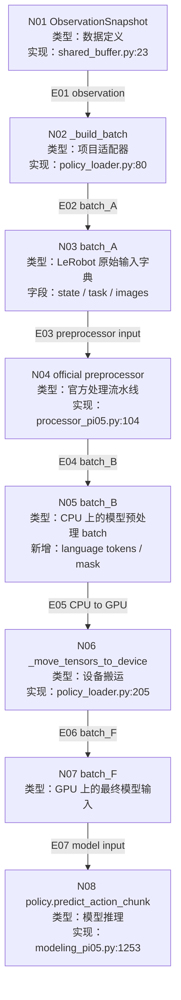

---
tags:
  - ROS
  - VLA
  - Pi05
  - deploy
  - learning
---

# ObservationSnapshot 到 batch_F 的数据流

> [!abstract]
> 本文只讲一条链路：`ObservationSnapshot` 如何被部署程序一步步加工成最终送入 Pi0.5 模型的 `batch_F`。

相关术语注释：

- [[注释文件/ObservationSnapshot|ObservationSnapshot]]
- [[注释文件/batch_A|batch_A]]
- [[注释文件/batch_F|batch_F]]
- [[注释文件/make_pi05_pre_post_processors|make_pi05_pre_post_processors]]
- [[注释文件/Pi05PrepareStateTokenizerProcessorStep|Pi05PrepareStateTokenizerProcessorStep]]
- [[注释文件/GPU tensor device|GPU tensor device]]

---

## 0. 先划定语义范围

这份笔记不讲：

- ROS topic 如何进 `ObservationCollector`。
- `ControlLoop` 如何调度 `InferenceRequest`。
- `ActionChunk` 后续如何发布到 `/pi05_vla/command/*`。
- Pi05BridgeNode / CommandMuxNode / picotele 下游链路。

这份笔记只讲：

```text
ObservationSnapshot
  -> _build_batch()
  -> batch_A
  -> preprocessor(batch_A)
  -> batch_B
  -> _move_tensors_to_device(batch_B, device)
  -> batch_F
  -> policy.predict_action_chunk(batch_F)
```

你可以把这条链理解为：

> 机器人世界的数据，先被翻译成 LeRobot/Pi0.5 官方能理解的字典，再被官方 processor 改造成模型真正需要的张量格式，最后移动到 GPU 上执行推理。

---

## 1. 需要提前理解的 Pi0.5 工作机制

### 1.1 Pi0.5 不是只吃图像

Pi0.5 的输入不是单纯一张图片，而是多模态输入：

| 输入类型 | 在本项目中的来源 | 最终作用 |
|---|---|---|
| 图像 | `ObservationSnapshot.images` | 让模型看见环境和机械臂视角 |
| 机器人状态 | `ObservationSnapshot.encoded_state` | 让模型知道当前关节、手部、末端状态 |
| 任务文本 | `deploy.yaml.runtime.task` | 告诉模型现在要执行什么任务 |

所以最终 batch 里至少要同时包含：

```text
图像 + 状态 + 任务文本
```

### 1.2 Pi0.5 的本质：把不同模态都变成 token / embedding

你这里的理解更接近 VLA 模型的本质：Pi0.5 不是“直接看原始图片、原始关节值、原始文字”，而是先把不同来源的数据转成模型内部可以对齐处理的表示。

可以先用这个拓扑理解：

```text
state
  -> 状态离散化 / 状态 token 化
  -> 状态相关 token 表示

image
  -> 图像预处理 / 图像编码器
  -> 图像语义 token / image embedding

language
  -> tokenizer / 语言编码器
  -> 文字 token / text embedding
```

然后模型在统一的表示空间里综合这些信息，预测未来一段 action。

> [!warning] 不要把 “state 写进 prompt” 理解成普通写作文
> 源码里确实会构造类似 `Task: ..., State: ...; Action:` 的字符串，但它的语义不是“把 state 当自然语言解释一遍”，而是把连续 state 先离散化，再借助 tokenizer 变成模型可以消费的 token 序列。

在当前 LeRobot/Pi0.5 实现里，状态链路更准确地说是：

```text
机器人状态
  -> 归一化
  -> 离散化为 256 桶编号
  -> 与 task 一起组成模型输入模板
  -> tokenizer 转成 token ids
  -> 模型读取 token ids / attention mask
```

所以有两层说法：

| 层级 | 更准确的表述 |
|---|---|
| 模型原理层 | state、image、language 都会变成 token / embedding，进入统一模型表示空间 |
| 当前源码实现层 | state 被归一化、离散化后，放入 `Task: ..., State: ...; Action:` 模板，再由 tokenizer 变成 `observation.language.tokens` |

### 1.3 模型最终主要看三类表示

在 `PI05Policy.predict_action_chunk(batch)` 内部，模型主要读取：

| 类型 | batch key |
|---|---|
| 图像 | `observation.images.*` |
| 语言 token | `observation.language.tokens` |
| token mask | `observation.language.attention_mask` |

也就是说，`task` 和 `state` 在当前实现中会经过 tokenizer 进入 `observation.language.tokens`；图像则保留为 image tensor，后续由模型内部图像处理逻辑变成图像语义表示。

---

## 2. 需要提前理解的 GPU 工作机制

### 2.1 CPU tensor 和 GPU tensor

PyTorch 的 tensor 可以在 CPU 上，也可以在 GPU 上。

```text
CPU tensor：适合普通 Python / NumPy / tokenizer 处理
GPU tensor：适合大模型矩阵计算
```

模型推理需要 GPU，所以最终的 `batch_F` 必须移动到：

```python
self.device
```

例如：

```text
cuda:0
```

### 2.2 为什么 preprocessor 先留在 CPU 上？

部署代码里有一段注释强调：

```python
batch = self.preprocessor(self._build_batch(observation))
batch = _move_tensors_to_device(batch, self.device)
```

意思是：

1. 先在 CPU 上完成官方 processor。
2. 再把最终 batch 里的 tensor 移动到 GPU。

原因是：`Pi05PrepareStateTokenizerProcessorStep` 里面会用 NumPy 离散化 state。NumPy 更适合在 CPU 上工作。如果太早把 state 放到 GPU，反而会产生 GPU -> CPU 同步开销。

---

## 3. 网络拓扑：从 ObservationSnapshot 到 batch_F



---

## 4. 按“函数输入输出”理解整条链路

> [!tip]
> 你可以把每个节点都当成一个函数：它只做三件事——接收输入、加工输入、吐出输出。

| 顺序 | 函数 / 节点 | 输入 | 函数内部做什么 | 输出 | 源码证据 |
|---|---|---|---|---|---|
| 1 | `ObservationCollector.snapshot()` | 分散在 collector 里的图像、关节、手部、末端位姿字段 | 检查字段是否齐全、是否过期；如果合格，就把它们打包成一次完整观测 | [[注释文件/ObservationSnapshot\|ObservationSnapshot]] | `observation_collector.py:75-103` |
| 2 | `_build_batch(observation)` | [[注释文件/ObservationSnapshot\|ObservationSnapshot]] | 读取 `encoded_state` 并归一化；读取 `task`；读取每一路图像；按 LeRobot/Pi0.5 字段名装成字典 | [[注释文件/batch_A\|batch_A]] | `policy_loader.py:80-95` |
| 3 | `preprocessor(batch_A)` | [[注释文件/batch_A\|batch_A]] | 调用官方 Pi0.5 processor 流水线：加 batch 维度、处理归一化兼容、把离散化 state 和 task 变成 token 输入、生成 attention mask | `batch_B`：CPU 上的官方预处理 batch | `policy_loader.py:68`、`processor_pi05.py:104-183` |
| 4 | `_move_tensors_to_device(batch_B, self.device)` | `batch_B` | 递归遍历字典；只要遇到 `torch.Tensor`，就移动到 `self.device`，例如 `cuda:0` | [[注释文件/batch_F\|batch_F]] | `policy_loader.py:69`、`policy_loader.py:205-212` |
| 5 | `policy.predict_action_chunk(batch_F)` | [[注释文件/batch_F\|batch_F]] | 读取图像字段、`observation.language.tokens`、`observation.language.attention_mask`；调用 Pi0.5 模型采样未来动作 | `norm_chunk`：归一化动作块 `[batch, chunk_size, action_dim]` | `modeling_pi05.py:1253-1268` |
| 6 | `action_normalizer.unnormalize(norm_chunk)` | `norm_chunk[0]` | 把模型输出从归一化空间还原到真实机器人 action 尺度 | `action_chunk`：真实尺度动作块 `[chunk_size, 14]` | `policy_loader.py:72-78` |

所以最简洁的输入输出链路是：

```text
ObservationSnapshot
  -> _build_batch()
  -> batch_A
  -> preprocessor()
  -> batch_B
  -> _move_tensors_to_device()
  -> batch_F
  -> policy.predict_action_chunk()
  -> norm_chunk
  -> action_normalizer.unnormalize()
  -> action_chunk
```

---

## 5. 分阶段解释

### 5.1 阶段一：`ObservationSnapshot`

`ObservationSnapshot` 是部署侧的数据结构。

它不是官方 Pi0.5 模型输入，而是 ROS observation 被收齐之后的运行时快照。

它包含：

| 字段 | 含义 |
|---|---|
| `images` | 多路相机图像，例如 top、left_wrist、right_wrist |
| `state` | 结构化机器人状态 |
| `encoded_state` | 编码后的 26D 状态向量 |
| `captured_at_s` | 观测捕获时间 |

它的作用是：

> 把分散到多个 ROS topic 的图像和状态，压成一个“同一时刻可用于推理”的观测对象。

---

### 5.2 阶段二：`_build_batch()` 生成 `batch_A`

`_build_batch()` 是项目自己写的适配器。

它做三件事：

1. 读取 `observation.encoded_state`。
2. 用 `state_normalizer` 归一化 state。
3. 按官方 Pi0.5 字段名写入字典。

伪代码：

```python
state = state_normalizer.normalize(observation.encoded_state)

batch_A = {
    "observation.state": state,
    "task": self.task,
    "observation.images.top": observation.images["top"],
    "observation.images.left_wrist": observation.images["left_wrist"],
    "observation.images.right_wrist": observation.images["right_wrist"],
}
```

所以 `batch_A` 的特征是：

| key | 内容 | 此时是否有 batch 维度 | 此时是否在 GPU |
|---|---|---:|---:|
| `observation.state` | 归一化后的状态向量 | 否 | 否 |
| `task` | 任务文本 | 否 | 否 |
| `observation.images.<camera>` | 单路图像 tensor | 否 | 否 |

---

### 5.3 阶段三：官方 `preprocessor(batch_A)` 生成 `batch_B`

官方函数来自：

```python
make_pi05_pre_post_processors(...)
```

部署代码只取第一个返回值：

```python
preprocessor, _ = make_pi05_pre_post_processors(...)
```

这个 `preprocessor` 是一个流水线。核心步骤包括：

| 顺序 | processor step | 作用 |
|---|---|---|
| 1 | `RenameObservationsProcessorStep` | 保持字段命名兼容 |
| 2 | `AddBatchDimensionProcessorStep` | 给单样本数据加 batch 维度 |
| 3 | `RelativeActionsProcessorStep` | 处理相对动作配置，当前推理链路主要是兼容步骤 |
| 4 | `NormalizerProcessorStep` | 官方归一化步骤；本部署中 `dataset_stats=None`，主要保留 pipeline 结构 |
| 5 | `Pi05PrepareStateTokenizerProcessorStep` | 把 state 离散化，并与 task 一起组织成模型输入模板 |
| 6 | `TokenizerProcessorStep` | 把模型输入模板变成 `observation.language.tokens` 和 attention mask |
| 7 | `DeviceProcessorStep` | 按 config device 放置；部署中 preprocessor config 被设置成 CPU |

最重要的是第 5 和第 6 步。这里不要理解成“普通文本拼接”，而要理解成“把 task 和离散化 state 一起变成 token 输入”：

```text
task + normalized/discretized state
  -> model input template
  -> tokenizer
  -> language tokens + attention mask
```

这时得到的 `batch_B` 已经比 `batch_A` 多了关键模型字段：

| key | 来源 |
|---|---|
| `observation.language.tokens` | tokenizer 生成 |
| `observation.language.attention_mask` | tokenizer 生成 |
| `observation.images.*` | 原图像字段保留 |
| `observation.state` | 状态字段仍可能保留，但 Pi0.5 推理核心读取的是语言 token 和图像 |

---

### 5.4 阶段四：`_move_tensors_to_device()` 生成 `batch_F`

`batch_B` 还在 CPU 上。

下一步是：

```python
batch_F = _move_tensors_to_device(batch_B, self.device)
```

这个函数递归处理 batch：

```text
如果值是 torch.Tensor
  -> 移动到 device
如果值是 dict/list/tuple
  -> 递归处理内部元素
其他值
  -> 原样保留
```

所以 `batch_F` 的定义是：

> 经过官方 Pi0.5 preprocessor 处理，并且其中 tensor 已经移动到 GPU device 的最终推理输入 batch。

---

### 5.5 阶段五：`policy.predict_action_chunk(batch_F)`

最终调用：

```python
norm_chunk = policy.predict_action_chunk(batch_F)
```

Pi0.5 policy 内部做：

```python
images, img_masks = self._preprocess_images(batch)
tokens = batch["observation.language.tokens"]
masks = batch["observation.language.attention_mask"]
actions = self.model.sample_actions(images, img_masks, tokens, masks)
```

也就是说，模型最终真正使用：

| 输入 | 作用 |
|---|---|
| images | 看见环境 |
| image masks | 告诉模型哪些图像有效 |
| language tokens | 包含 task 和 state 的 token |
| attention mask | 告诉模型哪些 token 有效 |

输出是归一化 action chunk：

```text
norm_chunk: [batch, chunk_size, action_dim]
```

部署代码随后取第一个 batch：

```python
norm_chunk = norm_chunk.detach().cpu().to(dtype=torch.float32)[0]
```

再用：

```python
action_normalizer.unnormalize(norm_chunk)
```

还原为真实机器人 action 尺度。

---

## 6. 回答你的核心问题

### 6.1 `batch_F` 有哪些特征？

`batch_F` 可以理解为：

```text
batch_F = GPU 上的、已经被官方 Pi0.5 processor 处理过的模型输入字典
```

它的核心字段是：

| 字段 | 含义 |
|---|---|
| `observation.images.<camera>` | 图像 tensor |
| `observation.language.tokens` | 由 task + 离散化 state 的输入模板生成的 token |
| `observation.language.attention_mask` | token 有效位标记 |
| `observation.state` | 预处理过程中使用过的状态字段 |
| `task` | 预处理过程中使用过的任务文本 |

更精确地说：`PI05Policy.predict_action_chunk()` 直接读取图像字段和语言 token 字段。

### 6.2 官方有没有函数能把 `batch_A` 转成 `batch_F`？

有，但要分两段：

```text
batch_A -> batch_B：官方 preprocessor
batch_B -> batch_F：部署代码里的 device 搬运函数
```

官方负责的是：

```python
preprocessor = make_pi05_pre_post_processors(...)[0]
batch_B = preprocessor(batch_A)
```

部署代码负责的是：

```python
batch_F = _move_tensors_to_device(batch_B, self.device)
```

所以结论是：

> 官方提供了 `batch_A -> batch_B` 的核心处理流水线；当前部署代码再补了一步 `_move_tensors_to_device()`，得到真正送入模型的 `batch_F`。

### 6.3 官方能不能直接把 `ObservationSnapshot` 变成 `batch_F`？

不能。

官方 processor 不认识 `ObservationSnapshot`。

它认识的是 LeRobot/Pi0.5 风格的字典字段：

```text
observation.state
observation.images.*
task
```

所以必须先经过项目自己的：

```python
_build_batch(observation)
```

这一步的意义就是：

> 把部署侧的 `ObservationSnapshot` 翻译成官方 processor 能理解的 `batch_A`。

---

## 7. 小白版总记忆

可以把全流程想成“做模型输入饭盒”：

| 阶段 | 类比 |
|---|---|
| `ObservationSnapshot` | 一堆原材料已经收齐：图像、状态、时间戳 |
| `_build_batch()` | 把原材料按官方菜单装进饭盒格子 |
| `preprocessor(batch_A)` | 官方厨师把饭盒加工成模型能吃的形态 |
| `_move_tensors_to_device()` | 把饭盒送到 GPU 餐桌 |
| `policy.predict_action_chunk(batch_F)` | 模型开吃，然后吐出一整段动作 |

最重要的一句话：

> `ObservationSnapshot` 是部署侧观测对象；`batch_A` 是项目适配出来的官方输入字典；`batch_F` 是经过官方 preprocessor 并移动到 GPU 后，真正送进 Pi0.5 模型的最终 batch。

---

## 8. 源码证据索引

| 主题 | 源码位置 |
|---|---|
| `ObservationSnapshot` 定义 | `pi05_test/pi05/deploy/src/pi05/deploy/runtime/shared_buffer.py:23-29` |
| `_build_batch()` | `pi05_test/pi05/deploy/src/pi05/deploy/models/policy_loader.py:80-95` |
| `predict_action_chunk()` 部署包装 | `pi05_test/pi05/deploy/src/pi05/deploy/models/policy_loader.py:63-78` |
| 创建官方 preprocessor | `pi05_test/pi05/deploy/src/pi05/deploy/models/policy_loader.py:130-138` |
| 官方 `make_pi05_pre_post_processors()` | `pi05_test/third_party/lerobot/src/lerobot/policies/pi05/processor_pi05.py:104-183` |
| state 离散化并进入模型输入模板 | `pi05_test/third_party/lerobot/src/lerobot/policies/pi05/processor_pi05.py:51-93` |
| Pi0.5 policy 读取最终 batch | `pi05_test/third_party/lerobot/src/lerobot/policies/pi05/modeling_pi05.py:1253-1268` |
| tensor 移动到 device | `pi05_test/pi05/deploy/src/pi05/deploy/models/policy_loader.py:205-212` |
