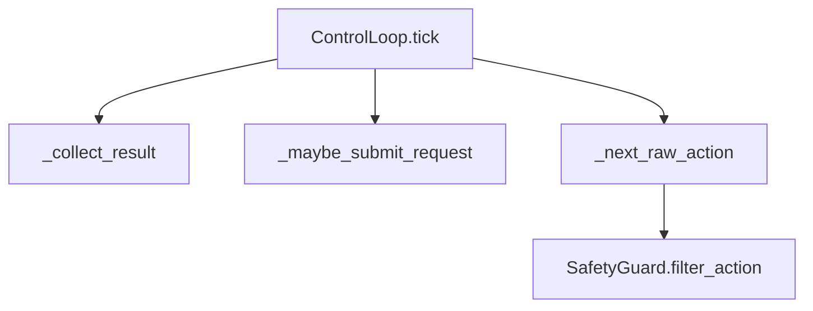

---
tags:
  - term-explainer
  - pi05
  - orchestration-function
source: [[部署推理数据流框架|部署推理数据流框架]]
---

# ControlLoop.tick()

> [!abstract] 核心定义
> 高频控制调度函数，每个控制周期尝试收集动作块、取出一步动作、安全过滤并返回 `ControlCommand`。

## 输入与输出

| 方向 | 内容 | 类型 |
|------|------|------|
| 输入 | result_queue | LatestQueue[ActionChunk] |
| 输入 | latest_observation | ObservationSnapshot | None |
| 输入 | last_command | BimanualAction | None |
| 输出 | command | ControlCommand | None |

## 调用链路图

## 运行逻辑

1. **步骤1**：收集推理线程刚写入的 pending chunk。
2. **步骤2**：根据 cursor 和 prefetch 策略决定是否提交新推理请求。
3. **步骤3**：从 active chunk 取出 raw action，经安全过滤后返回 `ControlCommand`。

> [!info] 编排逻辑总结
> 该术语的本质是 **“调度员”**：它重点决定谁先做、谁后做、结果如何交给下游。

## 具象隐喻

> [!tip] 生活场景类比
> 像交通指挥员每个红绿灯周期做决策：放哪辆车、要不要等新路况、要不要限速。
