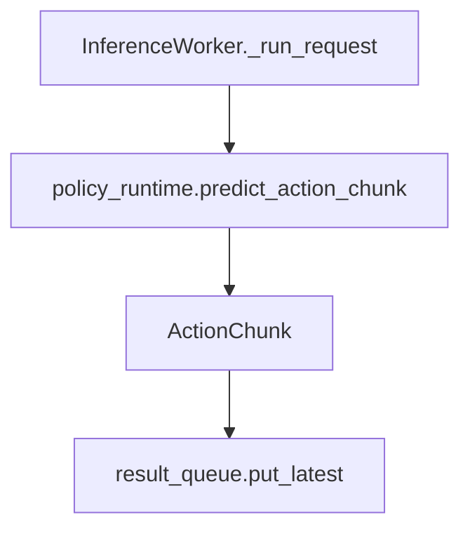

---
tags:
  - term-explainer
  - pi05
  - orchestration-function
source: [[部署推理数据流框架|部署推理数据流框架]]
---

# InferenceWorker._run_request()

> [!abstract] 核心定义
> 处理单个 `InferenceRequest` 的后台推理编排函数：调用模型、包装 `ActionChunk`、写入结果队列。

## 输入与输出

| 方向 | 内容 | 类型 |
|------|------|------|
| 输入 | request | InferenceRequest |
| 输出 | chunk written to result_queue | ActionChunk side effect |

## 调用链路图

## 运行逻辑

1. **步骤1**：记录 `infer_start`，作为 latency 和限频依据。
2. **步骤2**：调用 `policy_runtime.predict_action_chunk(request.observation)` 获得 `(chunk_size,14)` 动作块。
3. **步骤3**：用 request 中的 `obs_time/request_id` 和推理时间包装 `ActionChunk`，写入 result queue。

> [!info] 编排逻辑总结
> 该术语的本质是 **“调度员”**：它重点决定谁先做、谁后做、结果如何交给下游。

## 具象隐喻

> [!tip] 生活场景类比
> 像厨房出菜工位：拿到一张订单，调用厨师做菜，然后把成品放到出菜口。
