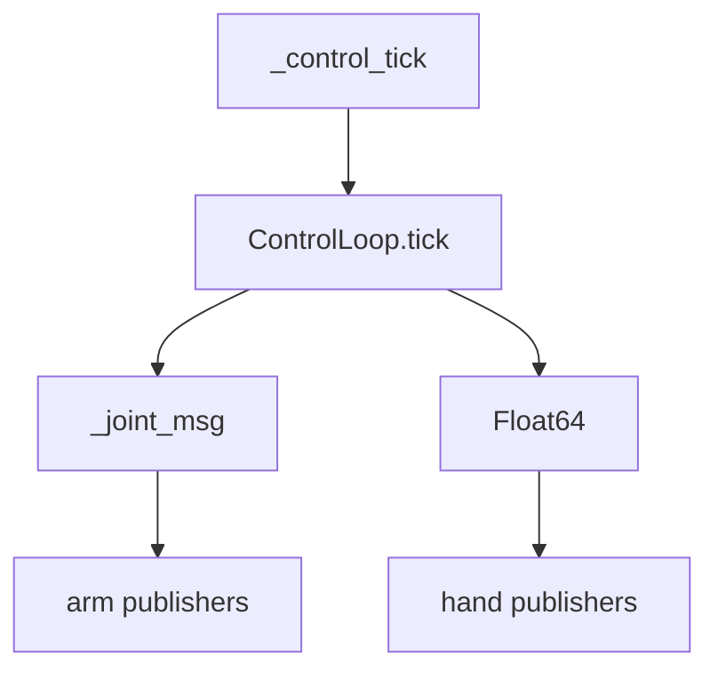

---
tags:
  - term-explainer
  - pi05
  - orchestration-function
source: [[部署推理数据流框架|部署推理数据流框架]]
---

# Pi05VlaDeployNode._control_tick() 执行：

> [!abstract] 核心定义
> ROS timer 触发的命令发布编排函数，读取 `ControlLoop.tick()` 返回的 `ControlCommand`，并分发到四路 command topic。

## 输入与输出

| 方向 | 内容 | 类型 |
|------|------|------|
| 输入 | timer event | ROS timer |
| 输入 | command | ControlCommand | None |
| 输出 | ROS messages | JointState / Float64 |

## 调用链路图

## 运行逻辑

1. **步骤1**：调用 `control_loop.tick()` 获取当前周期的安全命令。
2. **步骤2**：如果模式不允许发布，只记录 dry-run 日志。
3. **步骤3**：将左/右臂转成 `JointState`，左/右手转成 `Float64`并发布。

> [!info] 编排逻辑总结
> 该术语的本质是 **“调度员”**：它重点决定谁先做、谁后做、结果如何交给下游。

## 具象隐喻

> [!tip] 生活场景类比
> 像车站广播员：调度系统给出运行决定，广播员把指令分别通知各个站台。
