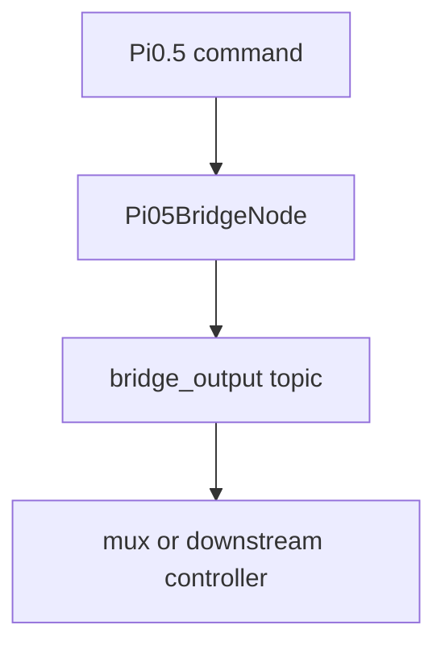

---
tags:
  - term-explainer
  - pi05
  - orchestration-function
source: [[部署推理数据流框架|部署推理数据流框架]]
---

# bridge

> [!abstract] 核心定义
> 将 Pi0.5 内部 command topic 适配到下游执行栈或 mux topic 的桥接层。

## 输入与输出

| 方向 | 内容 | 类型 |
|------|------|------|
| 输入 | Pi0.5 command topics | JointState / Float64 |
| 输出 | bridge_output topics | adapted JointState / trigger Float64 |

## 调用链路图

## 运行逻辑

1. **步骤1**：订阅 Pi0.5 内部命令 topic。
2. **步骤2**：对关节命令进行必要过滤，对手部命令进行 scale 转换。
3. **步骤3**：发布到下游配置的 bridge output topic。

> [!info] 编排逻辑总结
> 该术语的本质是 **“调度员”**：它重点决定谁先做、谁后做、结果如何交给下游。

## 具象隐喻

> [!tip] 生活场景类比
> 像转接头：前端插头和后端插座不一样，bridge 负责把形状和电平都转成对方能接受的格式。
