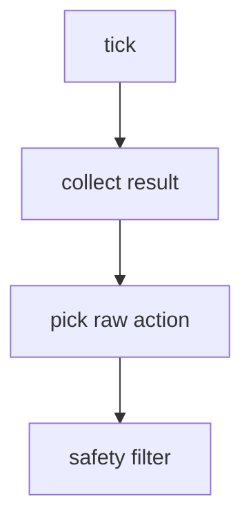

---
tags:
  - term-explainer
  - pi05
  - orchestration-function
source: [[部署推理数据流框架|部署推理数据流框架]]
---

# tick

> [!abstract] 核心定义
> 控制系统的单次周期调度执行，在这里通常指 `ControlLoop.tick()` 的一次 30Hz 迭代。

## 输入与输出

| 方向  | 内容                   | 类型                           |      |
| --- | -------------------- | ---------------------------- | ---- |
| 输入  | timer event          | periodic signal              |      |
| 输入  | runtime state        | active_chunk / pending_chunk |      |
| 输出  | one control decision | ControlCommand               | None |

## 调用链路图

## 运行逻辑

1. **步骤1**：按固定频率被 timer 触发。
2. **步骤2**：检查有无新动作块和是否需要提交新请求。
3. **步骤3**：产生一步当前控制周期的命令或返回 None。

> [!info] 编排逻辑总结
> 该术语的本质是 **“调度员”**：它重点决定谁先做、谁后做、结果如何交给下游。

## 具象隐喻

> [!tip] 生活场景类比
> 像节拍器的一声“哒”：每哒一次，机器人就走一小步控制逻辑。
