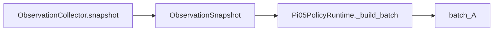

---
tags:
  - ROS
  - Pi05
  - term
  - data-definition
---

# ObservationSnapshot

> [!abstract] 核心定义
> `ObservationSnapshot` 是一次完整观测快照：它把多路图像、机器人状态、编码后的状态向量和捕获时间包在一起，作为一次模型推理请求的输入来源。

## 数据结构

| 字段名             | 类型                           | 含义                                         | 是否必填 |
| --------------- | ---------------------------- | ------------------------------------------ | ---- |
| `images`        | `Mapping[str, torch.Tensor]` | 相机图像字典，例如 `top`、`left_wrist`、`right_wrist` | 是    |
| `state`         | `BimanualState`              | 结构化双臂双手状态                                  | 是    |
| `encoded_state` | `np.ndarray`                 | 编码后的 26D 状态向量                              | 是    |
| `captured_at_s` | `float`                      | 使用 `time.monotonic()` 记录的捕获时间              | 是    |

## 在数据流中的位置

## 小白解释

可以把它理解成“拍照瞬间的资料袋”：

- 相机图像放在 `images`。
- 机器人身体姿态放在 `state`。
- 模型更容易读取的 26D 数字向量放在 `encoded_state`。
- 这包资料是什么时候收齐的，记在 `captured_at_s`。

## 源码证据

- `pi05_test/pi05/deploy/src/pi05/deploy/runtime/shared_buffer.py:23-29`

## 具象隐喻

> [!tip] 生活场景类比
> 你要给医生看病，不是只拿一张照片，而是带一份完整病历袋：照片、体温、血压、检查报告、采集时间都在里面。`ObservationSnapshot` 就是模型推理前的这份“完整病历袋”。

