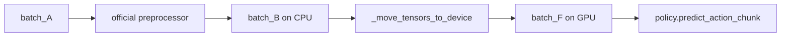

---
tags:
  - ROS
  - Pi05
  - term
  - data-definition
---

# batch_F

> [!abstract] 核心定义
> `batch_F` 是经过官方 Pi0.5 preprocessor 处理、并移动到 GPU device 后，真正传给 `policy.predict_action_chunk(batch)` 的最终模型输入 batch。

## 数据结构

| 字段名 | 含义 |
|---|---|
| `observation.images.<camera>` | 图像 tensor，供模型视觉分支使用 |
| `observation.language.tokens` | 由任务文本和状态 prompt tokenize 后得到的 token |
| `observation.language.attention_mask` | 标记哪些 token 有效 |
| `observation.state` | 预处理过程中使用过的状态字段 |
| `task` | 预处理过程中使用过的任务文本 |

## 关键特征

| 特征 | 说明 |
|---|---|
| 已经有 batch 维度 | 因为经过 `AddBatchDimensionProcessorStep` |
| 已经有语言 token | 因为经过 `Pi05PrepareStateTokenizerProcessorStep` 和 `TokenizerProcessorStep` |
| tensor 已经在 GPU 上 | 因为经过 `_move_tensors_to_device(batch, self.device)` |
| 能直接喂给模型 | 因为字段已经符合 `PI05Policy.predict_action_chunk()` 的读取方式 |

## 在数据流中的位置

## 具象隐喻

> [!tip] 生活场景类比
> `batch_F` 像已经做好并送到餐桌上的饭。`batch_A` 只是摆好原料的饭盒，`preprocessor` 是厨师，GPU 是餐桌，模型只有等饭真正送到餐桌上才开始“吃”。

## 源码证据

- `pi05_test/pi05/deploy/src/pi05/deploy/models/policy_loader.py:68-71`
- `pi05_test/pi05/deploy/src/pi05/deploy/models/policy_loader.py:205-212`
- `pi05_test/third_party/lerobot/src/lerobot/policies/pi05/modeling_pi05.py:1253-1268`

