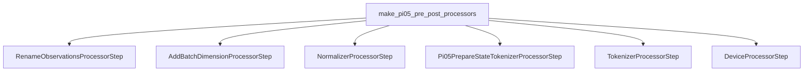

---
tags:
  - ROS
  - Pi05
  - term
  - orchestration-function
---

# make_pi05_pre_post_processors

> [!abstract] 核心定义
> `make_pi05_pre_post_processors()` 是 LeRobot/Pi0.5 官方提供的 processor 构造函数，用来生成模型输入前处理流水线和模型输出后处理流水线。

## 输入与输出

| 方向 | 内容 | 类型 |
|---|---|---|
| 输入 | `config` | `PI05Config` |
| 输入 | `dataset_stats` | 数据集统计信息；当前部署中传入 `None` |
| 输出 | `preprocessor` | 输入 batch 前处理流水线 |
| 输出 | `postprocessor` | action 后处理流水线 |

## 调用链路图



## 运行逻辑

1. 创建一组 processor step。
2. 把这些 step 串成 `PolicyProcessorPipeline`。
3. 返回 `preprocessor` 和 `postprocessor`。
4. 部署链路只使用 `preprocessor`。

## 小白解释

它不是直接推理模型，而是创建一条“加工流水线”。

`batch_A` 进去之后，会依次经历：

```text
加 batch 维度
归一化兼容
state 写入 prompt
prompt tokenize
移动到指定 device
```

## 具象隐喻

> [!tip] 生活场景类比
> 它像开一家工厂时配置流水线：第一站贴标签，第二站装盒，第三站扫码，第四站搬到货车。函数本身不加工每个货物，而是把加工机器按顺序摆好。

## 源码证据

- `pi05_test/third_party/lerobot/src/lerobot/policies/pi05/processor_pi05.py:104-183`

