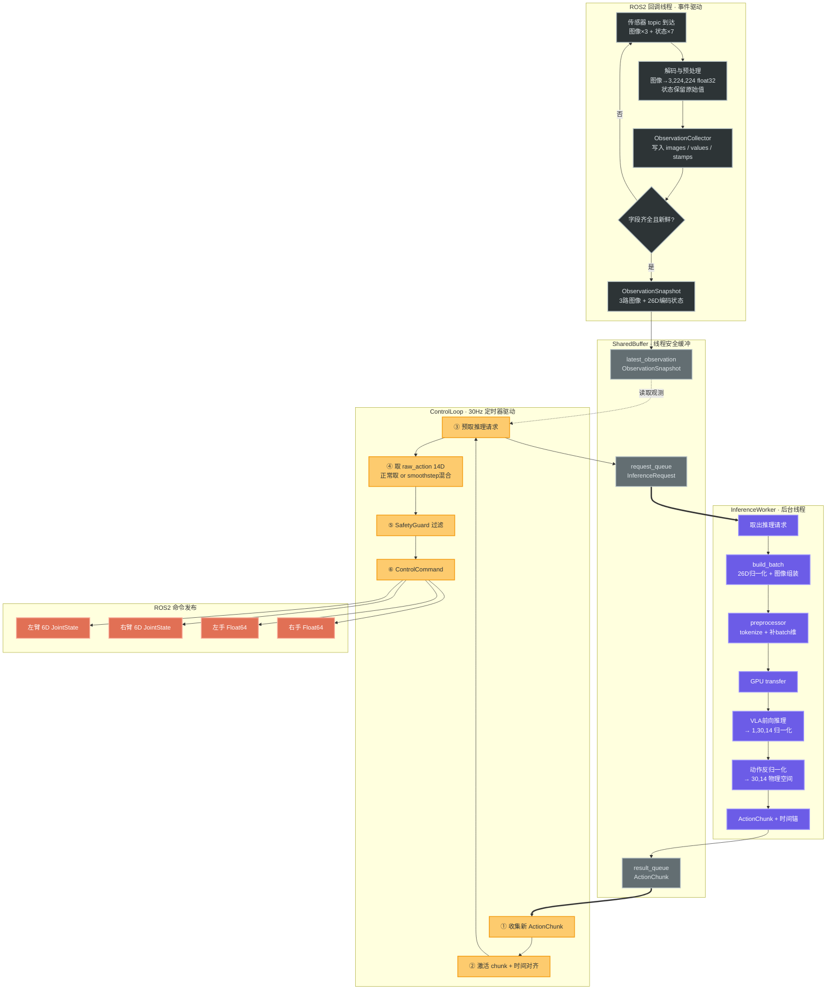
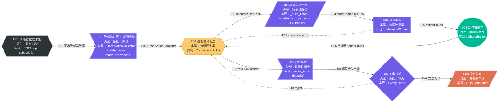

---
tags:
  - program-principle
analysis: pi05-deploy-dataflow
---

## 运行逻辑总览

程序由 **三个并发执行上下文** 驱动，通过 [[SharedBuffer]] 协作：



---

## 数据流节点




## D01 传感器数据采集

运行两个机械臂、三个相机、两个夹爪的驱动节点，使之发布以下 topic：

| 数据流     | 维度  | 说明               |
| ------- | --- | ---------------- |
| 机械臂关节角  | 12D | 两路，各 6 自由度       |
| 图像      | 3 路 | 三路相机             |
| 灵巧手单自由度 | 2D  | 两路，各 1 自由度       |
| 机械臂末端位姿 | 12D | 两路，各 6D（位置 + 姿态） |

> [!tip] 详细数据格式
> 见 [[传感器数据详解]]，包含 Message Type、Topic 路径、数值示例、26D 编码布局

## D02 传感器订阅 & 观测组装

> [!info] 核心类：`Pi05VlaDeployNode` (ROS2 回调) → `ObservationCollector` (数据聚合) → `SharedBuffer` (线程安全缓冲)

从 ROS2 topic 到 `ObservationSnapshot`，整个流程在 **ROS2 回调线程** 中完成：

### Step 1：ROS2 订阅 — 7 路 topic 的回调注册

`Pi05VlaDeployNode._create_subscriptions()` 在启动时注册以下订阅：

| Topic                                        | Msg Type     | 回调                               | 数据用途       |
| -------------------------------------------- | ------------ | -------------------------------- | ---------- |
| `/realsense/top/color/image_raw`             | `Image`      | `_image_cb("top", msg)`          | 顶部相机       |
| `/realsense/left_hand/color/image_rect_raw`  | `Image`      | `_image_cb("left_wrist", msg)`   | 左腕相机       |
| `/realsense/right_hand/color/image_rect_raw` | `Image`      | `_image_cb("right_wrist", msg)`  | 右腕相机       |
| `/vla_teleop/proprioception`                 | `JointState` | `_proprio_cb(msg)`               | 双臂 12D 关节角 |
| `/inspire/left_hand/joint_states`            | `JointState` | `_hand_cb("left", msg)`          | 左夹爪        |
| `/inspire/right_hand/joint_states`           | `JointState` | `_hand_cb("right", msg)`         | 右夹爪        |
| `/left_arm/ee_position`                      | `Point`      | `_point_cb("left_ee_pos", msg)`  | 左末端位置      |
| `/left_arm/ee_rpy`                           | `Vector3`    | `_vec3_cb("left_ee_rpy", msg)`   | 左末端姿态      |
| `/right_arm/ee_position`                     | `Point`      | `_point_cb("right_ee_pos", msg)` | 右末端位置      |
| `/right_arm/ee_rpy`                          | `Vector3`    | `_vec3_cb("right_ee_rpy", msg)`  | 右末端姿态      |

> [!note] 本体感觉编码顺序
> `/vla_teleop/proprioception` 发布的是 `[right6, left6]`（picotele 遗留顺序），`_proprio_cb` 内部调用 `decode_picotele_proprioception()` 将其拆分为 `left_arm_q` 和 `right_arm_q`。

### Step 2：编排函数 — 当 topic 有新 msg 时，自动执行对应的处理流程

程序预先把 5 个"指令卡"交给 ROS2，每张卡片的内容就是三步：**读取 msg → 数值加工 → 写入 collector**。ROS2 监听到对应 topic 有新消息时，就拿出对应的卡片执行。

**图像指令卡**（对应 3 路相机 topic）：

```
编排规则：当 /realsense/{name}/image_raw 有新 msg → 执行以下三步

第1步【读取】 _decode_image(msg)
              从 msg 中读出字节流 → 解码为 RGB 数组 (H, W, 3) uint8

第2步【加工】 preprocess_rgb_image(rgb, config)
              ├─ 等比缩放：scale = min(224/W, 224/H)，cv2.resize
              ├─ 居中填充：置于 (224, 224) 黑色画布中心
              └─ 类型转换：uint8 [0, 255] → float32 [0, 1]
              输出：(3, 224, 224) float32 tensor

第3步【写入】 collector.update_image(name, tensor)
              把处理后的 tensor 存入 collector 的 images 字典
```

**状态指令卡**（对应 7 路状态 topic）：

```
编排规则：当 /vla_teleop/proprioception 等 topic 有新 msg → 执行以下两步

第1步【读取】 从 msg 中提取数值 (np.float32)
              - JointState → msg.position
              - Point / Vector3 → msg.x, msg.y, msg.z

第2步【写入】 collector.update_xxx(key, value)
              直接存入 collector 的 values 字典，不做任何加工
```

> [!important]- 图像 vs 状态的处理差异
> 图像需要**即时加工**（resize、归一化），因为延迟到推理时会成为瓶颈。
> 状态**不做任何加工**，保留原始物理值（rad、300-1000），归一化留给推理线程去做。

> [!info]- `collector` 是什么？
> `collector` 是一个 `ObservationCollector` 类的对象，管理**三个内部字典**：`_images`（图像）、`_values`（状态值）、`_stamps`（时间戳）。指令卡中的"写入"就是往这三个字典里更新键值对。
>
> 详见 [[ObservationCollector详解]]，包含三个字典的完整结构、写入操作对照表、带具体数值的快照示例。

> [!tip]- 各指令卡详解
> 见 [[回调机制详解]]，包含每张指令卡的完整流程、解码细节、resize_pad 图解、线程安全模型

### Step 3：ObservationCollector — 用四类程序功能理解“就绪检测 + 26D 编码”

这一段不是一个神秘的“自动处理器”，而是四类程序功能的组合：

| 程序功能 | 对应代码 | 作用 |
|---|---|---|
| 读取与写入数值 | `update_image()` / `update_proprioception()` / `update_hand()` / `update_vector()` | 把回调中读出的数值写入 `ObservationCollector` 内部字典 |
| 编排函数 | `_publish_observation_if_ready()` → `collector.snapshot()` | 每次有新字段写入后，检查是否能生成完整观测 |
| 数值加工处理 | `encode_bimanual_state(state)` | 把结构化状态拼接为固定顺序的 26D 向量 |
| 数据结构定义 | `ObservationCollector` / `BimanualState` / `ObservationSnapshot` | 规定数据如何被保存、组织、传递 |

---

#### 3.1 读取与写入数值：`ObservationCollector` 管理三个内部字典

`ObservationCollector` 不是数学函数，而是一个**数据管理员**。它主要管理三个容器：

```python
self._images: dict[str, torch.Tensor]
self._values: dict[str, Any]
self._stamps: dict[str, float]
```

含义如下：

| 字典 | 写入内容 | key 示例 | value 示例 |
|---|---|---|---|
| `_images` | 已预处理图像 | `"top"`, `"left_wrist"` | `(3,224,224)` float32 tensor |
| `_values` | 原始状态值 | `"left_arm_q"`, `"right_hand_q"` | `np.ndarray` 或 `float` |
| `_stamps` | 每个字段最后更新时间 | `"image_top"`, `"proprioception"` | `time.monotonic()` |

每个 ROS 回调函数最后都会把新数值写入这里。例如：

```text
_image_cb("top", msg)
    ↓
collector.update_image("top", tensor)
    ↓
_images["top"] = tensor
_stamps["image_top"] = time.monotonic()
```

```text
_hand_cb("left", msg)
    ↓
collector.update_hand("left", float(msg.position[0]))
    ↓
_values["left_hand_q"] = value
_stamps["left_hand"] = time.monotonic()
```

这一步的本质是：**从零散 topic 中来的数值，被写入统一的数据容器。**

---

#### 3.2 编排函数：`_publish_observation_if_ready()` 负责“检查是否能进入下一步”

每次 callback 写完一个字段后，都会调用：

```python
self._publish_observation_if_ready()
```

它本身不做复杂数学计算，而是一个**编排函数**：

```text
某个 topic 有新 msg
    ↓
对应 callback 读取 msg 并写入 collector
    ↓
_publish_observation_if_ready()
    ↓
collector.snapshot(max_age_s=...)
    ↓
如果字段完整且未过期：生成 ObservationSnapshot
    ↓
如果字段不完整或过期：返回 None，继续等待
```

`collector.snapshot()` 内部主要检查两件事：

1. **必需字段是否到齐**
   - 图像：通常是 `top` / `left_wrist` / `right_wrist`
   - 状态：`left_arm_q` / `right_arm_q` / `left_hand_q` / `right_hand_q` / `left_ee_pos` / `left_ee_rpy` / `right_ee_pos` / `right_ee_rpy`
2. **字段是否过期**
   - 用 `_stamps` 中的时间戳比较当前时间
   - 超过 `stale_observation_timeout_s`，就不生成 snapshot

所以这里的程序作用是：

```text
读取 collector 内部字典
    ↓
判断字段完整性和新鲜度
    ↓
决定是否创建新的 ObservationSnapshot
```

---

#### 3.3 数据结构定义：`BimanualState` 保存“结构化状态”

当字段到齐后，程序先创建：

```python
BimanualState(
    left_arm_q=values["left_arm_q"],
    right_arm_q=values["right_arm_q"],
    left_hand_q=float(values["left_hand_q"]),
    right_hand_q=float(values["right_hand_q"]),
    left_ee_pos=values["left_ee_pos"],
    left_ee_rpy=values["left_ee_rpy"],
    right_ee_pos=values["right_ee_pos"],
    right_ee_rpy=values["right_ee_rpy"],
)
```

`BimanualState` 的作用不是给模型直接消费，而是保存**带语义名称的状态字段**：

| 字段             | 形状     | 数值含义      |
| -------------- | ------ | --------- |
| `left_arm_q`   | `(6,)` | 左臂 6 个关节角 |
| `right_arm_q`  | `(6,)` | 右臂 6 个关节角 |
| `left_hand_q`  | scalar | 左手/夹爪状态   |
| `right_hand_q` | scalar | 右手/夹爪状态   |
| `left_ee_pos`  | `(3,)` | 左末端位置     |
| `left_ee_rpy`  | `(3,)` | 左末端姿态     |
| `right_ee_pos` | `(3,)` | 右末端位置     |
| `right_ee_rpy` | `(3,)` | 末端姿态      |

它适合人和程序按字段名理解状态，例如安全检查或调试。

---

#### 3.4 数值加工处理：`encode_bimanual_state(state)`

这是本步骤最关键的数学/数值加工函数。

**输入：**

```python
BimanualState
```

内部包含：

```text
left_arm_q:   (6,) float32
right_arm_q:  (6,) float32
left_hand_q:  scalar
right_hand_q: scalar
left_ee_pos:  (3,) float32
left_ee_rpy:  (3,) float32
right_ee_pos: (3,) float32
right_ee_rpy: (3,) float32
```

**输出：**

```python
np.ndarray
shape = (26,)
dtype = np.float32
数值 = 原始物理值，尚未归一化
```

加工规则就是按固定顺序拼接：

| Index | 字段 | 维度 |
|---|---|---|
| `0-5` | `left_arm_q` | 6D |
| `6-11` | `right_arm_q` | 6D |
| `12` | `left_hand_q` | 1D |
| `13` | `right_hand_q` | 1D |
| `14-16` | `left_ee_pos` | 3D |
| `17-19` | `left_ee_rpy` | 3D |
| `20-22` | `right_ee_pos` | 3D |
| `23-25` | `right_ee_rpy` | 3D |

可以理解成：

```text
结构化状态 BimanualState
    ↓ encode_bimanual_state()
固定顺序的一阶向量 encoded_state: (26,)
```

注意：这里是 **一阶向量 `(26,)`**，不是二阶张量。

---

#### 3.5 数据结构定义：`ObservationSnapshot` 保存“一帧完整观测”

最终创建：

```python
ObservationSnapshot(
    images=images,
    state=state,
    encoded_state=encode_bimanual_state(state),
    captured_at_s=now,
)
```

定义如下：

```python
@dataclass(frozen=True)
class ObservationSnapshot:
    images: Mapping[str, torch.Tensor]
    state: BimanualState
    encoded_state: np.ndarray
    captured_at_s: float
```

为什么不只保留 `images` 和 `state`？因为这几个字段面向不同用途：

| 字段 | 面向谁 | 作用 |
|---|---|---|
| `images` | 模型输入组装 | 保存已预处理图像 tensor |
| `state` | 人类理解、调试、安全检查 | 保存有字段名的结构化状态 |
| `encoded_state` | 模型输入组装 | 保存固定顺序的 26D 状态向量 |
| `captured_at_s` | 控制循环/安全逻辑 | 判断 observation 是否过期、动作是否还能对齐 |

因此：

```text
state         = 有语义的状态结构
encoded_state = 给归一化和模型 batch 使用的 26D 向量
captured_at_s = 给实时控制使用的时间锚点
```

> [!abstract] D02 产出物
> `ObservationSnapshot` 是一个完整、未过期、可用于推理请求的观测快照：
>
> - 图像：`torch.Tensor (3,224,224) float32 [0,1] CPU`
> - 状态：`np.ndarray (26,) float32`，仍为原始物理值
> - 时间：`captured_at_s`，用于后续时间对齐和过期检查

### Step 4：写入 SharedBuffer

创建成功后，`Pi05VlaDeployNode` 执行：

```python
self.shared_buffer.set_observation(snapshot)
```

这一步属于**读取与写入数值**：

```text
读取：snapshot
写入：SharedBuffer._latest_observation
```

`SharedBuffer` 是线程安全的数据中转站：

```text
SharedBuffer
├── _latest_observation       # 最新 ObservationSnapshot
├── inference_request_queue   # 推理请求队列
├── chunk_result_queue        # 动作结果队列
└── metrics                   # 运行指标
```

它把 ROS 回调线程产生的最新完整观测，交给后面的 `ControlLoop` 和 `InferenceWorker` 使用。

---

## D03 模型输入组装

> [!info] 核心方法：`Pi05PolicyRuntime._build_batch()` → `preprocessor()` → `_move_tensors_to_device()`

D03 的目标是：

```text
ObservationSnapshot
    ↓
模型可消费的 batch
```

这部分同样由四类程序功能组成：

| 程序功能 | 对应代码 | 作用 |
|---|---|---|
| 读取与写入数值 | 从 `ObservationSnapshot` 读取 `images` / `encoded_state`，写入 `batch dict` | 把快照变成模型输入字典 |
| 编排函数 | `predict_action_chunk()` 调用 `_build_batch()` → `preprocessor()` → `_move_tensors_to_device()` | 规定推理前处理的执行顺序 |
| 数值加工处理 | `state_normalizer.normalize()` / `preprocessor()` / `_move_tensors_to_device()` | 归一化、补 batch 维、tokenize、搬运到设备 |
| 数据结构定义 | `batch: dict[str, Any]` | 用 LeRobot/Pi0.5 约定的 key 组织模型输入 |

---

### Step 1：读取 `ObservationSnapshot`

推理线程拿到的输入是：

```python
ObservationSnapshot
```

它从里面读取：

```text
images:
    top          -> torch.Tensor (3,224,224)
    left_wrist   -> torch.Tensor (3,224,224)
    right_wrist  -> torch.Tensor (3,224,224)

encoded_state:
    np.ndarray (26,)

task:
    不在 ObservationSnapshot 中，而是来自 runtime config 的 self.task
```

语言任务目前不是 `ObservationSnapshot` 的字段，而是在 `_build_batch()` 阶段加入。

---

### Step 2：数值加工处理：状态归一化

核心函数：

```python
self.state_normalizer.normalize(...)
```

**输入：**

```python
observation.encoded_state
# np.ndarray
# shape = (26,)
# dtype = float32
# 数值 = 原始物理值
```

先转成：

```python
torch.as_tensor(observation.encoded_state, dtype=torch.float32)
```

再做逐维 min-max 归一化。

**输出：**

```python
torch.Tensor
shape = (26,)
dtype = torch.float32
range ≈ [-1, 1]
device = CPU
```

归一化公式：

$$
y = 2 \times \frac{x - \min}{\max - \min} - 1
$$

含义：

```text
26D 原始物理状态
    ↓ 使用 bundle 中保存的 min/max
26D 归一化状态 tensor
```

图像在这里**不再加工**，因为图像已经在 ROS callback 阶段变成 `(3,224,224)` float32 `[0,1]`。

---

### Step 3：数据结构定义：组装 batch dict

`_build_batch()` 创建一个新的字典：

```python
batch = {
    "observation.state": normalized_state,
    "task": self.task,
}
```

然后把图像逐个写入：

```python
batch[f"observation.images.{name}"] = observation.images[name]
```

所以 `_build_batch()` 的直接产物是：

```python
{
    "observation.state": torch.Tensor(26,),
    "observation.images.top": torch.Tensor(3,224,224),
    "observation.images.left_wrist": torch.Tensor(3,224,224),
    "observation.images.right_wrist": torch.Tensor(3,224,224),
    "task": "bimanual manipulation",
}
```

这里的 batch 是 LeRobot/Pi0.5 约定的数据结构。模型不会直接消费 `ObservationSnapshot`，而是消费这个 batch 后续加工出的结果。

---

### Step 4：编排函数：`predict_action_chunk()` 串起整个推理前处理

`Pi05PolicyRuntime.predict_action_chunk()` 是这一段的总编排函数：

```text
ObservationSnapshot
    ↓
_build_batch()
    ↓
preprocessor()
    ↓
_move_tensors_to_device()
    ↓
policy.predict_action_chunk()
    ↓
action_normalizer.unnormalize()
```

对应四类功能：

| 顺序  | 函数                                            | 程序功能                               |
| --- | --------------------------------------------- | ---------------------------------- |
| 1   | `_build_batch()`                              | 读取 observation，写入 batch，并归一化 state |
| 2   | `preprocessor(batch)`                         | LeRobot/Pi0.5 官方输入预处理              |
| 3   | `_move_tensors_to_device(batch, self.device)` | 把 tensor 从 CPU 移到 GPU              |
| 4   | `policy.predict_action_chunk(batch)`          | 调用 VLA 模型                          |
| 5   | `action_normalizer.unnormalize()`             | 把模型输出动作从归一化空间还原到真实动作空间             |

---

### Step 5：数值加工处理：LeRobot/Pi0.5 preprocessor

部署代码中可以确认：

```python
batch = self.preprocessor(self._build_batch(observation))
```

这一步继续把 batch 转成 Pi0.5 policy 需要的内部格式。

**输入：**

```python
{
    "observation.state": torch.Tensor(26,),
    "observation.images.top": torch.Tensor(3,224,224),
    "observation.images.left_wrist": torch.Tensor(3,224,224),
    "observation.images.right_wrist": torch.Tensor(3,224,224),
    "task": str,
}
```

**输出：**

```python
batch
# 仍然是 dict，但字段已经被 LeRobot/Pi0.5 processor 处理成 policy 可接收格式
```

典型形状变化：

| 字段 | preprocessor 前 | preprocessor 后 |
|---|---|---|
| `observation.state` | `(26,)` | 通常变成 `(1,26)`，或进一步参与 state/token 处理 |
| `observation.images.top` | `(3,224,224)` | `(1,3,224,224)` |
| `observation.images.left_wrist` | `(3,224,224)` | `(1,3,224,224)` |
| `observation.images.right_wrist` | `(3,224,224)` | `(1,3,224,224)` |
| `task` | string | tokenizer / processor 可消费的语言输入 |

> [!warning] CPU 约束
> 部署代码明确让 Pi0.5 preprocessor 在 CPU 上运行。原因是其中部分 state/token 处理依赖 CPU/NumPy，过早搬到 CUDA 会引入 GPU→CPU 同步开销。

---

### Step 6：读取与写入数值：CPU batch → GPU batch

函数：

```python
_move_tensors_to_device(batch, self.device)
```

这一步更像**数值搬运**，不是数学变换。

**输入：**

```python
batch
# dict/list/tuple 中包含 CPU tensor
```

**输出：**

```python
batch
# 结构不变，但其中的 tensor 被移动到 self.device，例如 cuda:0
```

加工/搬运规则：

```text
CPU tensor
    ↓ contiguous()
    ↓ 可选 pin_memory()
    ↓ tensor.to(cuda, non_blocking=True)
CUDA tensor
```

---

### D03 小结：到这里为止，只完成“模型输入组装”

```text
ObservationSnapshot
    ↓ _build_batch()
batch dict on CPU
    ↓ preprocessor()
Pi0.5 processor batch on CPU
    ↓ _move_tensors_to_device()
model-ready batch on CUDA
```

> [!important] D03 的边界
> D03 的输出是 **VLA 模型可以直接消费的 batch**。  
> 一旦调用 `policy.predict_action_chunk(batch)`，就已经进入 D04：VLA 推理与动作后处理。

> [!tip] 详细数据格式
> 见 [[预处理后数据详解]]，包含预处理流程、数值示例、ObservationSnapshot 结构

---

## D04 VLA 推理与动作后处理：从 batch 到 `ActionChunk`

> [!info] 实现：`InferenceWorker` 后台线程 → `Pi05PolicyRuntime.predict_action_chunk()` → `ActionChunk`

D04 解决的问题是：

```text
model-ready batch
    ↓
VLA 模型输出归一化动作块
    ↓
反归一化为真实机器人动作空间
    ↓
包装成带时间信息的 ActionChunk
    ↓
写入结果队列，交给控制循环消费
```

---

### Step 1：模型消费 batch，输出归一化动作块

从这里开始，程序已经离开 D03 “输入组装”，进入 D04 “模型推理与动作后处理”。

D04 的局部主线只到 `ActionChunk` 为止：

```text
model-ready batch
    ↓ policy.predict_action_chunk(batch)
norm_chunk: (1, chunk_size, 14), normalized
    ↓ 去掉 batch 维度 + 搬回 CPU
norm_chunk: (chunk_size, 14), normalized
    ↓ action_normalizer.unnormalize()
action_chunk: (chunk_size, 14), physical
```

后续的缓存、取样、安全过滤、ROS 发布，分别属于 D05-D09。这里先不把它们算进 D04 Step 1。

按四类程序功能理解 D04 Step 1：

| 程序功能    | 对应代码                                          | 作用                        |
| ------- | --------------------------------------------- | ------------------------- |
| 读取与写入数值 | `policy.predict_action_chunk(batch)`          | 读入模型 batch，写出归一化动作块       |
| 编排函数    | `Pi05PolicyRuntime.predict_action_chunk()`    | 串起“建 batch → 模型前向 → 反归一化” |
| 数值加工处理  | `clamp()` / `action_normalizer.unnormalize()` | 把模型输出从归一化空间还原到真实动作空间      |
| 数据结构定义  | `norm_chunk` / `action_chunk`                 | 定义模型输出和反归一化后动作块的形状        |


---

#### 1.1 数值加工处理：`policy.predict_action_chunk(batch)`

> [!info] 封装在哪个类？
> 这里实际发生**两层调用**：
>
> 1. `Pi05PolicyRuntime.predict_action_chunk(observation)` — 部署封装类（`policy_loader.py`），负责串起整个推理管线
> 2. `PI05Policy.predict_action_chunk(batch)` — LeRobot 的模型类（`modeling_pi05.py`），负责真正的 VLA 模型前向传播
>
> `self._predict_fn(batch)` 就是第 2 层，可能被 `torch.compile` 包装过。

**输入：**

| 字段 | 形状 | 类型 | 设备 | 含义 |
|------|------|------|------|------|
| `observation.images.top` | `(1, 3, 224, 224)` | float32 | CUDA | 顶部相机图像 $[0,\,1]$ |
| `observation.images.left_wrist` | `(1, 3, 224, 224)` | float32 | CUDA | 左腕相机图像 |
| `observation.images.right_wrist` | `(1, 3, 224, 224)` | float32 | CUDA | 右腕相机图像 |
| `observation.state` | `(1, 26)` | float32 | CUDA | 归一化到 $[-1,\,1]$ 的状态向量 |
| `task`（tokenized） | `(1, max_length)` | int64 | CUDA | PaliGemma token ids，内容为 `"Task: ..., State: 128 45 ...;\nAction: "` |

> [!note] 输入已预处理完毕
> 这些输入在 D03 中已经完成了全部预处理：`_build_batch()` → `preprocessor()` → `_move_tensors_to_device()`。到了这一步，所有数据都是 CUDA 上的模型可直接消费的格式。

**模型内部做了什么**（`PI05Policy.predict_action_chunk`）：

```
batch 输入
  → _preprocess_images(batch)       # 图像进一步处理（归一化等）
  → 提取 tokens, masks               # 语言 token 和 attention mask
  → model.sample_actions(...)        # VLA 核心前向传播
  → actions[:, :, :14]               # 截断到实际 action_dim（去除 padding）
  → 返回 (1, 30, 14) 归一化动作
```

**输出：**

| 属性 | 值 |
|------|------|
| 形状 | `(1, chunk_size, 14)` 即 `(1, 30, 14)` |
| 类型 | float32（可能是 bfloat16 推理后转回） |
| 设备 | CUDA |
| 数值空间 | 归一化动作空间 $[-1,\,1]$ |

每一步 14D 的布局：

| Index | `0-5` | `6-11` | `12` | `13` |
|-------|-------|--------|------|------|
| 语义 | 左臂 6D | 右臂 6D | 左手 1D | 右手 1D |

随后去掉 batch 维度，搬回 CPU：

```python
norm_chunk = norm_chunk.detach().cpu().to(dtype=torch.float32)[0]
# (1, 30, 14) → (30, 14), CPU, float32
```

> [!example]- 具体数值示例
> 假设模型针对"把水从瓶子倒进杯子"这个任务，基于当前观测推理出了一组动作：
>
> ```python
> # 模型原始输出 (1, 30, 14)，归一化空间 [-1, 1]
> norm_chunk[0] = [
>     # 第 0 步：左臂开始向右移动，右手夹爪张开
>     [ 0.12, -0.45,  0.78, -0.03,  0.56,  0.21,   # 左臂 6 关节 (归一化)
>      -0.08,  0.52, -0.33,  0.15, -0.67,  0.44,   # 右臂 6 关节 (归一化)
>       0.85,  0.90],                                # 左夹爪=0.85(张开), 右夹爪=0.90(张开)
>
>     # 第 1 步：微调
>     [ 0.14, -0.43,  0.76, -0.02,  0.54,  0.23,
>      -0.06,  0.50, -0.31,  0.13, -0.65,  0.42,
>       0.83,  0.88],
>
>     # ... 中间省略 ...
>
>     # 第 10 步：双手接近瓶子，夹爪开始闭合
>     [ 0.45, -0.20,  0.90, -0.15,  0.30,  0.10,
>      -0.30,  0.70, -0.10,  0.30, -0.40,  0.60,
>       0.10,  0.05],                                # 夹爪接近闭合
>
>     # ... 后续步骤 ...
>
>     # 第 29 步：倒水动作接近尾声
>     [ 0.80,  0.10,  0.50, -0.40,  0.15, -0.30,
>      -0.60,  0.30,  0.20,  0.50, -0.20,  0.80,
>       0.70,  0.65],
> ]
> # shape: (30, 14), dtype: float32, device: CPU
> # 注意：这些值仍在归一化空间 [-1, 1]，不是物理弧度
> # 反归一化在下一步 1.2 中完成
> ```

---

#### 1.2 数值加工处理：动作反归一化

> [!info] 封装在哪个类？
> `self.action_normalizer` 是 `ActionStateNormalizer` 类的实例（来自 `normalization.py`），通过 `load_bundle_normalizers(bundle_dir)` 从 bundle 的 `normalizers.json` 文件加载。它是 `Pi05PolicyRuntime` 的一个属性。

**加工流程**（两步）：

**第 1 步：clamp（可选）**

| 参数 | 类型 | 来自哪里 | 含义 |
|------|------|---------|------|
| `norm_chunk` | `torch.Tensor (30, 14)` float32, CPU | 上一步模型输出的归一化动作 | 值通常在 $[-1,\,1]$ 附近，偶尔可能略超 |
| `self.clamp_normalized_action` | `bool` | 配置项 `safety.clamp_normalized_action`，默认 `True` | 是否强制裁剪到 $[-1,\,1]$ |

```python
if self.clamp_normalized_action:
    norm_chunk = norm_chunk.clamp(-1.0, 1.0)   # 强制裁剪
```

**第 2 步：逆 min-max 归一化（`unnormalize`）**

**输入：**

| 参数 | 类型 | 含义 |
|------|------|------|
| `norm_chunk` | `torch.Tensor (30, 14)` float32 | clamp 后的归一化动作，值在 $[-1,\,1]$ |
| `self.min_vals` | `torch.Tensor (14,)` float32 | 每个 action 维度的最小值（训练数据集统计） |
| `self.max_vals` | `torch.Tensor (14,)` float32 | 每个 action 维度的最大值（训练数据集统计） |

**计算公式**（逐维）：

$$x = (y + 1) \times 0.5 \times (\max - \min) + \min$$

**输出：**

| 返回值 | 类型 | 含义 |
|--------|------|------|
| `action_chunk` | `np.ndarray (30, 14)` float32 | 物理空间的动作序列 |

每维的物理含义：

| 维度 | 含义 | 单位/范围 |
|------|------|----------|
| `0-5` | 左臂 6 个目标关节角 | rad |
| `6-11` | 右臂 6 个目标关节角 | rad |
| `12` | 左手/夹爪命令 | 约 300-1000 |
| `13` | 右手/夹爪命令 | 约 300-1000 |

> [!example]- 具体数值示例
> 上一步模型输出了归一化空间的 `norm_chunk`，这里取第 0 步和第 10 步来演示反归一化过程。
>
> **假设 `normalizers.json` 中 action 的 min/max 统计量**（14 组，每组一个 min 和 max）：
>
> ```python
> # 左臂 6 关节的 min/max (rad)
> min_vals[0:6]  = [-1.50, -2.00, -1.80, -2.50, -1.20, -1.50]
> max_vals[0:6]  = [ 1.50,  2.00,  1.80,  2.50,  1.20,  1.50]
>
> # 右臂 6 关节的 min/max (rad)
> min_vals[6:12] = [-1.50, -2.00, -1.80, -2.50, -1.20, -1.50]
> max_vals[6:12] = [ 1.50,  2.00,  1.80,  2.50,  1.20,  1.50]
>
> # 夹爪的 min/max
> min_vals[12]   = 300.0    # 完全闭合
> min_vals[13]   = 300.0
> max_vals[12]   = 1000.0   # 完全张开
> max_vals[13]   = 1000.0
> ```
>
> **第 0 步的反归一化**：
>
> ```python
> # 归一化输入
> norm_chunk[0] = [0.12, -0.45, 0.78, -0.03, 0.56, 0.21,
>                 -0.08, 0.52, -0.33, 0.15, -0.67, 0.44,
>                  0.85, 0.90]
>
> # 以左臂 joint1 (index=0) 为例：
> # y = 0.12, min = -1.50, max = 1.50
> # x = (0.12 + 1) × 0.5 × (1.50 - (-1.50)) + (-1.50)
> #   = 1.12 × 0.5 × 3.0 + (-1.50)
> #   = 1.68 + (-1.50)
> #   = 0.18 rad  (≈10.3°)
>
> # 以左夹爪 (index=12) 为例：
> # y = 0.85, min = 300, max = 1000
> # x = (0.85 + 1) × 0.5 × (1000 - 300) + 300
> #   = 1.85 × 0.5 × 700 + 300
> #   = 647.5 + 300
> #   = 947.5  (接近全开)
>
> # 完整第 0 步反归一化结果：
> action_chunk[0] = [0.18, -1.35, 1.40, -0.13, 0.67, 0.32,
>                   -0.13, 1.56, -0.60, 0.38, -0.80, 0.66,
>                    947.5, 965.0]   # rad / rad / 夹爪值
> ```
>
> **第 10 步的反归一化**（夹爪开始闭合）：
>
> ```python
> norm_chunk[10] = [0.45, -0.20, 0.90, -0.15, 0.30, 0.10,
>                  -0.30, 0.70, -0.10, 0.30, -0.40, 0.60,
>                   0.10, 0.05]
>
> # 左夹爪 (index=12): y=0.10
> # x = (0.10 + 1) × 0.5 × 700 + 300 = 1.10 × 350 + 300 = 685.0  (半开)
>
> # 右夹爪 (index=13): y=0.05
> # x = (0.05 + 1) × 0.5 × 700 + 300 = 1.05 × 350 + 300 = 667.5  (接近半开)
>
> action_chunk[10] = [0.68, -0.60, 1.62, -0.39, 0.36, 0.15,
>                    -0.45, 1.70, -0.18, 0.69, -0.48, 0.90,
>                     685.0, 667.5]   # 夹爪从全开→半开，正在握持瓶子
> ```
>
> **从归一化到物理值的变化对比**：
>
> | | 归一化值 (index 12) | 物理值 | 含义 |
> |---|---|---|---|
> | 第 0 步 | 0.85 | 947.5 | 夹爪全开 |
> | 第 10 步 | 0.10 | 685.0 | 夹爪半开（开始抓握） |
>
> 反归一化把 $[-1,\,1]$ 的抽象数值还原为机器人执行器能理解的物理单位。

---

### Step 2：编排函数：`InferenceWorker._run_request()`

> [!info] 封装在哪个类？
> `_run_request()` 是 `InferenceWorker` 类的方法。`InferenceWorker` 继承自 `threading.Thread`，是一个后台守护线程，以 `inference_hz`（默认 10Hz）频率轮询 `request_queue`，取出请求后调用此方法执行推理。


**起初的输入：**

| 参数                     | 含义                       | 来自哪里                                    | 类型                    |
| ---------------------- | ------------------------ | --------------------------------------- | --------------------- |
| `request.observation`  | 当前最新的传感器快照（图像 + 26D 状态）  | `ControlLoop` 通过 `SharedBuffer` 提交的推理请求 | `ObservationSnapshot` |
| `request.obs_time`     | 观测采集时刻（单调时钟）             | `observation.captured_at_s`             | `float`               |
| `request.request_id`   | 请求编号                     | `ControlLoop.request_id` 单调递增           | `int`                 |
| `request.trigger_step` | 触发请求时 active_chunk 的播放位置 | `ControlLoop.active_cursor`             | `int`                 |

**编排了以下函数（按执行顺序）：**

**① 记录推理开始时刻**

```python
infer_start = time.monotonic()
```

纯读取操作，为后续延迟计算提供起点。

**② 调用 `policy_runtime.predict_action_chunk(observation)`**

这是编排的核心——它本身又是一个编排函数，内部串起了 Step 1 的全部子步骤：

```
ObservationSnapshot
  → _build_batch()            # D03: 组装 batch dict
  → preprocessor()            # D03: LeRobot 预处理管线
  → _move_tensors_to_device() # D03: 迁移到 CUDA
  → _predict_fn(batch)        # 1.1: VLA 模型前向传播 → (1, 30, 14)
  → .detach().cpu()[0]        # 1.1: 搬回 CPU，去掉 batch 维
  → .clamp(-1, 1)             # 1.2: 可选裁剪
  → action_normalizer.unnormalize()  # 1.2: 逆 min-max → 物理空间
  → 返回 np.ndarray (30, 14) float32
```

如果推理失败，进入异常处理：

```python
except Exception:
    shared_buffer.record_inference_error(message)  # 记录错误
    return                                         # 直接返回，不产出 ActionChunk
```

**③ 组装 `ActionChunk`**

```python
chunk = ActionChunk(
    actions          = actions,        # (30, 14) 物理空间动作
    obs_time         = request.obs_time,
    infer_start_time = infer_start,
    ready_time       = time.monotonic(),
    action_dt        = 1.0 / control_hz,
    request_id       = request.request_id,
)
```

把原始动作数组包装成带时间锚点的结构体。

**④ 记录延迟指标**

```python
latency_s = ready_time - infer_start
shared_buffer.record_inference_latency(latency_s)
```

写入 `SharedBuffer.metrics`，供 `/pi05_vla/metrics` topic 发布。

**⑤ 写入结果队列**

```python
result_queue.put_latest(chunk)
```

把 `ActionChunk` 塞入 `LatestQueue`，旧结果自动丢弃。

**最终的输出：**

| 输出 | 写入到哪里 | 类型 | 含义 |
|------|-----------|------|------|
| `ActionChunk` | `self.result_queue` (`SharedBuffer.chunk_result_queue`) | `ActionChunk` dataclass | 带 `(30, 14)` 动作序列和时间锚点的完整动作块 |
| 延迟指标 | `self.shared_buffer.metrics` | `float` | 本次推理耗时（秒） |
| 错误信息（如果失败） | `self.shared_buffer.metrics` | `str` | 异常原因描述 |

---

### Step 3：数据结构定义：`ActionChunk`

推理结果不会直接发给执行器，而是先包装为：

```python
ActionChunk(
    actions=actions,
    obs_time=request.obs_time,
    infer_start_time=infer_start,
    ready_time=ready_time,
    action_dt=1.0 / control_hz,
    request_id=request.request_id,
)
```

`ActionChunk` 的字段含义：

| 字段 | 类型 | 作用 |
|---|---|---|
| `actions` | `np.ndarray (chunk_size,14)` | 一段未来动作序列 |
| `obs_time` | `float` | 这段动作基于哪一帧 observation 生成 |
| `infer_start_time` | `float` | 推理开始时间 |
| `ready_time` | `float` | 推理完成时间 |
| `action_dt` | `float` | 每个动作步之间的时间间隔，通常 `1/control_hz` |
| `request_id` | `int` | 请求编号 |
| `cursor` | `int` | 当前消费位置 |

`ActionChunk` 的关键是：它不仅保存动作数值，还保存**时间锚点**。这使控制循环可以判断当前应该消费第几步动作。

---

### Step 4：读取与写入数值：写入结果队列

推理线程（`InferenceWorker` 类）最后执行：

```python
self.result_queue.put_latest(chunk)
```

> [!info]- `self` 是谁？
> `self` 是 `InferenceWorker` 类的实例。它继承自 [[threading.Thread]]，是一个[[后台线程]]。
>
> `result_queue` 是它的一个属性，指向 [[SharedBuffer.chunk_result_queue]]（一个 [[LatestQueue[ActionChunk] ]]）。
>
> 简单说：`InferenceWorker` 这个线程干完推理活儿后，把结果塞进 `result_queue` 这个队列里。

写入的内容是一个 `ActionChunk` 对象：

```
ActionChunk {
    actions:          np.ndarray (30, 14) float32    ← 这就是 D04 的核心产出
    obs_time:         891234.567                      ← 基于哪一帧观测生成的
    infer_start_time: 891234.600                      ← 推理开始时刻
    ready_time:       891234.680                      ← 推理完成时刻（延迟约80ms）
    action_dt:        0.0333                          ← 每步间隔 = 1/30Hz
    request_id:       42                              ← 请求编号（单调递增）
    cursor:           0                               ← 播放位置（由控制循环递增）
}
```

**`actions` 字段的具体含义**：一个 `(30, 14)` 的二维数组，每一行是未来一个时刻的 14D 动作指令：

```
actions[0]  = [ 0.12, -0.45, 0.78, -0.03, 0.56, 0.21,   ← 左臂 6 关节 (rad)
              -0.08,  0.52,-0.33,  0.15,-0.67, 0.44,     ← 右臂 6 关节 (rad)
               750.0,  420.0 ]                            ← 左夹爪, 右夹爪
→ 对应 obs_time + 0×action_dt 时刻的动作

actions[1]  = [ 0.13, -0.44, 0.77, -0.02, 0.55, 0.22, ... ]
→ 对应 obs_time + 1×action_dt 时刻的动作（约33ms后）

...

actions[29] = [ ... ]
→ 对应 obs_time + 29×action_dt 时刻的动作（约1秒后）
```

> [!important] D04 的输出总结
> D04 的输出就是一个 `ActionChunk` 对象，核心是 `(30, 14)` 的动作序列数组。14D 布局与输入的 26D 状态布局不同——只有关节角和夹爪，没有末端位姿。
>
> | Index | 0-5 | 6-11 | 12 | 13 |
> |-------|-----|------|----|----|
> | 字段 | 左臂 6 关节角 | 右臂 6 关节角 | 左夹爪 | 右夹爪 |
> | 单位 | rad | rad | 300-1000 | 300-1000 |

`LatestQueue` 只保留最新结果。推理太慢时，旧 chunk 会被丢弃，控制循环只拿最新的动作块。

---

## D05 动作块缓存与控制循环取样

> [!info] 实现：`SharedBuffer` + `LatestQueue` + `ControlLoop.tick()`

D05 解决的问题是：

```text
ActionChunk 是一段未来动作
但执行器每个控制周期只需要当前一步动作
```

所以这里需要把：

```python
ActionChunk.actions: (chunk_size, 14)
```

变成每个 [[tick]] 的：

```python
raw_action: np.ndarray
shape = (14,)
```

---

### Step 1：编排函数：`ControlLoop.tick()`

[[ControlLoop.tick()]] 以 `control_hz` 运行，例如 30 Hz。

每次 tick 的主流程是：

```text
1. 从 result_queue 收集新的 ActionChunk
2. 把可用 chunk 激活为 active_chunk
3. 必要时预取下一次推理请求
4. 从 active_chunk 中取出当前 14D raw_action
5. 对 raw_action 做安全过滤
6. 返回 ControlCommand
```

---

### Step 2：数值加工处理：动作块时间对齐

> [!info] 封装在哪个类？
> `aligned_index(now)` 是 `ActionChunk` 类的方法。`chunk` 就是 `ActionChunk` 的实例（D04 推理产出的那个动作块对象）。它用自己内部的 `obs_time`、`action_dt`、`chunk_size` 来计算对齐位置。

**输入：**

| 参数                | 含义             | 类型      | 来自哪里                                        |
| ----------------- | -------------- | ------- | ------------------------------------------- |
| `now`             | 当前时刻（单调时钟）     | `float` | 调用方传入，`time.monotonic()`                    |
| `self.obs_time`   | 这段动作基于哪一帧观测生成  | `float` | `ActionChunk` 自身字段                          |
| `self.action_dt`  | 每个动作步之间的时间间隔   | `float` | `ActionChunk` 自身字段，$1 / \text{control\_hz}$ |
| `self.chunk_size` | 动作序列总步数（默认 30） | `int`   | `ActionChunk` 自身字段，即 `actions.shape[0]`     |

**输出：**

| 返回值             | 含义                                                                  | 类型    |
| --------------- | ------------------------------------------------------------------- | ----- |
| `aligned_index` | 当前时刻应该从 `chunk.actions` 中取出的动作下标，范围 $[0,\, \text{chunk\_size} - 1]$ | `int` |

计算逻辑：

```
raw_idx = int((now - obs_time) / action_dt)
aligned_index = clip(raw_idx, 0, chunk_size - 1)
```

含义：这段动作是基于 `obs_time` 那一帧观测生成的，现在已经过去了多少个 control step，就从 chunk 中对齐到对应下标。

> [!example]- 具体数值示例
> 假设控制循环在 30Hz 下运行，某次推理产出了一个 `ActionChunk`：
>
> ```python
> chunk = ActionChunk(
>     obs_time         = 891234.567,    # 观测时刻
>     action_dt        = 0.0333,        # 1/30 = 33.3ms 每步
>     chunk_size       = 30,            # 30 步动作
>     actions          = np.ndarray (30, 14),
>     ...
> )
> ```
>
> **场景 1：刚生成，还没过多少时间**
>
> ```python
> now = 891234.600  # 当前时刻，距 obs_time 过了 0.033s
> raw_idx = int((891234.600 - 891234.567) / 0.0333)
>         = int(0.033 / 0.0333)
>         = int(0.99)
>         = 0
> aligned_index = clip(0, 0, 29) = 0
> → 取 actions[0]，即第 1 步动作
> ```
>
> **场景 2：过了 5 步时间**
>
> ```python
> now = 891234.734  # 距 obs_time 过了 0.167s ≈ 5×action_dt
> raw_idx = int(0.167 / 0.0333)
>         = int(5.01)
>         = 5
> aligned_index = clip(5, 0, 29) = 5
> → 取 actions[5]，即第 6 步动作
> ```
>
> **场景 3：推理延迟，chunk 已经过时**
>
> ```python
> now = 891236.000  # 距 obs_time 过了 1.433s → 远超 30 步
> raw_idx = int(1.433 / 0.0333)
>         = int(43.03)
>         = 43
> aligned_index = clip(43, 0, 29) = 29
> → 超出范围，被 clamp 到最后一步 actions[29]
> ```
>
> 这种情况下控制循环的 `max_action_age_s`（0.45s）会把整个 chunk 判定为过期并丢弃，所以实际上不会用到 clamp 的结果。

含义：

```text
这段动作是基于 obs_time 那一帧观测生成的
现在已经过去了多少个 control step
就从 chunk 中对齐到对应下标
```

---

### Step 3：读取与写入数值：从 `ActionChunk` 取出单步 `raw_action`

如果当前没有 [[blending]]，核心读取动作是：

```python
action = self.active_chunk.actions[self.active_cursor]
self.active_cursor += 1
```

**输入：**

```python
active_chunk.actions
# np.ndarray
# shape = (chunk_size, 14)
```

**输出：**

```python
raw_action
# np.ndarray
# shape = (14,)
# 数值空间 = 真实机器人动作空间
```

此时的 `raw_action` 还只是一个扁平 14D 数组，还没有拆成双臂双手结构。

---

### Step 4：数值加工处理：chunk 边界平滑混合

> [!info] 封装在哪个类？
> `_blend_next_action()` 是 `ControlLoop` 类的方法；`smoothstep_alpha()` 是模块级函数。这里的核心不是“源码怎么写”，而是：**chunk 交接时，程序用一个固定旧端点 $O$ 去接入新 chunk 的连续动作 $N_i$。**

> [!tip] 场景例子
> 详细时间线推演见 [[control_loop_chunk_blend_scenario|ControlLoop chunk 边界混合场景例子]]。这个例子从 `t=0` 的 VLA 启动讲起，解释 $O$、$N_i$、$B_i$ 分别对应哪一个 chunk 的哪一步。

当旧 chunk 执行到交接点，并且新 chunk 已经在 `pending_chunk` 中等待时，程序不会继续按“旧轨迹 + 新轨迹”逐点配对混合，而是进入一个短暂的 `blend_steps` 帧过渡。

默认：

```text
control_hz = 30 Hz
execute_horizon = 10
blend_steps = 3
```

---

#### 4.1 先定义 chunk 与索引

设当前正在执行的旧 chunk 为：

$$
C^{old} = \{C^{old}_0, C^{old}_1, \dots, C^{old}_{29}\}
$$

新到达的 pending chunk 为：

$$
C^{new} = \{C^{new}_0, C^{new}_1, \dots, C^{new}_{29}\}
$$

每一个 $C_j$ 都是一条 14D action：

$$
C_j \in \mathbb{R}^{14}
$$

`execute_horizon = 10` 表示：当 `active_cursor >= 10` 且 `pending_chunk` 已经存在时，程序准备从旧 chunk 切到新 chunk。

> [!warning] 容易误解的点
> 代码并不是用 `C_old[9]`、`C_old[10]`、`C_old[11]` 分别去混合 `C_new[k]`、`C_new[k+1]`、`C_new[k+2]`。  
> 一旦进入 blend，旧 chunk 后续点不会作为 $O_2, O_3$ 继续参与逐点混合。

---

#### 4.2 旧端点 $O$ 到底是谁？

源码中进入混合时保存的是：

```python
self.blend_start_command = self.last_command
```

因此数学上：

$$
O = \text{blend\_start\_command.as\_vector()}
$$

而 `last_command` 是**进入混合前最后一次已经通过 `SafetyGuard` 并被控制循环接受的动作**。

在最常见的新 chunk 及时到达的场景里，如果旧 chunk 执行到 `active_cursor = 10` 才切换，那么刚刚执行完的旧 chunk 点通常是：

$$
C^{old}_9
$$

所以可以近似理解为：

$$
O \approx \operatorname{SafetyGuard}(C^{old}_9)
$$

如果安全过滤没有改变数值，则近似为：

$$
O \approx C^{old}_9
$$

但严格说，$O$ 不是重新从旧 chunk 数组中取出来的，而是 `last_command` 的快照。

> [!note] 如果新 chunk 来晚了
> 如果 `active_cursor = 10` 时新 chunk 还没到，程序会继续消费旧 chunk，例如 `C_old[10]`、`C_old[11]`。  
> 等新 chunk 到达并开始 blend 时，$O$ 会变成“那一刻之前最后实际执行的动作”，例如可能近似为 `C_old[12]`。  
> 但即使这样，混合窗口内仍然只有一个固定 $O$，不会变成 $O_1,O_2,O_3$。

---

#### 4.3 新动作 $N_i$ 到底是谁？

进入混合时，程序会对新 chunk 做时间对齐：

$$
k = C^{new}.aligned\_index(now)
$$

即：

$$
k = \operatorname{clip}\left(
\left\lfloor \frac{now - C^{new}.obs\_time}{action\_dt} \right\rfloor,
0,
chunk\_size-1
\right)
$$

然后设置：

```python
self.next_cursor = aligned
```

因此第 $i$ 个混合步使用的新 chunk 动作是：

$$
N_i = C^{new}_{k+i-1}
$$

也就是说：

| 混合步 | 新 chunk 动作 |
|---|---|
| 第 1 步 | $N_1 = C^{new}_k$ |
| 第 2 步 | $N_2 = C^{new}_{k+1}$ |
| 第 3 步 | $N_3 = C^{new}_{k+2}$ |

---

#### 4.4 输出 $B_i$ 代表什么？

第 $i$ 个混合步的 smoothstep 权重为：

$$
s_i = \operatorname{clip}\left(\frac{i}{m}, 0, 1\right)
$$

$$
\alpha_i = 3s_i^2 - 2s_i^3
$$

其中 $m = blend\_steps$。当 $m=3$ 时：

| $i$ | $\alpha_i$ |
|---:|---:|
| 1 | 0.259 |
| 2 | 0.741 |
| 3 | 1.000 |

混合输出为：

$$
B_i = (1 - \alpha_i)O + \alpha_i N_i
$$

这里的 $B_i$ 是 `_blend_next_action()` 返回的 **raw action**。它还不是最终发布到 ROS topic 的动作；后面还要经过：

```text
B_i -> SafetyGuard.filter_action() -> ControlCommand.action
```

如果安全过滤没有修改它，最终执行动作才近似等于 $B_i$。

---

#### 4.5 结论：你的直觉和源码实现的差异

你提出的直觉是“轨迹对轨迹混合”：

$$
B_1 = (1-\alpha_1)C^{old}_9 + \alpha_1C^{new}_k
$$

$$
B_2 = (1-\alpha_2)C^{old}_{10} + \alpha_2C^{new}_{k+1}
$$

$$
B_3 = (1-\alpha_3)C^{old}_{11} + \alpha_3C^{new}_{k+2}
$$

这是一种合理设计，但不是当前源码。

当前源码实际是“固定旧端点 + 新轨迹连续点”：

$$
B_1 = (1-\alpha_1)O + \alpha_1C^{new}_k
$$

$$
B_2 = (1-\alpha_2)O + \alpha_2C^{new}_{k+1}
$$

$$
B_3 = (1-\alpha_3)O + \alpha_3C^{new}_{k+2}
$$

其中 $O$ 在三步混合中保持不变。

一句话：**当前代码不是 old chunk 轨迹和 new chunk 轨迹逐点混合，而是用进入混合前最后执行的安全动作作为固定起点，平滑接入 new chunk 的连续动作。**

---

## D06 动作解码：raw 14D action -> `BimanualAction`

> [!info] 实现
> `action_codec.split_action()` / `action_spec.split_bimanual_action()`

从 `ControlLoop._next_raw_action()` 取出的 `raw_action` 是一条 14D 向量。它需要按固定布局拆成左臂、右臂、左手、右手四组命令。

| 区间 | 含义 | 维度 | 说明 |
|---|---|---:|---|
| `0:6` | `left_arm` | 6D | 左臂 6 个关节角，rad |
| `6:12` | `right_arm` | 6D | 右臂 6 个关节角，rad |
| `12` | `left_hand` | 1D | 左灵巧手开合命令，约 `300-1000` |
| `13` | `right_hand` | 1D | 右灵巧手开合命令，约 `300-1000` |

解码后的结构是 `BimanualAction`：

```python
BimanualAction(
    left_arm=raw_action[:6],
    right_arm=raw_action[6:12],
    left_hand=float(raw_action[12]),
    right_hand=float(raw_action[13]),
)
```

---

## D07 安全过滤：`SafetyGuard.filter_action()`

> [!info] 实现
> `pi05/deploy/runtime/safety_guard.py`

`ControlLoop.tick()` 不会把 raw 14D action 直接返回给发布层，而是先调用：

```python
result = self.safety_guard.filter_action(
    raw_action,
    observation=observation,
    previous_action=self.last_command,
)
```

这一层主要做：

| 检查 / 处理 | 目的 |
|---|---|
| NaN / Inf 检查 | 防止非法数值进入执行侧 |
| 14D shape 检查 | 确保动作维度符合协议 |
| delta clamp | 限制相邻控制帧的关节变化量 |
| hand clamp | 将灵巧手命令限制在 `hand_min` / `hand_max` |
| fallback anchor | 优先用上一条安全动作，否则用当前观测状态做锚点 |

只有 `result.accepted == True` 且 `result.action is not None` 时，`tick()` 才会更新 `last_command` 并返回 `ControlCommand`。

---

## D08 命令发布：`ControlCommand` -> ROS topic

> [!info] 实现
> `Pi05VlaDeployNode._control_tick()` / `_joint_msg()` / ROS2 publishers

`tick()` 只产生 `ControlCommand`，真正的 ROS 消息发布在 `Pi05VlaDeployNode._control_tick()` 里完成。

### Step 1：四路命令 topic

| 字段 | ROS message | topic |
|---|---|---|
| `left_arm` | `JointState` | `/pi05_vla/command/left_arm/joint_target` |
| `right_arm` | `JointState` | `/pi05_vla/command/right_arm/joint_target` |
| `left_hand` | `Float64` | `/pi05_vla/command/left_hand/target` |
| `right_hand` | `Float64` | `/pi05_vla/command/right_hand/target` |

### Step 2：数据格式转换

机械臂命令从 `np.ndarray (6,)` 转成 `JointState`：

```python
def _joint_msg(joints_rad: np.ndarray) -> JointState:
    msg = JointState()
    msg.name = list(ARM_JOINT_NAMES)
    msg.position = [float(value) for value in joints_rad[: len(ARM_JOINT_NAMES)]]
    return msg
```

手部命令则直接包装为 `Float64(data=float(...))`。

### Step 3：发布守卫：哪些模式会真正 publish？

`_control_tick()` 的关键判断：

```python
command = self.control_loop.tick()
if command is None:
    return
if not self.config.runtime.publishes_command_topics:
    self.get_logger().info("dry-run command ...")
    return
```

`publishes_command_topics` 的定义：

```python
return self.mode in {"shadow-run", "safe-run"}
```

| `runtime.mode` | 是否 publish | 说明 |
|---|---:|---|
| `dry-run` | 否 | 只打印命令，不写入执行 topic |
| `shadow-run` | 是 | 发布 VLA 候选命令，供下游 mux / bridge 使用 |
| `safe-run` | 是 | 安全过滤后的 VLA 命令进入执行链路 |

### Step 4：bridge 适配：内部 command topic -> 下游执行栈

如果启用 `Pi05BridgeNode`，它会订阅 Pi0.5 内部 command topic，再转成下游执行栈需要的 topic 和数值格式。其中手部命令常见的数值映射是：

```text
Pi0.5 internal hand command: 300-1000
    -> hand_command_to_trigger()
Downstream trigger command: 0-1
```

## D09 控制循环调度：总编排函数，把所有下游步骤串起来

> [!info] 实现：`ControlLoop.tick()` — 30 Hz 主调度器

> [!tip] 注释文件
> 见 [[control_loop_tick_annotations|ControlLoop.tick 注释详解]]，包含 tick 调度顺序、chunk 切换、prefetch、fallback 与 SafetyGuard 关系。

D09 的主类是 **编排函数**。它不是某个单独的数学函数，而是在每个控制周期内调度多个子步骤。

| 程序功能 | 在 D09 中的对应内容 | 作用 |
|---|---|---|
| 编排函数 | `ControlLoop.tick()` | 决定每个 30Hz 周期里先收结果、再激活 chunk、再取动作、再安全过滤 |
| 读取与写入数值 | 读 `result_queue`，写 `request_queue`，更新 `last_command/active_cursor` | 在控制循环内移动和更新状态 |
| 数值计算 | `aligned_index()` / `smoothstep_alpha()` / `SafetyGuard.filter_action()` 内部计算 | 完成时间对齐、chunk 混合、安全限幅 |
| 数据定义 | `ActionChunk` / `BimanualAction` / `ControlCommand` | 定义控制循环中流动的数据形态 |

---

### Step 1：数据定义：`tick()` 的上下游输入输出

> [!info] 封装在哪个类？
> `tick()` 是 `ControlLoop` 类的方法。`ControlLoop` 不是线程，而是一个普通对象。它的 `tick()` 由 `Pi05VlaDeployNode` 的 ROS 定时器以 30Hz 回调驱动。

**输入：**

| 参数/状态                         | 含义                       | 来自哪里                                                     | 类型                            |
| ----------------------------- | ------------------------ | -------------------------------------------------------- | ----------------------------- |
| `self.result_queue`           | 推理线程刚产出的新动作块（可能为空）       | `SharedBuffer.chunk_result_queue`，由 `InferenceWorker` 写入 | `LatestQueue[ActionChunk]`    |
| `self.observation_provider()` | 当前最新观测（用于安全过滤的锚点）        | `SharedBuffer.latest_observation`，由 ROS2 回调写入            | `ObservationSnapshot \| None` |
| `self.last_command`           | 上一帧已发布的安全动作              | 上一次 `tick()` 成功执行后保存                                     | `BimanualAction \| None`      |
| `self.active_chunk`           | 当前正在消费的动作块               | 上一次 `_activate_pending()` 设置                             | `ActionChunk \| None`         |
| `self.active_cursor`          | 当前读到 `active_chunk` 的第几步 | `tick()` 内部递增                                            | `int`                         |

**输出：**

| 返回值 | 类型 | 含义 |
|--------|------|------|
| `ControlCommand(action=BimanualAction, held=False, fallback=False)` | `ControlCommand` | 正常产出的安全动作 |
| `ControlCommand(action=..., held=True)` | `ControlCommand` | hold 模式：重复上一帧动作 |
| `ControlCommand(action=..., fallback=True)` | `ControlCommand` | fallback 模式：无可用动作时的降级策略 |
| `None` | — | 极端情况，连 fallback 都无法提供 |

---

### Step 2：编排函数：`tick()` 的完整调度流程

```text
tick() 被 ROS timer 以 30 Hz 触发
  │
  ├─ 1. _collect_result()
  │     读取：result_queue
  │     写入：pending_chunk
  │
  ├─ 2. _activate_pending()
  │     读取：pending_chunk
  │     写入：active_chunk + active_cursor
  │
  ├─ 3. _maybe_submit_request()
  │     读取：latest_observation
  │     写入：InferenceRequest -> request_queue
  │
  ├─ 4. _next_raw_action()
  │     读取：active_chunk.actions (chunk_size,14)
  │     输出：raw_action (14,)
  │
  ├─ 5. SafetyGuard.filter_action()
  │     输入：raw_action (14,)
  │     输出：SafetyResult(action=BimanualAction)
  │
  └─ 6. return ControlCommand(action=BimanualAction)
```

> [!info] 编排逻辑总结
> `tick()` 的本质是“调度员”：它不亲自完成所有数学计算，而是决定每个子函数的执行顺序和数据交接方式。

---

### Step 2.5：编排分叉：`raw_action` 有 A/B 两条来源

`_next_raw_action()` 输出的都是同一种东西：

```text
raw_action
shape = (14,)
含义 = 当前 tick 准备送入 SafetyGuard 的候选动作
```

但是这个 `raw_action` 可能来自两条路径。

> [!important] 关键判断
> 路径 A / B **不是根据 `action_chunk.actions` 里的动作数值判断**，而是根据 `ControlLoop` 当前状态判断：  
> 当前是在“正常播放一个动作块”，还是正在“从旧动作块切换到新动作块”。

#### 路径 A：正常播放当前 `active_chunk`

如果当前没有处在混合状态，并且 `active_chunk` 还有动作没有播放完，控制循环直接取下一步：

```text
active_chunk.actions[active_cursor]
    ↓
raw_action (14,)
    ↓
active_cursor += 1
```

语义是：

> 当前动作块还在正常执行阶段，不需要切换，也不需要混合。

#### 路径 B：新旧 chunk 交接时做三步混合

当旧 chunk 已经执行到切换窗口，并且新推理出来的 `pending_chunk` 已经准备好时，控制循环会尝试从旧 chunk 切换到新 chunk。

如果同时满足：

```text
blend_steps > 0
last_command 存在
pending_chunk 可用
```

则进入混合路径：

```text
上一帧安全动作 last_command
        +
新 chunk 当前动作 next_chunk.actions[next_cursor]
        ↓ smoothstep_alpha
blended raw_action (14,)
```

这里的三步混合不是安全过滤，而是**chunk 边界平滑**。它的作用是避免从旧动作块突然跳到新动作块。

#### 分叉判断表

| 判断问题 | 条件 | 结果 |
|---|---|---|
| 已经处于混合中吗？ | `blend_active == True` | 路径 B：继续输出 blended action |
| 当前 chunk 还在正常播放吗？ | `active_cursor < active_chunk.chunk_size`，且没有触发切换 | 路径 A：直接取 `active_chunk.actions[active_cursor]` |
| 当前 chunk 到达切换窗口了吗？ | `active_cursor >= execute_horizon` | 检查是否有 `pending_chunk` |
| 新 chunk 已经准备好吗？ | `pending_chunk is not None` | 尝试切换或混合 |
| 是否允许混合？ | `blend_steps > 0` 且 `last_command is not None` | 路径 B：三步混合 |
| 不允许混合怎么办？ | `blend_steps <= 0` 或 `last_command is None` | 立即激活新 chunk，然后回到路径 A |

#### A/B 路径与安全过滤的关系

无论走路径 A 还是路径 B，输出都只是候选动作：

```text
路径 A：直接取出的 raw_action
路径 B：混合得到的 raw_action
        ↓
SafetyGuard.filter_action()
        ↓
safe_action / fallback
```

因此：

> 三步混合只解决“新旧动作块是否平滑衔接”的问题；  
> `SafetyGuard` 才解决“这个动作是否允许发给执行器”的问题。

---

### Step 3：读取与写入数值：`tick()` 内部状态如何被更新

| 子步骤                           | 含义                         | 读取                                                             | 写入/更新                                     |
| ----------------------------- | -------------------------- | -------------------------------------------------------------- | ----------------------------------------- |
| `_collect_result()`           | 把推理线程产出的新 chunk 收进控制循环     | `result_queue`                                                 | `pending_chunk`                           |
| `_activate_pending()`         | 将待用 chunk 变成当前正在执行的 chunk  | `pending_chunk`                                                | `active_chunk`, `active_cursor`           |
| `_maybe_submit_request()`     | 预取下一次模型推理                  | `latest_observation`, `active_cursor`                          | `request_queue`, `request_pending`        |
| `_next_raw_action()`          | 通过路径 A 直接取动作，或通过路径 B 混合出动作 | `active_chunk.actions` / `next_chunk.actions` / `last_command` | `active_cursor += 1` 或 `next_cursor += 1` |
| `SafetyGuard.filter_action()` | 记录本次已执行的安全动作，供下一帧做 anchor  | `raw_action`, `observation`, `last_command`                    | `last_command = result.action`            |

---

### Step 4：具体数值示例：一次 tick 怎样从 chunk 取出第 6 步

> [!example]- 点击展开数值流转过程
> 假设当前 tick 时刻 `now = 891234.800`，推理线程刚刚完成一次推理：
>
> ```python
> result_queue.get_latest_or_none() → ActionChunk(
>     actions    = np.ndarray (30, 14),
>     obs_time   = 891234.567,
>     action_dt  = 0.0333,
>     request_id = 42,
> )
> ```
>
> **1. 时间对齐计算：**
>
> $$
> aligned\_index = int((891234.800 - 891234.567) / 0.0333) = int(6.99) = 6
> $$
>
> 因此程序激活 chunk 时，会跳过前 6 步已过时的动作，从 `active_chunk.actions[6]` 开始执行。
>
> **2. 预取新请求：**
>
> ```text
> cursor = 6
> execute_horizon = 10
> prefetch_steps = 5
> trigger_cursor = 10 - 5 = 5
> 6 >= 5  →  提交新 InferenceRequest
> ```
>
> **3. 取出单步动作并安全过滤：**
>
> ```text
> active_chunk.actions[6] -> raw_action (14,)
> raw_action -> SafetyGuard.filter_action()
> result.action -> ControlCommand
> ```

---

### Step 5：数值计算在 D09 里的位置

D09 主体是编排，但它调用的子函数中有多个数值计算：

| 数值计算 | 输入 | 输出 | 作用 |
|---|---|---|---|
| `aligned_index(now)` | `now`, `obs_time`, `action_dt` | `int index` | 计算当前应该执行 chunk 中第几步 |
| `smoothstep_alpha()` | `blend_counter`, `blend_steps` | `alpha` | 计算 chunk 切换时的混合权重 |
| `SafetyGuard.filter_action()` | `raw_action`, `observation`, `last_command` | `safe_action` | 对动作做 NaN/Inf、delta clamp、hand clamp 等安全处理 |

---

### Step 6：外层发布对齐：`ControlCommand` 如何继续走到四路 ROS 命令

`tick()` 只返回 `ControlCommand`，它不直接发布 ROS topic。真正发布在外层 `Pi05VlaDeployNode._control_tick()` 里执行：

```text
ControlCommand(action=BimanualAction)
    ↓
left_arm  → JointState → left_arm publisher
right_arm → JointState → right_arm publisher
left_hand → Float64    → left_hand publisher
right_hand→ Float64    → right_hand publisher
```

---

### 全链路对齐表：从 batch 到双臂双手指令

| 阶段 | 输入 | 输出 | 程序功能 |
|---|---|---|---|
| 模型推理 | `batch` | `norm_chunk (1,chunk_size,14)` | 数值加工处理 |
| 去 batch 维 | `norm_chunk (1,T,14)` | `norm_chunk (T,14)` | 数值加工处理 |
| 动作反归一化 | normalized `(T,14)` | physical `action_chunk (T,14)` | 数值加工处理 |
| 包装动作块 | `action_chunk` + 时间戳 | `ActionChunk` | 数据定义 |
| 写入队列 | `ActionChunk` | `chunk_result_queue` | 读取与写入数值 |
| 控制循环取样 A | `active_chunk.actions[cursor]` | `raw_action (14,)` | 编排函数 + 读取数值 |
| 控制循环取样 B | `last_command` + `next_chunk.actions[next_cursor]` | `blended raw_action (14,)` | 编排函数 + 数值计算 |
| 动作解码 | `raw_action (14,)` | `BimanualAction` | 数值加工处理 |
| 安全过滤 | `BimanualAction` + anchor | `safe_action` | 数值加工处理 |
| 控制命令 | `safe_action` | `ControlCommand` | 数据定义 |
| 发布守卫 | `ControlCommand` + `runtime.mode` | publish 或 dry-run log | 编排函数 + 读写守卫 |
| ROS 发布 | `ControlCommand` | 4 路 ROS msg | 读取与写入数值 |
| 可选桥接 | Pi0.5 command topics | 下游 bridge/mux topics | 编排适配 + 数据读写 |

---

### 最终映射：14D 动作如何变成双臂双手命令

```text
action[0:6]
    ↓
left_arm JointState.position
    ↓
左机械臂目标关节角

action[6:12]
    ↓
right_arm JointState.position
    ↓
右机械臂目标关节角

action[12]
    ↓
left_hand Float64.data
    ↓
左手/左夹爪目标值

action[13]
    ↓
right_hand Float64.data
    ↓
右手/右夹爪目标值
```

一句话总结：

> VLA 模型输出的是 `(chunk_size,14)` 的未来动作序列；控制循环每个 tick 只取其中一个 14D 动作，安全过滤后拆成 `left_arm(6D)`、`right_arm(6D)`、`left_hand(1D)`、`right_hand(1D)`，再根据发布模式决定是只记录日志，还是写入四个 ROS2 command topic；若启用 bridge，则进一步适配到下游执行栈的 topic 和数值格式。
