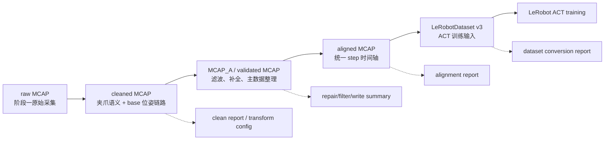

# 阶段二产物架构设计

## 文档定位

本文固定阶段二新版主线的产物架构。它回答每个数据产物是什么、从哪里来、交给谁、必须带哪些追溯信息。它不固定具体源码文件名或内部实现类名。

旧版 `canonical_dataset_mcap/` 架构已经归档，不再作为当前阶段二主产物。

## 一、总体目标

阶段二产物架构围绕一个目标设计：

```text
用真实 MCAP 数据生成可被 LeRobot 框架读取的 LeRobotDataset v3，
并支持 ACT 模型训练前检查。
```

新版产物链路：

```text
raw MCAP
  -> cleaned MCAP
  -> MCAP_A / validated MCAP
  -> aligned MCAP
  -> LeRobotDataset v3
```

## 二、产物架构图



## 三、产物契约

### 1. raw MCAP

**定义**：阶段一采集得到的外部原始 MCAP。

**来源**：本机或外部数据目录，不默认进入 Git。

**职责**：

- 保留原始 topic、消息、时间戳和硬件采集状态。
- 作为场景一输入。

**禁止事项**：

- 阶段二不得覆盖、重命名或移动 raw MCAP。
- 不得把大体积 raw MCAP 复制进仓库作为默认方案。

### 2. cleaned MCAP

**定义**：场景一输出，补齐后续处理需要的基础语义。

**核心变化**：

- 新主线中，位姿处理必须服务机械臂 base 坐标系链路。
- `common_frame` 不再作为宏观主路径目标；如果已有调试或兼容逻辑需要 common frame，只能作为中间实现细节或历史兼容说明。

**必须包含或可追溯**：

- 图像、触觉、夹爪开合等场景一必需 topic。
- 左右侧位姿来源、转换配置和坐标系说明。
- 清洗报告、失败原因、配置快照。

**下游**：场景二 MCAP_A / validated MCAP。

### 3. MCAP_A / validated MCAP

**定义**：场景二输出，是 cleaned MCAP 经主数据滤波、补全、异常标记和写出后的 MCAP。

**P0 职责**：

- 保持 cleaned MCAP 的 topic/time 主结构。
- 写入或替换滤波后的位姿、触觉、夹爪主数据。
- 输出异常、补全、滤波和写出 sidecar 摘要。

**P0 不负责**：

- 不做 MuJoCo 仿真标注。
- 不做关节限位标注。
- 不把 IK 结果作为 validated 主产物的必要字段。
- 不决定 LeRobotDataset v3 的 episode/action 最终结构。

**下游**：场景三 aligned MCAP。

### 4. aligned MCAP

**定义**：场景三输出，把 MCAP_A 中多 topic 数据对齐到统一 step 时间轴。

**必须表达**：

- 每个 step 的时间戳。
- observation 相关字段的来源 topic、对齐方式和时间误差。
- 缺失、复用、插值、超时等状态。
- 对齐质量报告。

**边界**：

- aligned MCAP 仍是时间序列/MCAP 世界。
- 它不承担 LeRobotDataset v3 的目录结构和 metadata 语义。

**下游**：场景四 LeRobotDataset v3 构建。

### 5. LeRobotDataset v3

**定义**：阶段二最终交付给阶段三 ACT 训练的数据集格式。

**格式来源**：以 LeRobot 官方 `LeRobotDataset v3` 格式为准。阶段二文档不得凭记忆锁死官方格式细节；实现 L2/L3 时必须核对当时使用的 LeRobot 版本。

**必须满足**：

- 能被 LeRobot 数据读取流程加载。
- 能表达 ACT 训练需要的 observation、action、episode 和 step 信息。
- 能追溯到 aligned MCAP、上游报告和处理配置。
- 生成转换报告和最小读取校验结果。

**不负责**：

- 不在阶段二内训练模型。
- 不回头修改 raw、cleaned、MCAP_A 或 aligned 数据。
- 不维护通用 HDF5/Zarr/export 抽象作为当前主线。

## 四、运行产物与追溯文件

每次开发验证或生产运行都必须有独立 run 目录。L3 开发验证默认使用：

```text
src/data_clean/runs/{YYYY-MM-DD_HHMMSS}_{l3_id}/
```

每个涉及真实数据处理的 run 至少包含：

```text
run_log.json
config_snapshot.yaml
input_sample_manifest.json
outputs/
```

其中：

- `run_log.json` 记录输入、配置、执行步骤、关键状态、错误信息和输出位置。
- `config_snapshot.yaml` 记录本次实际生效配置。
- `input_sample_manifest.json` 记录本次读取的外部 MCAP 路径、文件名、大小、mtime、样本选择规则和读取结论。
- `outputs/` 保存调试产物、中间结果、小样本结果或临时报告。

## 五、开发者与生产输出隔离

| 类型 | 默认位置 | 用途 |
|---|---|---|
| L3 开发验证 run | `src/data_clean/runs/` | Agent 开发、TDD、功能局部验证。 |
| 阶段二开发者调试 run | `asset/阶段二：数据清洗/dev_runs/` 或场景指定 run 目录 | 用户通过 `./start_data_clean.sh --dev` 做人工验收。 |
| 阶段数据流产物 | `asset/阶段二：数据清洗/dev/` 或正式生产输出目录 | cleaned、MCAP_A、aligned、LeRobotDataset v3 等数据产物。 |
| 外部 raw MCAP | `/home/hit/下载/mcap` 或 `DATA_CLEAN_RAW_MCAP_DIR` | 只读输入源，不进 Git。 |

禁止把临时调试输出散落到仓库根目录、`src/`、`config/` 或外部 MCAP 输入目录。

## 六、分层架构约束

程序实现继续遵守分层方向：

```text
Types -> Config -> Repo -> Service -> Runtime -> UI
```

对应到产物链：

- Types 定义产物数据结构、schema、report 和 manifest。
- Config 管理路径、topic、坐标系、对齐、LeRobot 字段映射等配置。
- Repo 负责 MCAP、JSON、YAML、Parquet 或 LeRobotDataset v3 文件读写。
- Service 负责清洗、滤波、补全、对齐、转换和数据集构建逻辑。
- Runtime 负责编排场景、run 目录、日志、错误摘要和状态。
- UI 提供 `./start_data_clean.sh --dev` 与生产入口。

## 七、验收清单

阶段二产物架构有效的最低验收条件：

- [ ] cleaned MCAP、MCAP_A、aligned MCAP、LeRobotDataset v3 的输入输出关系清晰。
- [ ] `MCAP_A / validated MCAP` 不再被要求承载 IK、关节限位或 MuJoCo 仿真标注。
- [ ] LeRobotDataset v3 是当前阶段二最终数据产物。
- [ ] 每个真实数据 run 都有日志、配置快照、输入样本 manifest 和 outputs。
- [ ] 用户能通过 `./start_data_clean.sh --dev` 对场景功能和场景 smoke test 做最终人工验收。
