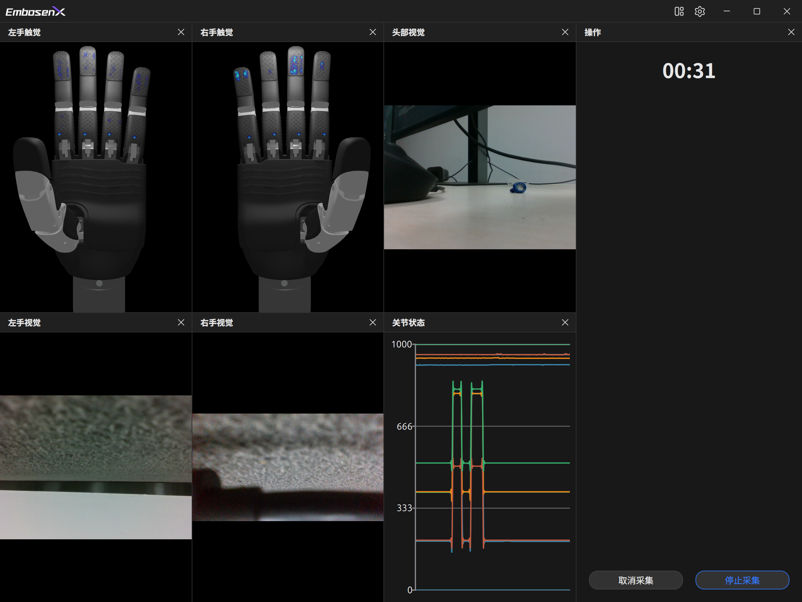

<p align="center">
    
</p>

<h1 align="center"> Octopus - EmbosenX 数据采集系统</h1>

<p>
    <p align="center">
         多模态数据采集系统
    </p>
</p>

## Topics

- `/realsense/left_hand/color/image_raw`: 左手相机 - 彩色
- `/realsense/right_hand/color/image_raw`: 右手相机 - 彩色
- `/realsense/top/color/image_raw`: 主相机 - 彩色
- `/realsense/left_hand/depth/image_rect_raw`: 左手相机 - 深度
- `/realsense/right_hand/depth/image_rect_raw`: 右手相机 - 深度
- `/realsense/top/depth/image_rect_raw`: 主相机 - 深度
- `/inspire/left_hand/tactile_12`: 因时四代手 - 指尖触觉
- `/inspire/left_hand/tactile_13`: 因时四代手 - 指腹触觉
- `/inspire/left_hand/tactile_22`: 因时四代手 - 指尖触觉
- `/inspire/left_hand/tactile_23`: 因时四代手 - 指腹触觉
- `/inspire/left_hand/tactile_32`: 因时四代手 - 指尖触觉
- `/inspire/left_hand/tactile_33`: 因时四代手 - 指腹触觉
- `/inspire/left_hand/tactile_42`: 因时四代手 - 指尖触觉
- `/inspire/left_hand/tactile_43`: 因时四代手 - 指腹触觉
- `/inspire/left_hand/tactile_52`: 因时四代手 - 指尖触觉
- `/inspire/left_hand/tactile_54`: 因时四代手 - 指腹触觉
- `/inspire/left_hand/tactile_61`: 因时四代手 - 掌心触觉
- `/inspire/right_hand/tactile_12`: 因时四代手 - 指尖触觉
- `/inspire/right_hand/tactile_13`: 因时四代手 - 指腹触觉
- `/inspire/right_hand/tactile_22`: 因时四代手 - 指尖触觉
- `/inspire/right_hand/tactile_23`: 因时四代手 - 指腹触觉
- `/inspire/right_hand/tactile_32`: 因时四代手 - 指尖触觉
- `/inspire/right_hand/tactile_33`: 因时四代手 - 指腹触觉
- `/inspire/right_hand/tactile_42`: 因时四代手 - 指尖触觉
- `/inspire/right_hand/tactile_43`: 因时四代手 - 指腹触觉
- `/inspire/right_hand/tactile_52`: 因时四代手 - 指尖触觉
- `/inspire/right_hand/tactile_54`: 因时四代手 - 指腹触觉
- `/inspire/right_hand/tactile_61`: 因时四代手 - 掌心触觉
- `/joint_states`: 手 + 机械臂关节状态

## Realsense cameras

### Check Serial Number

```bash
rs-enumerate-devices | grep Serial
```

### Start multiple cameras

```bash
ros2 launch realsense2_camera rs_launch.py camera_namespace:=realsense camera_name:=left_hand serial_no:=_348522073348
```

## Dependencies

### Qt 6.8+

Downlaod Qt `.run` installer from [Qt Download](https://download.qt.io/archive/online_installers/4.10/)

```bash
./qt-online-installer-linux-x64-4.10.0.run
```

### FFmpeg 8.0

```bash
sudo add-apt-repository ppa:ubuntuhandbook1/ffmpeg8
sudo apt install ffmpeg
```
