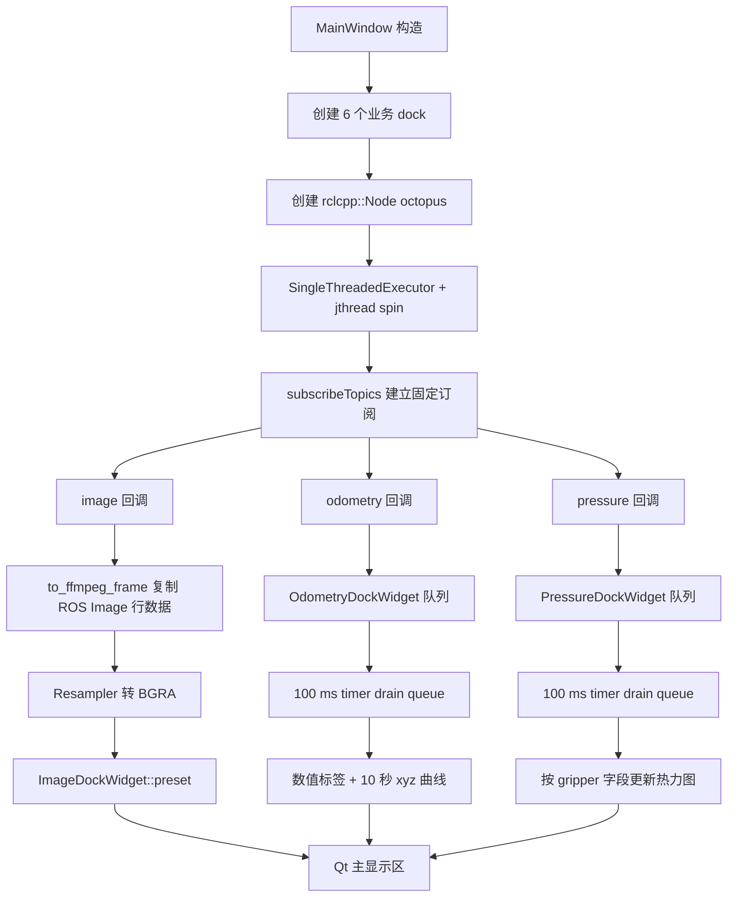
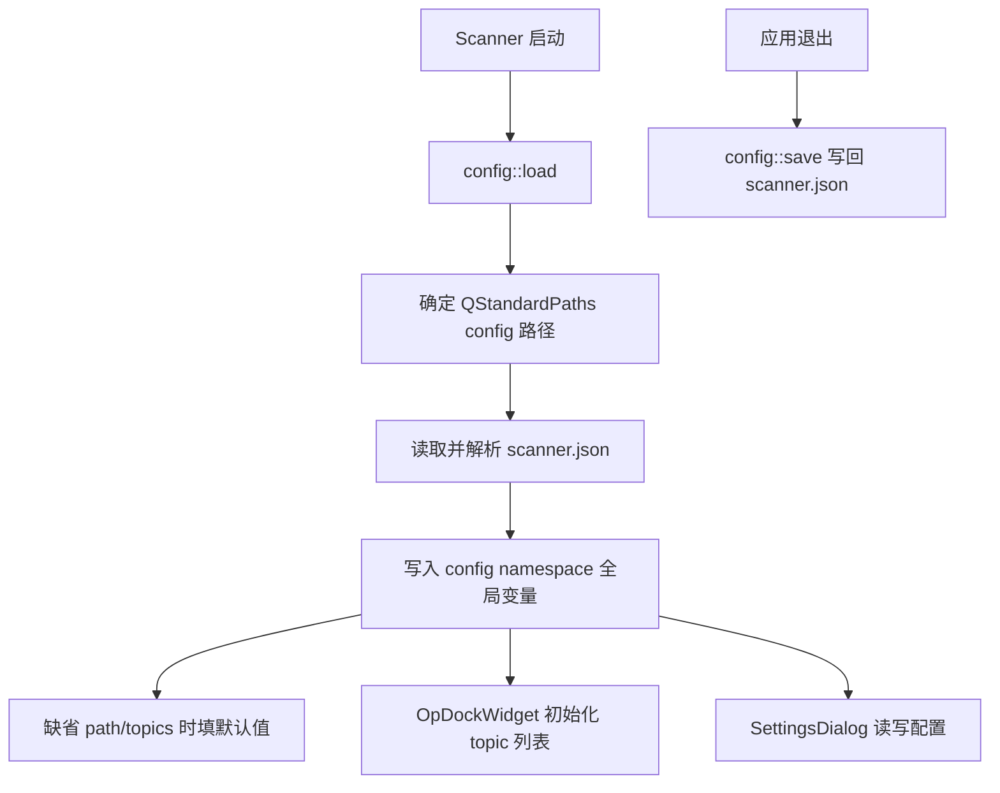

# Octopus 包内架构说明

本文档是 `/home/hit/ROS/src/VTLA_octopus-master/octopus` 代码包内的架构说明。全局项目视角仍以 `/home/hit/ROS/DOCS/Octopus_architecture.md` 为第一入口；本文件聚焦包内程序职责、数据流、运行方式和 UI 逻辑。

## 1. 概述

Octopus 是 ROS2 + Qt 桌面采集程序，服务于场景三和场景四：在 UI 中展示 FASTUMI 采集链路的目标 topic，并把用户选择的 topic 录制为 `.mcap` 文件。

当前项目中它承担两条相互独立的链路：

- 显示链路：固定订阅左右 GoPro 图像、左右 Baton Mini 位姿、左右手触觉压力 topic，并更新 Qt 面板。
- 录制链路：Operation 面板根据勾选 topic 创建 `McapRecorder`，使用 generic ROS2 subscription 写出 MCAP。

## 2. 目录结构

| 路径                                            | 职责                                                                                  |
| ----------------------------------------------- | ------------------------------------------------------------------------------------- |
| `src/main.cpp`                                | 程序入口，初始化日志、ROS2、Qt `Scanner` 和 `MainWindow`。                        |
| `src/scanner.*`                               | Qt 应用壳，加载字体、主题、翻译和全局配置。                                           |
| `src/mainwindow.*`                            | 主窗口和显示链路中心；创建 dock 布局、ROS2 显示节点、executor 线程和固定 topic 订阅。 |
| `src/mcap-recorder.*`                         | MCAP 录制器；按 topic/type 创建 generic subscription，写 schema/channel/message。     |
| `src/pages/op-panel.*`                        | Operation 面板；展示可勾选 topic、Start/Stop 录制按钮和录制计时。                     |
| `src/pages/image-widget.*`                    | GoPro 图像显示面板；接收 FFmpeg frame 并显示 FPS/分辨率。                             |
| `src/pages/odometry-panel.*`                  | 位姿显示面板；显示 odometry 数值和最近 10 秒 xyz 曲线。                               |
| `src/pages/pressure-panel.*`                  | 触觉显示面板；按 gripper_1/gripper_2 显示热力图、max/avg、矩阵尺寸和更新时间。        |
| `src/pages/topics-widget.*`                   | ROS2 topic 列表面板，通过标题栏 Layout 菜单控制显示。                                 |
| `src/pages/settings-dialog.*`                 | 设置对话框，维护主题、语言、录制路径和压缩等配置。                                    |
| `src/utils/config.*`                          | 读写 `scanner.json`，保存主题、语言、MCAP 路径、压缩方式和默认 topic 列表。         |
| `src/graphics/`                               | QRhi/模型/纹理等渲染辅助。                                                            |
| `src/media/`                                  | FFmpeg wrapper、resampler、队列和媒体辅助。                                           |
| `src/widgets/`                                | Dock、菜单、按钮、路径输入等通用 Qt 控件。                                            |
| `resources/`、`languages/`、`scanner.qrc` | 图标、模型、shader、翻译和 Qt 资源。                                                  |
| `CMakeLists.txt`、`package.xml`             | ROS2/Qt/C++ 构建清单。                                                                |

## 3. 数据流

本节重点说明程序内部如何工作。Octopus 不是“topic 进来后自动显示/录制”的黑盒；它在启动时建立两个互不复用的 ROS2 节点链路：一个属于 `MainWindow`，只服务实时显示；另一个在点击 Start 后由 `McapRecorder` 创建，只服务 MCAP 写盘。

### 3.1 显示链路



固定显示 topic：

| 输入 topic                         | 消息类型                                      | UI 目标                 |
| ---------------------------------- | --------------------------------------------- | ----------------------- |
| `/gopro_left/image_raw`          | `sensor_msgs/msg/Image`                     | Left GoPro 图像面板     |
| `/gopro_right/image_raw`         | `sensor_msgs/msg/Image`                     | Right GoPro 图像面板    |
| `/baton_mini_left/fast_odom`     | `nav_msgs/msg/Odometry`                     | Left Pose 位姿面板      |
| `/baton_mini_right/fast_odom`    | `nav_msgs/msg/Odometry`                     | Right Pose 位姿面板     |
| `/pressure/left_hand/gripper_1`  | `hwk_pressure_interfaces/msg/PressureFrame` | Left Tactile gripper_1  |
| `/pressure/left_hand/gripper_2`  | `hwk_pressure_interfaces/msg/PressureFrame` | Left Tactile gripper_2  |
| `/pressure/right_hand/gripper_1` | `hwk_pressure_interfaces/msg/PressureFrame` | Right Tactile gripper_1 |
| `/pressure/right_hand/gripper_2` | `hwk_pressure_interfaces/msg/PressureFrame` | Right Tactile gripper_2 |

内部工作机理：

1. `MainWindow` 构造函数先创建 Qt dock 布局，再创建 `sub_node_ = rclcpp::Node("octopus")`。
2. `sub_executor_` 是显示链路自己的 `SingleThreadedExecutor`，放在 `std::jthread` 中持续 `spin()`；这让 ROS 回调不阻塞 Qt 主线程。
3. `subscribeTopics()` 内部定义三个 lambda：`subscribe_image`、`subscribe_odometry`、`subscribe_pressure`，分别绑定图像、位姿、触觉面板。
4. 图像回调中维护一个 `ImageSubscriptionState`，里面缓存 `Resampler`、宽和高。图像尺寸变化时重建 `Resampler`，尺寸不变时复用，避免每帧重新分配转换器。
5. `to_ffmpeg_frame()` 根据 `sensor_msgs/msg/Image.encoding` 选择 FFmpeg pixel format，并按 `img.step` 逐行复制 `img.data`。这里不是零拷贝；它会创建新的 FFmpeg frame，并把每行缺省区域清零。
6. `Resampler::scale()` 把输入 frame 转为面板固定需要的 BGRA frame，随后 `ImageDockWidget::preset()` 将帧交给纹理显示链路。
7. 位姿和触觉回调不直接更新 UI，而是调用面板 `preset()` 把消息压入队列。面板自己的 100 ms timer 调用 `refresh()`，一次性 drain 队列并更新标签/图表/热力图。
8. `OdometryDockWidget` 每次刷新时更新 frame、stamp、position、orientation、linear、angular，并把 position xyz 追加到时间窗，`refresh_chart()` 只保留最近 10 秒数据。
9. `PressureDockWidget` 依靠 `PressureFrame.gripper` 判断 gripper_1 或 gripper_2；两个 gripper 使用同一个当前最大压力值做颜色缩放，避免同手两块热力图颜色尺度不一致。
10. 所有显示订阅都保存在 `subscriptions_` map 中，key 是 topic 字符串；生命周期跟随 `MainWindow`。

排障重点：

- 某个面板不更新，先确认上游 topic 是否存在且类型正确，再看 `subscribeTopics()` 是否订阅了该固定 topic。
- 图像黑屏但 topic 有消息时，重点看 `encoding` 是否被 `to_ffmpeg_pixfmt()` 支持。
- 触觉热力图空白时，重点看 `PressureFrame.rows/cols/data` 是否有效，以及 `gripper` 是否是 `gripper_1` 或 `gripper_2`。

### 3.2 录制链路

```mermaid
flowchart TD
  CLICK[Start 按钮] --> LIST[遍历 QListWidget 勾选项]
  LIST --> RECNEW[创建 shared_ptr<McapRecorder>]
  RECNEW --> RECNODE[recorder 节点 + executor 线程]
  RECNODE --> DISC[get_topic_names_and_types]
  DISC --> FILTER[只保留当前 ROS graph 中存在的 topic]
  FILTER --> OPEN[打开 McapWriter 输出文件]
  OPEN --> CH[为每个 topic 注册 schema/channel]
  CH --> GENSUB[create_generic_subscription]
  GENSUB --> SER[收到 SerializedMessage]
  SER --> THROTTLE[fast_odom 按 60 Hz 节流]
  THROTTLE --> WRITE[writer_->write mcap::Message]
  WRITE --> FILE[/home/hit/ROS/mcap 时间戳.mcap]
  STOP[Stop 按钮] --> DESTROY[reset recorder]
  DESTROY --> CLOSE[析构关闭 writer 和 executor]
```

内部工作机理：

1. `OpDockWidget` 构造时读取 `config::recording::mcap::topics`，为每个默认 topic 创建一个可勾选的 `QListWidgetItem`。
2. 用户点击 Start 后，`OpDockWidget::start()` 遍历列表，只把 checked 的 topic 放入 `topics` vector；如果为空，直接弹出错误，不创建 recorder。
3. `McapRecorder` 构造时创建独立的 `rclcpp::Node("recorder")`、`SingleThreadedExecutor` 和后台线程。这个节点与显示链路的 `octopus` 节点完全分离。
4. `subscribe_topics()` 调用 `node_->get_topic_names_and_types()` 查询当前 ROS graph。只有此刻已经存在的 topic 才会进入 `topics_` map；不存在的勾选项会被静默跳过。
5. `record()` 先用 `running_.exchange(true)` 防止重复开始，再检查 `topics_` 是否为空。若所有勾选 topic 都不存在，会报 `no available topics to record`。
6. 打开输出文件后，`create_channel()` 为每种消息类型注册一次 MCAP schema，为每个 topic 注册一个 MCAP channel。schema 文本来自 `get_message_definition()` 的手写定义。
7. `create_subscription()` 使用 `create_generic_subscription(topic, type, qos, callback)`，回调收到的是序列化消息，不需要把 ROS 消息反序列化成 C++ 类型。
8. QoS 由 `qos_for_topic()` 决定：默认 reliable；如果发现上游 publisher 是 best effort，或图像 topic 暂时没有 publisher，则使用 best effort。
9. 写入时使用 ROS middleware 提供的 `received_timestamp` 作为 MCAP `logTime`，`source_timestamp` 作为 `publishTime`，数据指针直接指向 serialized buffer。
10. topic 名包含 `fast_odom` 时，按 `kFastOdomMinIntervalNs = 16,666,666 ns` 节流，约等于 60 Hz；被跳过的消息不会写入 MCAP。
11. Stop 的本质是 `recorder_.reset()`；`McapRecorder` 析构时 cancel executor、join 线程、close writer。

排障重点：

- Operation 列表中有 topic 不代表一定会录制；Start 当刻 ROS graph 中不存在的 topic 不会进入 `topics_`。
- 新增消息类型后，如果 `get_message_definition()` 没有维护 schema 文本，MCAP 可能无法被后续工具正确解析。
- 录制链路写的是原始序列化消息，显示链路的图像转换、位姿曲线、触觉热力图不会影响 MCAP 内容。

### 3.3 配置链路



内部工作机理：

1. `Scanner` 启动时调用 `config::load()`。
2. `config::load()` 用 Qt `QStandardPaths::GenericConfigLocation` 拼出 `scanner.json` 路径，当前机器通常对应 `/home/hit/.config/scanner.json`。
3. 文件存在且 JSON 可解析时，`from_json()` 只读取已支持字段：语言、主题、MCAP path、compression、topics。
4. 如果 `recording.mcap.path` 为空，默认写为 Qt Documents 目录；项目启动脚本会提前用 `configure_octopus_scanner.py` 改成 `/home/hit/ROS/mcap`。
5. 如果 `recording.mcap.topics` 为空，`config.cpp` 内置 8 个目标 topic。Operation 面板只在构造时读取这份列表，所以启动后的配置文件变化不会自动刷新已创建的列表。
6. `config::save()` 在应用退出或设置保存时覆盖写回 JSON。它保存的是当前全局 `config` namespace 状态。

## 4. 依赖与运行

主要依赖：

- ROS2：`rclcpp`、`sensor_msgs`、`nav_msgs`、`hwk_pressure_interfaces`
- Qt 6.8：Core、Gui、Widgets、Charts、LinguistTools、ShaderTools
- FFmpeg、Assimp、MCAP C++、spdlog、nlohmann_json、zstd、glm

构建示例：

```bash
cd /home/hit/ROS
colcon build --packages-select octopus --cmake-args -DCMAKE_BUILD_TYPE=Release
```

推荐运行入口：

```bash
cd /home/hit/ROS
./start_octopus.sh
```

直接运行安装产物：

```bash
/home/hit/ROS/install/octopus/lib/octopus/octopus
```

直接运行时需要调用方自行保证 ROS2 环境、Qt/FFmpeg 动态库路径和 `scanner.json` 已配置。

## 5. 配置项说明

| 配置项                             | 默认或来源                                            | 含义                                       |
| ---------------------------------- | ----------------------------------------------------- | ------------------------------------------ |
| `recording.mcap.path`            | `scanner.json`；启动脚本写为 `/home/hit/ROS/mcap` | MCAP 输出目录。                            |
| `recording.mcap.compression`     | `scanner.json`                                      | MCAP 压缩方式。                            |
| `recording.mcap.topics`          | `scanner.json` 或 `config.cpp` 内置 8 topic       | Operation 面板默认展示并勾选的录制 topic。 |
| `language`                       | `scanner.json`                                      | UI 语言。                                  |
| `theme`                          | `scanner.json`                                      | UI 主题，并影响部分图表配色。              |
| `layout.visibility.topics_panel` | 运行期全局配置                                        | Topics 面板是否显示。                      |

内置默认录制 topic 为场景三/四的 8 个目标 topic：2 路 Baton Mini fast odom、2 路 GoPro image、4 路触觉 PressureFrame。

## 6. UI 逻辑

- 主显示区启动即创建 6 个核心 dock：Left/Right GoPro、Left/Right Pose、Left/Right Tactile。
- Topics 面板默认隐藏，可通过标题栏 Layout 菜单显示；刷新时读取当前 ROS graph 的 topic 列表。
- Operation 面板右侧常驻，读取 `config::recording::mcap::topics` 生成复选列表。
- 点击 Start 时收集已勾选 topic，创建 `McapRecorder`，生成时间戳命名的 `.mcap` 文件并开始录制。
- 点击 Stop 时销毁 recorder；析构会关闭 writer、取消 executor 并结束录制线程。
- 位姿面板显示 frame、stamp、position、orientation、linear、angular，并维护最近 10 秒 xyz 曲线。
- 触觉面板按 `PressureFrame.gripper` 路由到 gripper_1 / gripper_2，热力图使用同手两路数据的当前最大值统一缩放。

## 7. 与上下游的关系

上游：

- `/home/hit/ROS/start_all_sensor.sh` 启动左右 Baton Mini、左右 GoPro 和触觉驱动。
- `/home/hit/ROS/src/baton_mini_sdk_demo` 发布 Baton Mini odometry。
- `/home/hit/ROS/src/gopro_camera_launch` 发布 GoPro image。
- `/home/hit/ROS/src/hwk_pressure_driver` 发布 PressureFrame。

下游：

- MCAP 原始输出写入 `/home/hit/ROS/mcap`。
- `/home/hit/ROS/src/data_clean` 读取原始 MCAP，生成 TCP odom 和 gripper width 后写入 `/home/hit/ROS/mcap_cleaned`。

边界：

- Octopus 负责实时显示和原始 MCAP 录制，不负责硬件身份解析。
- Octopus 录制的是序列化 ROS2 原始消息，不负责 data_clean 的离线转换。
- 修改显示 topic、录制 topic、schema 支持或 UI 面板时，必须同步更新本文件和 `/home/hit/ROS/DOCS/Octopus_architecture.md`。
