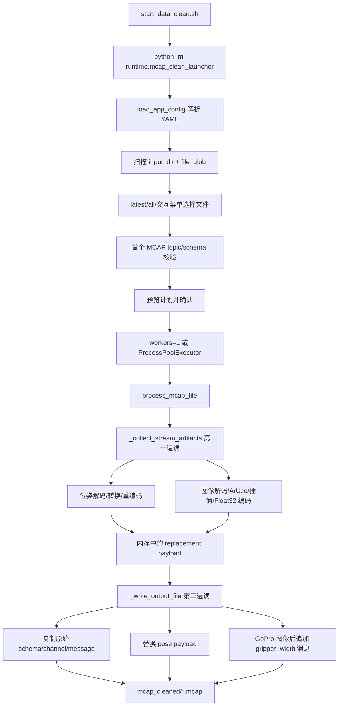

# data_clean 架构说明

本文档说明 `src/data_clean` 离线 MCAP 清洗程序的功能、数据流、使用方式和配置逻辑。该程序属于阶段二场景一“提取夹爪开合以及位姿转换”。

## 1. 概述

`data_clean` 读取 Octopus 录制的原始 `.mcap` 文件，保留原始 topic，同时生成新的清洗结果：

- 将 Baton Mini 原始位姿转换为 common frame 下的相机位姿。
- 从 GoPro 图像中检测 ArUco 标记，估计左右夹爪宽度并写入 `std_msgs/msg/Float32` topic。
- 通过交互式 launcher 选择要处理的文件、并行数、dry-run、标定向导等。

它不是 ROS2 节点，而是 Python 离线处理工具。入口由 `start_data_clean.sh` 包装，避免用户手工设置 `PYTHONPATH`。

## 2. 目录结构

代码按单向依赖分层组织：`Schemas → Config → Repo → Service → Runtime → UI`，后层可调前层，前层不能反向依赖后层。

| 路径 | 层级 | 职责 |
| --- | --- | --- |
| `schemas/__init__.py` | Schemas | Python 包标记。 |
| `schemas/ros2_schemas.py` | Schemas | 清洗流程需要写出的 ROS2 schema 文本。零依赖。 |
| `config/__init__.py` | Config | Python 包标记。 |
| `config/mcap_process_config.py` | Config | YAML 配置解析与校验；定义 batch、transform、pose_streams、gripper_streams。零内部依赖。 |
| `repo/__init__.py` | Repo | Python 包标记。 |
| `repo/ros2_codec.py` | Repo | ROS2 CDR 动态编解码、图像转 ndarray、位姿字段提取/注入。依赖 types。 |
| `service/__init__.py` | Service | Python 包标记。 |
| `service/validator.py` | Service | 输入 MCAP topic/schema 校验、输出契约校验和报告数据结构。依赖 config。 |
| `service/tcp_transform.py` | Service | Baton Mini start frame 到 common frame 的标准 SE(3) 位姿转换。依赖 config。 |
| `service/gripper_width.py` | Service | 基于 OpenCV ArUco 的夹爪宽度提取、缺失帧插值和归一化。依赖 config。 |
| `service/mcap_io.py` | Service | 单文件清洗核心；读取原始 MCAP、生成 common-frame 相机位姿 payload、新增夹爪宽度 topic、写出 MCAP。依赖 config、repo、service 内部模块、types。 |
| `runtime/__init__.py` | Runtime | Python 包标记。 |
| `runtime/mcap_clean_batch.py` | Runtime | 非交互批处理入口；读取配置、遍历输入目录、并行处理文件、输出 JSON 报告。依赖 config、service。 |
| `runtime/mcap_clean_launcher.py` | Runtime | 面向用户的交互式入口；选择 MCAP 文件、预览计划、校验首个文件、调度清洗。依赖 config、service。 |
| `ui/__init__.py` | UI | Python 包标记。 |
| `ui/mcap_calibration_wizard.py` | UI | 配置/标定向导；辅助生成 `config/data_clean_calibrated.yaml`。依赖 config、repo。 |

相关入口和配置在代码包外：

| 路径 | 职责 |
| --- | --- |
| `start_data_clean.sh` | 推荐启动入口，设置 Python/环境变量后调用 launcher。 |
| `config/data_clean_smoke_test.yaml` | 默认测试配置。 |
| `config/data_clean_calibrated.yaml` | 标定向导生成的正式配置。 |
| `config/data_clean_left_transform.yaml` | 左手 Baton Mini 专用 `start_from_common` 配置。 |
| `config/data_clean_right_transform.yaml` | 右手 Baton Mini 专用 `start_from_common` 配置。 |

## 3. 数据流

本节重点说明 `data_clean` 内部如何把“一个 MCAP 文件”变成“一个清洗后 MCAP 文件”。它不是边读边简单复制；单文件清洗分为“先收集可替换/可新增 payload”与“再按原始消息顺序重写输出文件”两步。



### 3.1 启动器到单文件任务

`mcap_clean_launcher.py` 的内部流程：

1. `_build_parser()` 定义 `--config`、`--latest`、`--all`、`--dry-run`、`--workers`、`--calibrate` 等参数。
2. `load_app_config()` 读取 YAML，构造强类型 dataclass，并做交叉校验：topic 不能重复、图像输入只能是 `sensor_msgs/msg/Image`、夹爪宽度输出只能是 `std_msgs/msg/Float32`。
3. `_iter_input_files()` 扫描 `batch.input_dir` 下匹配 `batch.file_glob` 的文件，按文件名倒序排列；当前文件名含时间戳，因此“最近 N 个”依赖文件名排序。
4. `_choose_files()` 根据命令行或交互菜单选出文件集合。无参数时，回车是最近 1 个，`n` 是最近 N 个，`a` 是全部，`c` 跳到标定向导。
5. `_build_selection()` 为每个输入文件计算同名输出路径，并记录输出文件之前是否存在、大小和 mtime，用于失败或中断后的半成品清理。
6. `_validate_first_mcap()` 只检查选中集合的第一个文件：读取 summary，构造 topic inventory，确认所有配置中的 pose/image topic 存在、类型匹配且有消息。
7. `_run_cleaning()` 根据 workers 选择串行或 `ProcessPoolExecutor`。并行时每个子进程处理一个文件，返回 `FileProcessingReport`。
8. 失败文件会调用 `_safe_delete_output()` 清理本轮产生的半成品；Ctrl+C 时保留已成功输出，清理未完成输出。

### 3.2 第一遍读取：生成中间 payload

`mcap_io._collect_stream_artifacts()` 是第一遍核心：

1. 从配置中建立两个索引：`pose_by_topic()` 和 `gripper_by_image_topic()`，分别用输入 topic 快速判断消息是否需要处理。
2. 打开输入 MCAP，先读取 summary 并调用 `validate_input_inventory()`。这里会检查：
   - pose topic 必须存在、有消息、只有一个 channel、schema name 等于配置的 `msg_type`。
   - image topic 必须存在、有消息、只有一个 channel、schema name 等于配置的 `image_msg_type`。
   - gripper 输出 topic 不能已经存在于输入 MCAP，避免新增 topic 与原始 topic 冲突。
3. 重新从文件开头创建 reader，遍历 `reader.iter_messages(log_time_order=False)`。这里保持 MCAP 原始存储顺序，不强制按时间重排。
4. 遇到 pose topic 时：
   - `Ros2DynamicCodec.decode(schema, message)` 把 CDR payload 解成 Python 对象。
   - `extract_pose_fields()` 从 `nav_msgs/msg/Odometry` 或 `geometry_msgs/msg/PoseStamped` 中取出 position 和 quaternion。
   - `transform_pose_to_common_camera()` 按该 pose stream 自己的 `start_from_common` 计算 common frame 下的 camera pose；如果配置了 `transform_file`，参数来自对应外部文件。
   - `inject_pose_fields()` 把转换后的 pose 写回解码对象。
   - `codec.encode()` 重编码成新的 CDR payload，放入 `pose_payloads[topic]`。
5. 遇到 image topic 时：
   - `codec.decode()` 解码 ROS Image。
   - `image_message_to_ndarray()` 根据 encoding/height/width/step 转为 numpy 图像。
   - `GripperWidthAccumulator.consume()` 检测 ArUco marker 并保存该帧估计出的夹爪宽度样本。
6. 文件遍历结束后，每个 `GripperWidthAccumulator.finalize()` 会把所有图像帧补齐成与图像帧数量一致的宽度序列，再用 `codec.encode_float32()` 编成 `std_msgs/msg/Float32` payload。

### 3.3 位姿转换机理

`tcp_transform.py` 当前承担 common-frame 相机位姿转换。配置文件保存的是 `start_from_common`，也就是 common frame 在 Baton Mini 初始坐标系中的位姿。清洗时每帧 raw pose 可理解为 `T_start_camera(t)`，程序计算：

```text
T_common_camera(t) = inverse(T_start_common) * T_start_camera(t)
```

实现上，`transform_pose_to_common_camera()` 会把配置和每帧 pose 都转成 4x4 齐次矩阵，使用标准 SE(3) 逆变换和矩阵乘法，再输出 `[x, y, z, qx, qy, qz, qw]`。

当前 `_write_output_file()` 不新增独立 camera pose topic，而是复用原始 pose channel，把原 pose payload 替换为 common frame 下的相机位姿 payload；`pose_streams[].output_topic` 只作为报告中的语义名称。

左右手 transform 配置边界：

- 左手 Baton Mini 的 transform 来自 `config/data_clean_left_transform.yaml`。
- 右手 Baton Mini 的 transform 来自 `config/data_clean_right_transform.yaml`。
- `pose_streams[].transform_file` 优先级高于顶层 `transform`。
- 新格式不兼容旧 `base_position/base_orientation_deg/tcp_offset`。
- 标定向导保存 common frame 时，会按当前手写回对应的 `transform_file`，不会把左右手写进同一份 transform。

### 3.4 夹爪宽度提取机理

`gripper_width.py` 的 `GripperWidthAccumulator` 按一条 image stream 维护状态：

1. 初始化时根据 `aruco_dict` 找 OpenCV 字典，创建 detector parameters。
2. 每消费一帧，`frame_count += 1`，先把图像转成连续的 `uint8` 灰度图。
3. `cv2.aruco.detectMarkers()` 返回 marker corners 和 ids。
4. 只关心 `marker_id_0` 和 `marker_id_1`。两个 marker 都检测到时，用两个中心点欧氏距离；只检测到一个 marker 时，用它到图像中心线的水平距离乘 2 作为估计；都没有则该帧没有直接样本。
5. `_map_pixel_distance()` 将像素距离按 `(distance - marker_min) / (marker_max - marker_min) * gripper_max` 映射到夹爪宽度，并裁剪到 `[0, gripper_max]`。
6. `finalize()` 要求至少有一帧图像且至少有一个有效 marker 样本；否则整条 gripper stream 失败。
7. `_interpolate_distances()` 对缺失帧补值：开头缺失用第一个有效值，中间缺失线性插值，结尾缺失用最后一个有效值。
8. 最终每帧宽度除以 `gripper_max` 得到归一化值，再编码成 `Float32`。

### 3.5 第二遍写出：保留原始消息并插入清洗结果

`mcap_io._write_output_file()` 是第二遍核心：

1. 重新读取输入 MCAP，并打开输出文件创建 `mcap.writer.Writer`。
2. `_McapOutputBuilder.ensure_original_channel()` 为每个原始 channel 在输出文件中注册对应 schema/channel；schema 会先经过 `normalize_ros2_schema()`，解决 Octopus 写入 schema 缩进导致动态解析失败的问题。
3. 遍历每条原始 message：
   - 默认原样复制原始 message。
   - 如果 channel.topic 是 pose topic，则从第一遍生成的 `pose_iterators[topic]` 取一个转换后的 payload，并写回原始 pose topic 对应 channel。
   - 如果 channel.topic 是配置中的 image topic，则马上注册/获取 gripper output channel，并用同一条图像消息的时间戳写入一个 `Float32` gripper width message。
4. 写完后检查所有 pose/gripper payload iterator 是否刚好消耗完；多余 payload 表示第一遍与第二遍消息数量不一致，会判为处理错误。
5. 构造 `FileProcessingReport`，并用 `validate_output_contract()` 确认输出 topic 数等于输入 topic 数加 gripper stream 数，位姿消息数量不变，gripper 消息数量等于图像帧数。

默认输入与输出：

| 类型 | 默认值 |
| --- | --- |
| 原始输入目录 | `mcap` |
| 清洗输出目录 | `mcap_cleaned` |
| 输入匹配 | `*.mcap` |
| 位姿输入/当前写回 channel | `/baton_mini_left/fast_odom`、`/baton_mini_right/fast_odom` |
| 位姿目标语义 | `/baton_mini_left/camera_common_pose`、`/baton_mini_right/camera_common_pose`；当前仅用于报告，不新增同名 channel |
| 左手 transform 文件 | `config/data_clean_left_transform.yaml` |
| 右手 transform 文件 | `config/data_clean_right_transform.yaml` |
| 图像输入 | `/gopro_left/image_raw`、`/gopro_right/image_raw` |
| 夹爪宽度输出 | `/gopro_left/gripper_width`、`/gopro_right/gripper_width` |

## 4. 依赖与运行

主要依赖：

- Python 3
- `mcap`
- `numpy`
- `scipy`
- `opencv-python` 且包含 `cv2.aruco`
- `PyYAML`
- ROS2 CDR 解码所需的本地 Python 环境

推荐运行：

```bash
cd .
./start_data_clean.sh
```

常用参数：

```bash
./start_data_clean.sh --dry-run --latest 1
./start_data_clean.sh --latest 5 --workers auto
./start_data_clean.sh --all --workers 6
./start_data_clean.sh --calibrate
DATA_CLEAN_RAW_JSON=1 ./start_data_clean.sh --latest 1
```

直接模块入口仅用于调试；正常使用应走 `start_data_clean.sh`。

## 5. 配置项说明

配置文件优先级：命令行 `--config` 或 `DATA_CLEAN_CONFIG` > `config/data_clean_calibrated.yaml` > `config/data_clean_smoke_test.yaml`。

| 配置块 | 字段 | 含义 |
| --- | --- | --- |
| `batch` | `input_dir`、`output_dir`、`file_glob` | 输入目录、输出目录、文件匹配规则。 |
| `batch` | `workers`、`overwrite`、`fail_fast` | 并行数、是否覆盖、失败后是否停止。 |
| `transform` | `start_from_common.translation`、`start_from_common.rotation_xyzw` | 默认 common frame 转换参数；正式左右手参数应优先放入左右独立 transform 文件。 |
| `pose_streams` | `input_topic`、`msg_type`、`output_topic`、`transform_file` | 位姿输入、类型、输出语义以及左右手独立 transform 文件。 |
| `pose_streams` | 可选 `transform` | 内联单流覆盖 transform，格式同 `start_from_common`。 |
| `gripper_streams` | `image_topic`、`output_topic`、`aruco_dict`、`marker_id_0/1` | 图像输入、夹爪宽度输出和 ArUco 标记定义。 |
| `gripper_streams` | `marker_min`、`marker_max`、`gripper_max` | 像素距离到夹爪宽度的线性映射范围。 |
| `calibration` | `common_frame`、`gripper` | 标定状态记录；launcher 用于提示是否仍为测试参数。 |

当前 validator 支持的位姿类型为 `nav_msgs/msg/Odometry` 和 `geometry_msgs/msg/PoseStamped`；夹爪图像输入支持 `sensor_msgs/msg/Image`；夹爪宽度输出固定为 `std_msgs/msg/Float32`。

## 6. 交互/UI 逻辑

`mcap_clean_launcher.py` 是命令行交互 UI：

- 启动后显示配置文件、配置状态、输入/输出目录和可清洗文件数量。
- 无参数时显示菜单：回车处理最近 1 个，`n` 输入最近 N 个，`a` 全部，`c` 进入配置/标定向导，`q` 退出。
- `--latest`、`--all`、`--dry-run` 可跳过交互，适合脚本调用。
- 执行前会预览清洗计划、并行数、覆盖策略和目标输出。
- 首个 MCAP 会先做 topic/schema 校验，失败时不进入批处理。
- 清洗过程中显示进度、每个文件的输入输出 topic 数、位姿和夹爪统计。
- `DATA_CLEAN_RAW_JSON=1` 时输出机器可读 JSON，减少中文交互文本。

`mcap_calibration_wizard.py` 是标定向导逻辑：

- 可启动或复用左右 GoPro-only 图像 topic。
- 采样 ArUco 检测结果，计算左右夹爪 marker 范围。
- 订阅左右 Baton Mini 实时 odometry，点击 common frame 标定后采样稳定窗口并生成 `start_from_common` 配置。
- 输出 `config/data_clean_calibrated.yaml`，覆盖前应备份旧文件。

## 7. 与上下游的关系

上游：

- Octopus 在场景三/四生成 `mcap/*.mcap`。
- 原始 MCAP 应包含 2 路 Baton Mini 位姿、2 路 GoPro 图像和其他原始 topic。

下游：

- 清洗后 MCAP 写入 `mcap_cleaned`，供后续回放、验证或训练数据处理使用。
- 输出报告可被人工阅读，也可通过 `DATA_CLEAN_RAW_JSON=1` 被脚本解析。

边界：

- `data_clean` 不启动 Octopus，不负责实时录制。
- `data_clean` 不修改原始 MCAP；输出目录中同名文件按配置和 launcher 覆盖策略处理。
- 修改清洗算法、topic 契约、配置项或交互入口时，必须同步更新本文件和阶段二场景一的输出程序与文件清单。
