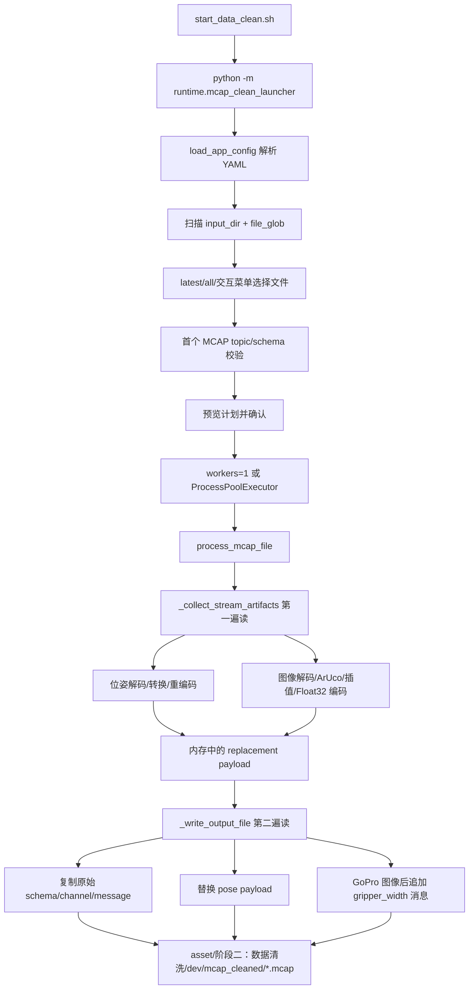

# data_clean 架构说明

本文档说明 `src/data_clean` 离线 MCAP 清洗程序的功能、数据流、使用方式和配置逻辑。该程序属于阶段二场景一“提取夹爪开合以及位姿转换”。

> 阶段二 service-s1 目标契约已更新：raw pose 必须保留或可追溯，位姿配置目标迁移为 `frame_alignment.common_anchor`，默认 `common_frame = left_umi_start_frame`，并输出 common frame camera pose 与 TCP pose。本文中关于 `start_from_common` 和替换 pose payload 的描述表示当前旧实现，后续由 `service_s1_006` 到 `service_s1_008` 改造。

## 1. 概述

`data_clean` 读取 Octopus 录制的原始 `.mcap` 文件，保留原始 topic，同时生成新的清洗结果：

- 将 Baton Mini 原始位姿转换为 common frame 下的相机位姿；目标契约还要求保留 raw pose，并叠加 TCP 外参得到 common frame TCP pose。
- 从 GoPro 图像中检测 ArUco 标记，估计左右夹爪宽度并写入 `std_msgs/msg/Float32` topic。
- 通过交互式 launcher 选择要处理的文件、并行数、dry-run、标定向导等。

它不是 ROS2 节点，而是 Python 离线处理工具。入口由 `start_data_clean.sh` 包装，避免用户手工设置 `PYTHONPATH`。

## 2. 目录结构

代码按单向依赖分层组织：`Schemas → Config → Repo → Service → Runtime → UI`，后层可调前层，前层不能反向依赖后层。

| 路径 | 层级 | 职责 |
| --- | --- | --- |
| `schemas/__init__.py` | Schemas | Python 包标记；导出公共类型。 |
| `schemas/alignment_config.py` | Schemas | 场景三对齐配置、目标字段映射、模态和侧枚举 (Scene3AlignmentConfig, TargetFieldMapping, AlignmentModality, AlignmentSide)。零依赖。 |
| `schemas/step_timeline.py` | Schemas | 场景三 step 时间轴、字段对齐状态枚举和对齐索引类型 (StepTimeline, StepTimelineEntry, StepTimelineSummary, FieldAlignmentStatus, AlignmentIndexRecord, AlignmentIndexSchema)。零依赖。 |
| `schemas/alignment_input.py` | Schemas | 场景三 MCAP_A 输入盘点与校验类型 (SourceTopicCatalog, McapAInputValidationSummary, TopicTimestampOrder, FieldAvailability, InputValidationStatus, SummaryConsistencyStatus, SourceTopicEntry, SourceFieldEntry)。零依赖。 |
| `schemas/aligned_mcap_report.py` | Schemas | 场景三 aligned MCAP 产物契约、对齐统计报告、写出摘要和 final report 补齐类型 (AlignedMcap, AlignmentReport, AlignedMcapWriteSummary, AlignmentReportFinalization)。零依赖。 |
| `schemas/field_alignment.py` | Schemas | 场景三字段对齐结果、策略契约和轻量派生值类型 (FieldAlignmentResult, FieldAlignmentStrategy, FieldAlignmentStrategyMethod, DerivedAlignmentValue)。零依赖。 |
| `schemas/ros2_schemas.py` | Schemas | 清洗流程需要写出的 ROS2 schema 文本。零依赖。 |
| `schemas/runtime_enums.py` | Schemas | Runtime 枚举（RunStatus、RunMode、SceneName、ServiceMode）。零依赖。 |
| `schemas/reliability.py` | Schemas | 场景二可靠性检测结果类型（样本级问题、缺失区间、问题组和聚合结果）。零依赖。 |
| `schemas/repair.py` | Schemas | 场景二数据补全器策略、方法、决策状态、run、样本记录和聚合结果类型。依赖 reliability。 |
| `schemas/pose_filter.py` | Schemas | 场景二位姿滤波器配置、输入序列、样本审计、分段摘要和聚合结果类型。依赖 reliability、repair。 |
| `schemas/tactile_filter.py` | Schemas | 场景二触觉滤波器配置、输入序列、样本审计、分段摘要和聚合结果类型。依赖 reliability、repair。 |
| `schemas/runtime_context.py` | Schemas | RunContext 定义。依赖 runtime_enums、run_directory_types。 |
| `schemas/runtime_config_types.py` | Schemas | 配置加载相关类型（EffectiveRuntimeConfig、ConfigSnapshot 等）。零依赖。 |
| `schemas/runtime_results.py` | Schemas | 运行结果与错误引用类型。依赖 runtime_enums。 |
| `schemas/run_directory_types.py` | Schemas | Run 目录结构与命名规则类型。零内部类型依赖。 |
| `schemas/runtime_log_types.py` | Schemas | 结构化日志类型（RunLogFile、RuntimeLogEvent、RuntimeLogWriteResult）。依赖 runtime_enums、runtime_results。 |
| `schemas/runtime_precheck_types.py` | Schemas | 配置预检查类型（ConfigPrecheckIssue、ConfigPrecheckResult、ConfigPrecheckRule、SceneConfigRequirement）及 PRECHECK_RULES 常量。依赖 runtime_enums、runtime_config_types、runtime_results。 |
| `schemas/input_artifact_types.py` | Schemas | 输入产物预检查类型（InputArtifactRequirement、InputArtifactCheckResult、InputArtifactPrecheckSummary）。依赖 runtime_enums、runtime_results。 |
| `schemas/service_dispatch_types.py` | Schemas | Service 调度类型（ServiceRegistry、ServiceBinding、SceneDispatchPlan、SceneDispatchEvent、DispatchEventType）。依赖 runtime_enums、input_artifact_types、runtime_results。 |
| `schemas/structured_log_types.py` | Schemas | 结构化日志类型（RunLogFile、RuntimeLogEvent、RuntimeLogWriteResult、RuntimeLogEventType）。依赖 runtime_enums、runtime_results。 |
| `config/__init__.py` | Config | Python 包标记。 |
| `config/mcap_process_config.py` | Config | YAML 配置解析与校验；定义 batch、transform、pose_streams、gripper_streams。零内部依赖。 |
| `repo/__init__.py` | Repo | Python 包标记。 |
| `repo/ros2_codec.py` | Repo | ROS2 CDR 动态编解码、图像转 ndarray、位姿字段提取/注入。依赖 types。 |
| `repo/mcap_topic_catalog.py` | Repo | 场景三 MCAP_A topic 只读元数据提取器 (TopicFact, extract_topic_facts)。依赖 schemas。 |
| `repo/alignment_sidecar_writer.py` | Repo | 场景三 alignment index Parquet 写出和 report JSON sidecar 写出 (write_alignment_index, write_alignment_report)。依赖 schemas、pyarrow。 |
| `repo/aligned_mcap_writer.py` | Repo | 场景三 aligned MCAP 最小写出 (write_aligned_mcap)。按 FieldAlignmentResult 状态过滤，只写 aligned/interpolated/aggregated/fallback_nearest 消息，跳过 missing_time/timeout/unavailable。message_ref 源消息会保留原始 schema；pose derived_value 会编码为 Forge 可识别的 `sensor_msgs/msg/JointState`，用于 `/forge/observation/state` 和 `/forge/action`。依赖 schemas、mcap、mcap_ros2。 |
| `service/aligned_mcap_writer.py` | Service | 场景三 aligned MCAP 写出编排器 (run_aligned_mcap_write_staging)。实现临时目录（staging）整体提交策略：全部写入 staging 后统一提交到 outputs/；任一写失败时不留下误导性完整产物，保留失败摘要和运行日志。依赖 schemas、repo。 |
| `service/__init__.py` | Service | Python 包标记。 |
| `service/detectors.py` | Service | 场景二位姿和夹爪样本级异常、缺失区间检测。依赖 schemas。 |
| `service/repair_run.py` | Service | 场景二数据补全器样本问题聚合、repair run 构建和合法邻居查找。依赖 schemas。 |
| `service/repair_compute.py` | Service | 场景二数据补全器 pose/gripper/tactile 修复值计算、hold/copy 和 SignalRepairResult 聚合。依赖 schemas。 |
| `service/pose_segment.py` | Service | 场景二位姿滤波器可靠片段切分、时间窗口样本数换算和短片段处理。依赖 schemas。 |
| `service/pose_filter.py` | Service | 场景二位姿滤波器位置 Savitzky-Golay 滤波、姿态原值保留和 guard 样本级审计。依赖 schemas。 |
| `service/validator.py` | Service | 输入 MCAP topic/schema 校验、输出契约校验和报告数据结构。依赖 config。 |
| `service/tcp_transform.py` | Service | Baton Mini start frame 到 common frame 的标准 SE(3) 位姿转换。依赖 config。 |
| `service/gripper_width.py` | Service | 基于 OpenCV ArUco 的夹爪宽度提取、缺失帧插值和归一化。依赖 config。 |
| `service/mcap_io.py` | Service | 单文件清洗核心；读取原始 MCAP、生成 common-frame 相机位姿 payload、新增夹爪宽度 topic、写出 MCAP。依赖 config、repo、service 内部模块、types。 |
| `service/mcap_a_input_validator.py` | Service | 场景三 MCAP_A 输入盘点与校验服务 (validate_mcap_a_input)。读取 MCAP_A 和写出摘要，生成 SourceTopicCatalog 与 McapAInputValidationSummary。依赖 schemas, repo。 |
| `service/step_timeline_generator.py` | Service | 场景三统一 Step 时间轴生成服务 (generate_step_timeline)。消费验证结论和 baseline intersection，使用有理数累计生成 StepTimeline。依赖 schemas。 |
| `service/tactile_field_aligner.py` | Service | 场景三触觉字段半 step 窗口聚合对齐器 (align_tactile_field)。对 StepTimeline 中每个 step 计算 [step_time_ns - half_period, step_time_ns + half_period) 窗口，聚合窗口内触觉样本的均值/标准差/极值和覆盖率，输出 FieldAlignmentResult。依赖 schemas。 |
| `service/field_aligner.py` | Service | 场景三图像与夹爪最近邻字段对齐器 (align_nearest_fields)。对 StepTimeline 中每个 step，按 field_name 查找 catalog 判断 availability，按 step_time_ns 最近邻找 source message，产出 FieldAlignmentResult。仅 image/gripper modality，不涉及 pose/tactile。依赖 schemas。 |
| `service/pose_field_aligner.py` | Service | 场景三 pose 字段插值+slerp 对齐器 (align_pose_field)。对 StepTimeline 中每个 step，查找前后 pose 样本，position 线性插值、orientation 四元数 slerp；邻居不足或超阈值时 fallback 到最近邻。依赖 schemas、numpy。 |
| `runtime/__init__.py` | Runtime | Python 包标记。 |
| `runtime/mcap_clean_batch.py` | Runtime | 非交互批处理入口；读取配置、遍历输入目录、并行处理文件、输出 JSON 报告。依赖 config、service。 |
| `runtime/mcap_clean_launcher.py` | Runtime | 面向用户的交互式入口；选择 MCAP 文件、预览计划、校验首个文件、调度清洗。依赖 config、service。 |
| `runtime/scene_input_requirements.py` | Runtime | 场景输入需求解析；按 SceneName 返回 InputArtifactRequirement 列表。依赖 schemas。 |
| `runtime/service_registry.py` | Runtime | Service 注册表构建与查询；按 SceneName 查找 ServiceBinding。依赖 schemas。 |
| `runtime/config_prechecker.py` | Runtime | Runtime 级配置预检查器；基于 RunContext、EffectiveRuntimeConfig、ConfigSnapshot 产出 ConfigPrecheckResult。依赖 schemas。 |
| `runtime/runtime_init.py` | Runtime | Runtime 初始化编排入口；装配配置加载、配置预检查、输入预检查和 Service 调度步骤，预检查失败时停止后续流程。依赖 schemas、runtime/config_prechecker。 |
| `runtime/scene_dispatcher.py` | Runtime | 单场景调度器；按 SceneDispatchPlan 调度单个场景，预检查失败时不调用 Service。依赖 schemas、runtime/service_registry。 |
| `runtime/pipeline_dispatcher.py` | Runtime | 全流程调度器；按 SceneDispatchPlan 顺序执行多个场景，任一场景失败时停止后续场景并汇总 PipelineResult。依赖 schemas、runtime/scene_dispatcher。 |
| `runtime/structured_log_writer.py` | Runtime | 结构化日志写入器；将 RunLogFile 写入 run_log.json 并返回 RuntimeLogWriteResult。依赖 schemas。 |
| `runtime/scene3_mcap_a_input_check.py` | Runtime | 场景三 MCAP_A 输入检验开发者入口 runtime wrapper。创建隔离 run 目录，调用 ``validate_mcap_a_input()`` 服务，写出 ``source_topic_catalog.json``、``mcap_a_input_validation_summary.json`` 和运行日志。依赖 schemas、service。 |
| `runtime/scene3_aligned_mcap_write_check.py` | Runtime | 场景三 aligned MCAP 写出检验开发者入口 runtime wrapper。创建隔离 run 目录，调用 ``run_aligned_mcap_write_staging()`` 写出服务，写出 aligned MCAP、alignment_index.parquet、alignment_report.json、aligned_mcap_write_summary.json 和运行日志；无可写对齐结果或 aligned MCAP 消息数为 0 时返回失败。开发者菜单默认输出目录为 `asset/阶段二：数据清洗/dev/03_aligned_mcap/MM-DD-HH:MM/`。依赖 schemas、service。 |
| `runtime/scene3_full_flow_check.py` | Runtime | 场景三全流程开发者入口 runtime wrapper。顺序调用 MCAP_A 输入检验、Step 时间轴、字段对齐、对齐报告和 aligned MCAP 写出五个检验项；默认从 MCAP_A 抽取左右 baseline image 样本生成 message_ref，任一步失败或最终 aligned MCAP 消息数为 0 即停止/失败并写出总 run log。开发者菜单默认输出目录为 `asset/阶段二：数据清洗/dev/03_aligned_mcap/MM-DD-HH:MM/`。依赖 schemas、runtime。 |
| `ui/__init__.py` | UI | Python 包标记。 |
| `ui/dev_menu.py` | UI | `./start_data_clean.sh --dev` 开发者功能检验菜单；按场景和功能项分发到具体 dev check。依赖 ui/scene1_dev_checks。 |
| `ui/scene1_dev_checks.py` | UI | 场景一开发者检验项；为位姿配置生成、common pose 转换、夹爪提取、夹爪配置生成、输出契约检查和 smoke test 创建隔离运行目录、测试产物和 run log。依赖 config、service、runtime。 |
| `ui/mcap_calibration_wizard.py` | UI | 配置/标定向导；辅助生成 `config/data_clean/data_clean_calibrated.yaml`。依赖 config、repo。 |

相关入口和配置在代码包外：

| 路径 | 职责 |
| --- | --- |
| `start_data_clean.sh` | 推荐启动入口，设置 Python/环境变量后调用 launcher。 |
| `config/data_clean/data_clean_smoke_test.yaml` | 默认测试配置。 |
| `config/data_clean/data_clean_calibrated.yaml` | 标定向导生成的正式配置。 |
| `config/data_clean/data_clean_left_transform.yaml` | 左手 Baton Mini 专用 `start_from_common` 配置。 |
| `config/data_clean/data_clean_right_transform.yaml` | 右手 Baton Mini 专用 `start_from_common` 配置。 |

## 3. 数据流

本节重点说明 `data_clean` 内部如何把“一个 MCAP 文件”变成“一个清洗后 MCAP 文件”。它不是边读边简单复制；单文件清洗分为“先收集可替换/可新增 payload”与“再按原始消息顺序重写输出文件”两步。



### 3.1 启动器到单文件任务

`mcap_clean_launcher.py` 的内部流程：

1. `_build_parser()` 定义 `--config`、`--latest`、`--all`、`--dry-run`、`--workers`、`--calibrate` 等参数。
2. `load_app_config()` 读取 YAML，构造强类型 dataclass，并做交叉校验：topic 不能重复、图像输入只能是 `sensor_msgs/msg/Image`、夹爪宽度输出只能是 `std_msgs/msg/Float32`。
3. `_iter_input_files()` 扫描 `batch.input_dir` 下匹配 `batch.file_glob` 的文件，按文件名倒序排列；当前文件名含时间戳，因此“最近 N 个”依赖文件名排序。
4. `_choose_files()` 根据命令行或交互菜单选出文件集合。无参数时，回车是最近 1 个，`n` 是最近 N 个，`a` 是全部，`c` 跳到标定向导。
5. `_build_selection()` 为每个输入文件计算同名输出路径，并记录输出文件之前是否存在、大小和 mtime，用于失败或中断后的半成品清理。
6. `_validate_first_mcap()` 只检查选中集合的第一个文件：读取 summary，构造 topic inventory，确认所有配置中的 pose/image topic 存在、类型匹配且有消息。
7. `_run_cleaning()` 根据 workers 选择串行或 `ProcessPoolExecutor`。并行时每个子进程处理一个文件，返回 `FileProcessingReport`。
8. 失败文件会调用 `_safe_delete_output()` 清理本轮产生的半成品；Ctrl+C 时保留已成功输出，清理未完成输出。

### 3.2 第一遍读取：生成中间 payload

`mcap_io._collect_stream_artifacts()` 是第一遍核心：

1. 从配置中建立两个索引：`pose_by_topic()` 和 `gripper_by_image_topic()`，分别用输入 topic 快速判断消息是否需要处理。
2. 打开输入 MCAP，先读取 summary 并调用 `validate_input_inventory()`。这里会检查：
   - pose topic 必须存在、有消息、只有一个 channel、schema name 等于配置的 `msg_type`。
   - image topic 必须存在、有消息、只有一个 channel、schema name 等于配置的 `image_msg_type`。
   - gripper 输出 topic 不能已经存在于输入 MCAP，避免新增 topic 与原始 topic 冲突。
3. 重新从文件开头创建 reader，遍历 `reader.iter_messages(log_time_order=False)`。这里保持 MCAP 原始存储顺序，不强制按时间重排。
4. 遇到 pose topic 时：
   - `Ros2DynamicCodec.decode(schema, message)` 把 CDR payload 解成 Python 对象。
   - `extract_pose_fields()` 从 `nav_msgs/msg/Odometry` 或 `geometry_msgs/msg/PoseStamped` 中取出 position 和 quaternion。
   - `transform_pose_to_common_camera()` 按该 pose stream 自己的 `start_from_common` 计算 common frame 下的 camera pose；如果配置了 `transform_file`，参数来自对应外部文件。
   - `inject_pose_fields()` 把转换后的 pose 写回解码对象。
   - `codec.encode()` 重编码成新的 CDR payload，放入 `pose_payloads[topic]`。
5. 遇到 image topic 时：
   - `codec.decode()` 解码 ROS Image。
   - `image_message_to_ndarray()` 根据 encoding/height/width/step 转为 numpy 图像。
   - `GripperWidthAccumulator.consume()` 检测 ArUco marker 并保存该帧估计出的夹爪宽度样本。
6. 文件遍历结束后，每个 `GripperWidthAccumulator.finalize()` 会把所有图像帧补齐成与图像帧数量一致的宽度序列，再用 `codec.encode_float32()` 编成 `std_msgs/msg/Float32` payload。

### 3.3 位姿转换机理

`tcp_transform.py` 当前承担 common-frame 相机位姿转换。配置文件保存的是 `start_from_common`，也就是 common frame 在 Baton Mini 初始坐标系中的位姿。清洗时每帧 raw pose 可理解为 `T_start_camera(t)`，程序计算：

```text
T_common_camera(t) = inverse(T_start_common) * T_start_camera(t)
```

实现上，`transform_pose_to_common_camera()` 会把配置和每帧 pose 都转成 4x4 齐次矩阵，使用标准 SE(3) 逆变换和矩阵乘法，再输出 `[x, y, z, qx, qy, qz, qw]`。

当前旧实现中，`_write_output_file()` 不新增独立 camera pose topic，而是复用原始 pose channel，把原 pose payload 替换为 common frame 下的相机位姿 payload；`pose_streams[].output_topic` 只作为报告和配置中的目标语义名称。

目标契约中，这一行为需要改造：`/baton_mini_left/fast_odom` 与 `/baton_mini_right/fast_odom` 的 raw pose 必须保留或可追溯，cleaned MCAP 还需要输出 common frame camera pose 和 common frame TCP pose。新配置入口为 `frame_alignment`，默认 `common_anchor: left`。

左右手 transform 配置边界：

- 左手 Baton Mini 的 transform 来自 `config/data_clean/data_clean_left_transform.yaml`。
- 右手 Baton Mini 的 transform 来自 `config/data_clean/data_clean_right_transform.yaml`。
- `pose_streams[].transform_file` 优先级高于顶层 `transform`。
- 新格式不兼容旧 `base_position/base_orientation_deg/tcp_offset`。
- 标定向导保存 common frame 时，会按当前手写回对应的 `transform_file`，不会把左右手写进同一份 transform。

### 3.4 夹爪宽度提取机理

`gripper_width.py` 的 `GripperWidthAccumulator` 按一条 image stream 维护状态：

1. 初始化时根据 `aruco_dict` 找 OpenCV 字典，创建 detector parameters。
2. 每消费一帧，`frame_count += 1`，先把图像转成连续的 `uint8` 灰度图。
3. `cv2.aruco.detectMarkers()` 返回 marker corners 和 ids。
4. 只关心 `marker_id_0` 和 `marker_id_1`。两个 marker 都检测到时，用两个中心点欧氏距离；只检测到一个 marker 时，用它到图像中心线的水平距离乘 2 作为估计；都没有则该帧没有直接样本。
5. `_map_pixel_distance()` 将像素距离按 `(distance - marker_min) / (marker_max - marker_min) * gripper_max` 映射到夹爪宽度，并裁剪到 `[0, gripper_max]`。
6. `finalize()` 要求至少有一帧图像且至少有一个有效 marker 样本；否则整条 gripper stream 失败。
7. `_interpolate_distances()` 对缺失帧补值：开头缺失用第一个有效值，中间缺失线性插值，结尾缺失用最后一个有效值。
8. 最终每帧宽度除以 `gripper_max` 得到归一化值，再编码成 `Float32`。

### 3.5 第二遍写出：保留原始消息并插入清洗结果

`mcap_io._write_output_file()` 是第二遍核心：

1. 重新读取输入 MCAP，并打开输出文件创建 `mcap.writer.Writer`。
2. `_McapOutputBuilder.ensure_original_channel()` 为每个原始 channel 在输出文件中注册对应 schema/channel；schema 会先经过 `normalize_ros2_schema()`，解决 Octopus 写入 schema 缩进导致动态解析失败的问题。
3. 遍历每条原始 message：
   - 默认原样复制原始 message。
   - 如果 channel.topic 是 pose topic，则从第一遍生成的 `pose_iterators[topic]` 取一个转换后的 payload，并写回原始 pose topic 对应 channel。
   - 如果 channel.topic 是配置中的 image topic，则马上注册/获取 gripper output channel，并用同一条图像消息的时间戳写入一个 `Float32` gripper width message。
4. 写完后检查所有 pose/gripper payload iterator 是否刚好消耗完；多余 payload 表示第一遍与第二遍消息数量不一致，会判为处理错误。
5. 构造 `FileProcessingReport`，并用 `validate_output_contract()` 确认输出 topic 数等于输入 topic 数加 gripper stream 数，位姿消息数量不变，gripper 消息数量等于图像帧数。

默认输入与输出：

| 类型 | 默认值 |
| --- | --- |
| 原始输入目录 | `asset/阶段二：数据清洗/dev/mcap_raw` |
| 清洗输出目录 | `asset/阶段二：数据清洗/dev/mcap_cleaned` |
| 输入匹配 | `*.mcap` |
| 位姿输入/当前写回 channel | `/baton_mini_left/fast_odom`、`/baton_mini_right/fast_odom` |
| 位姿目标语义 | `/baton_mini_left/camera_common_pose`、`/baton_mini_right/camera_common_pose`；当前仅用于报告，不新增同名 channel |
| 左手 transform 文件 | `config/data_clean/data_clean_left_transform.yaml` |
| 右手 transform 文件 | `config/data_clean/data_clean_right_transform.yaml` |
| 图像输入 | `/gopro_left/image_raw`、`/gopro_right/image_raw` |
| 夹爪宽度输出 | `/gopro_left/gripper_width`、`/gopro_right/gripper_width` |

## 4. 依赖与运行

主要依赖：

- Python 3
- `mcap`
- `numpy`
- `scipy`
- `opencv-python` 且包含 `cv2.aruco`
- `PyYAML`
- ROS2 CDR 解码所需的本地 Python 环境

推荐运行：

```bash
cd .
./start_data_clean.sh
```

常用参数：

```bash
./start_data_clean.sh --dry-run --latest 1
./start_data_clean.sh --latest 5 --workers auto
./start_data_clean.sh --all --workers 6
./start_data_clean.sh --calibrate
DATA_CLEAN_RAW_JSON=1 ./start_data_clean.sh --latest 1
```

直接模块入口仅用于调试；正常使用应走 `start_data_clean.sh`。

## 5. 配置项说明

配置文件优先级：命令行 `--config` 或 `DATA_CLEAN_CONFIG` > `config/data_clean/data_clean_calibrated.yaml` > `config/data_clean/data_clean_smoke_test.yaml`。

| 配置块 | 字段 | 含义 |
| --- | --- | --- |
| `batch` | `input_dir`、`output_dir`、`file_glob` | 输入目录、输出目录、文件匹配规则。 |
| `batch` | `workers`、`overwrite`、`fail_fast` | 并行数、是否覆盖、失败后是否停止。 |
| `transform` | `start_from_common.translation`、`start_from_common.rotation_xyzw` | 默认 common frame 转换参数；正式左右手参数应优先放入左右独立 transform 文件。 |
| `pose_streams` | `input_topic`、`msg_type`、`output_topic`、`transform_file` | 位姿输入、类型、输出语义以及左右手独立 transform 文件。 |
| `pose_streams` | 可选 `transform` | 内联单流覆盖 transform，格式同 `start_from_common`。 |
| `gripper_streams` | `image_topic`、`output_topic`、`aruco_dict`、`marker_id_0/1` | 图像输入、夹爪宽度输出和 ArUco 标记定义。 |
| `gripper_streams` | `marker_min`、`marker_max`、`gripper_max` | 像素距离到夹爪宽度的线性映射范围。 |
| `calibration` | `common_frame`、`gripper` | 标定状态记录；launcher 用于提示是否仍为测试参数。 |

当前 validator 支持的位姿类型为 `nav_msgs/msg/Odometry` 和 `geometry_msgs/msg/PoseStamped`；夹爪图像输入支持 `sensor_msgs/msg/Image`；夹爪宽度输出固定为 `std_msgs/msg/Float32`。

## 6. 交互/UI 逻辑

`mcap_clean_launcher.py` 是命令行交互 UI：

- 启动后显示配置文件、配置状态、输入/输出目录和可清洗文件数量。
- 无参数时显示菜单：回车处理最近 1 个，`n` 输入最近 N 个，`a` 全部，`c` 进入配置/标定向导，`q` 退出。
- `--latest`、`--all`、`--dry-run` 可跳过交互，适合脚本调用。
- 执行前会预览清洗计划、并行数、覆盖策略和目标输出。
- 首个 MCAP 会先做 topic/schema 校验，失败时不进入批处理。
- 清洗过程中显示进度、每个文件的输入输出 topic 数、位姿和夹爪统计。
- `DATA_CLEAN_RAW_JSON=1` 时输出机器可读 JSON，减少中文交互文本。

`mcap_calibration_wizard.py` 是标定向导逻辑：

- 可启动或复用左右 GoPro-only 图像 topic。
- 采样 ArUco 检测结果，计算左右夹爪 marker 范围。
- 订阅左右 Baton Mini 实时 odometry，点击 common frame 标定后采样稳定窗口并生成 `start_from_common` 配置。
- 输出 `config/data_clean/data_clean_calibrated.yaml`，覆盖前应备份旧文件。

`dev_menu.py` 是开发者验收入口：

- `./start_data_clean.sh --dev` 进入一级场景菜单，目前暴露场景一、场景二和场景三。
- 选择场景一后按 L2 功能模块显示 6 个检验项：位姿转换配置生成、位姿转换、夹爪开合提取、夹爪开合配置生成、检查配置报告是否完整、全场景测试。
- 场景三当前包含 `scene3_mcap_a_input_check`（检查 MCAP_A 输入是否可消费）、`scene3_step_timeline_check`（检查 Step 时间轴生成）、`scene3_field_alignment_check`（检查多策略字段对齐）、`scene3_alignment_report_check`（检查对齐索引与报告生成）、`scene3_aligned_mcap_write_check`（检查 aligned MCAP 与 sidecar 写出）和 `scene3_full_flow_check`（顺序运行场景三全部功能），分别调用 `runtime/` 对应模块的 `run_*` 函数。
- 场景三 aligned MCAP 与 sidecar 默认写入 `asset/阶段二：数据清洗/dev/03_aligned_mcap/MM-DD-HH:MM/`（例如 `05-29-15:00/`），一次运行的 `aligned.mcap`、`alignment_index.parquet`、`alignment_report.json`、`aligned_mcap_write_summary.json` 都集中在同一个子目录；菜单提示处可输入其他目录临时覆盖。
- `scene3_full_flow_check` 的默认字段不仅包含左右图像，还会从 `/baton_mini_left/tcp_common_pose` 生成 Forge 约定 topic：`/forge/observation/state` 与 `/forge/action`。首版二者都使用 TCP 位置 `[x, y, z]`，用于打通 LeRobot v3 导出与 quality 轨迹评估；后续若存在真实 commanded action，应将 `/forge/action` 映射到真实动作 topic。
- 每个检验项由 `scene1_dev_checks.py` 创建独立 `asset/阶段二：数据清洗/dev_runs/scene1/<run_id>/`，并写入 `artifacts/`、`logs/run_log.json` 和必要的 `config/effective_config.yaml`。
- `scene1_smoke_test` 优先在隔离输出目录运行真实最小清洗；当配置输入目录没有匹配 MCAP 时，写出 skipped smoke summary，不写正式 cleaned/canonical 输出。

## 7. 与上下游的关系

上游：

- Octopus 在阶段一采集链路生成 raw MCAP；阶段二默认从 `asset/阶段二：数据清洗/dev/mcap_raw/*.mcap` 读取。
- 原始 MCAP 应包含 2 路 Baton Mini 位姿、2 路 GoPro 图像和其他原始 topic。

下游：

- 清洗后 MCAP 写入 `asset/阶段二：数据清洗/dev/mcap_cleaned`，供后续回放、验证或训练数据处理使用。
- 输出报告可被人工阅读，也可通过 `DATA_CLEAN_RAW_JSON=1` 被脚本解析。

边界：

- `data_clean` 不启动 Octopus，不负责实时录制。
- `data_clean` 不修改原始 MCAP；输出目录中同名文件按配置和 launcher 覆盖策略处理。
- 修改清洗算法、topic 契约、配置项或交互入口时，必须同步更新本文件和阶段二场景一的输出程序与文件清单。
